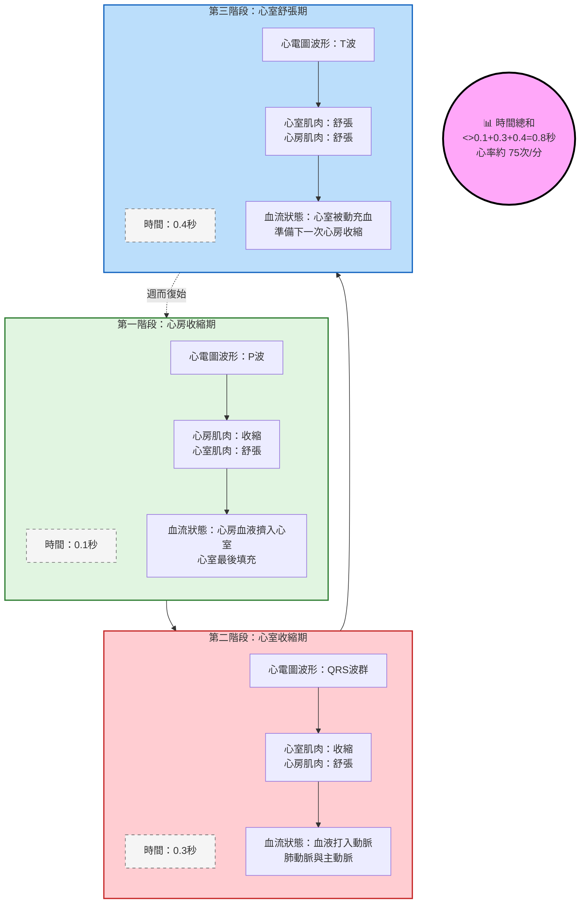
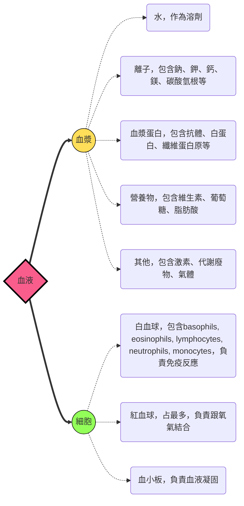
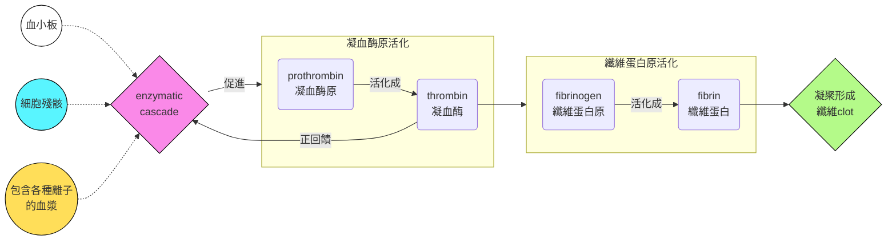
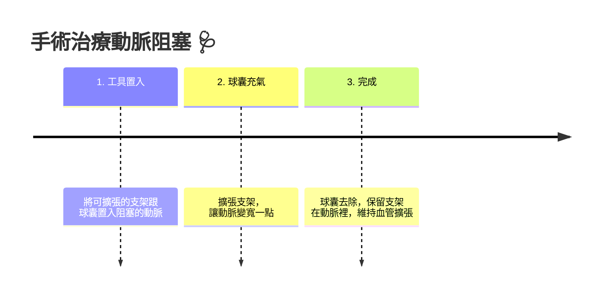
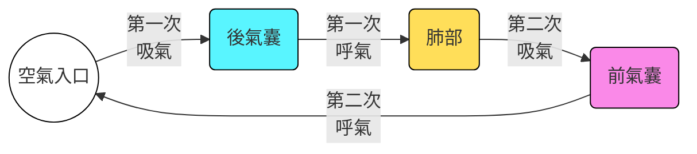

# biology note
## transport system
### 物質交換
- 小分子可以透過diffusion在細胞跟環境間交換
- 但是單純擴散只有在小距離有用，因為擴散的時間跟擴散距離的平方成正比:
$$
t\propto d^2
$$
- 簡單的生物可以直接進行擴散，但是多數大型動物需要**利用循環系統**
#### 消化循環腔
- 刺絲胞動物沒有循環系統，他們有的是gastrovascular cavities，作為消化跟養分分配的手段，體腔跟消化循環腔只有兩層細胞厚
- flatworm也有消化循環腔，三胚層的身體

#### 循環系統
- 循環系統包含**循環的液體、內部連接的系統、幫蒲 (也就是心臟)**，用來交換氣體、吸收養分、帶走代謝廢物
- 可分為開放式跟閉鎖式循環，節肢動物跟一部份軟體動物 (如腹足綱) 屬於開放式，傳送的液體叫做hemolymph，所有臟器都浸泡在裡面
- 閉鎖式循環系統中，血液跟臟器沒有直接接觸，而是在封閉的血管裡面流動，例子包含環節動物、頭足綱、脊椎動物
> [!Tip]
> 開放式系統優勢: 更省能量
> 閉鎖式系統優勢: 物種可以長更大、傳送營養更有效率

#### 脊椎動物的循環系統
- 又稱為心血管系統 (cardiovascular system)
- 三種血管包含arteries，veins，以及capillaries，單方向循環
- 具體的方向為**arteries → arterioles → capillaries → venules → veins**
> [!Caution]
> Arteries跟veins的分法是透過 "血流方向是遠離心臟還是接近心臟" 來分，而不是其血液的含氧量 !
- 血液進入 atria (心房) ，然後從 ventricles (心室) 被打出去
- 脊椎動物的心臟chambers數量跟位置大不相同
#### single circularion
- 魚類 (軟骨跟硬骨) 為單循環，兩個chamber的心臟
#### double circulation
- 兩棲類、爬蟲類跟哺乳動物為雙循環，低氧血在心臟右側，高氧血在心臟左側
- 在爬蟲跟哺乳動物，低氧血會經過pulmonary circuit (肺循環)，從肺臟接收氧氣
- 在兩棲類身上，低氧血會經過pulmocutaneous circuit (肺皮循環)，從廢跟皮膚接收氧氣
- 高氧血由systemic circuit傳送
- 基本上，雙循環動物的血壓會比單循環還要高
#### 演化上的雙循環差異
- 有些雙循環系統動物能進行 "間歇性呼吸" (intermittent breathers)
- 兩棲跟爬蟲動物可以長時間不進行氣體交換
- 兩棲類主要是三腔室心臟，兩心房一心室
  - 心室裡面的充氧跟缺氧血可以相互混合，但通常有一個脊狀結構，把大部分的充氧血帶到體循環，缺氧血帶到肺皮循環
  - 青蛙在水面下時，基本上血液不經過肺臟
- 多數爬蟲動物也是三腔室心臟，心室中間由發育不全的隔膜分開缺氧跟充氧血
- 鱷魚的心室隔膜發育完好，而且**肺循環跟體循環有在其間相連**
> [!Note] 
> 通常是在右心室 (也就是連接肺動脈的地方)，多開一個通道 (又稱為Panizza tube)，讓缺氧血流到體循環當中 👀
- 鳥跟哺乳類就是四腔室心臟，兩心房兩心室。他們屬於內溫動物，通常需要更多的氧氣

### 深入探討

#### 哺乳動物循環系統
- 右心室打出血液，讓血液進到肺循環
- 血液到微血管床中 (又稱為capillary beds)，在那裏釋放二氧化碳，接收氧氣
- 然後透過肺靜脈 (pulmonary veins) 進到左心房
- 充氧血從左心室打出去，透過主動脈 (aorta)，進到體循環
- aorta的第一個分支為冠狀動脈 (coronary arteries)，為心臟提供氧氣
- 接下來就是傳到微血管床，提供身體氧氣，並且二氧化碳從組織溶入血漿
- 血液匯聚到小靜脈，然後再連接到靜脈。靜脈分為上腔跟下腔靜脈 (superior & inferior vena cava)，把上半身跟下半身的血液匯聚到右心房，然後最終進到右心室
#### 心臟節律
- 心臟由心肌組成，兩個心防的心肌壁較薄，心室的心肌較厚
- 心臟收縮期被稱為systole phase，舒張期被稱為diastole phase

- cardiac output = 心臟每分鐘輸出的血量，和心律 (一分鐘跳多少次) 跟stroke volume (一次心搏的輸出量) 有關
- 一共有四個瓣膜 (valves): 
  - 房室瓣 (atriovemtricular valves, AV valves)，隔開心房跟心室
  - 半月瓣 (semilunar valves)，隔開心室和大血管 (aorta跟pulmonary artery)
- 心跳的聲音 (撲通)，第一心音為血液撞擊房室瓣的聲音，第二心音是血液撞擊半月瓣的聲音
- 如果瓣膜有缺陷，導致血液逆流出現，會導致心雜音 (heart murmur)
#### 維持心律
- 心肌細胞為自發節律 (autorhythmic)，不需要神經系統即可收縮
- 竇房結 (sinoatrial node, SA node) 位於右心房上側，決定心臟的收縮，這些傳導的脈衝可以用心電圖紀錄 (electrocardiogram, ECG)
- 房室結 (atrioventricular node, AV node) 位於右心房下側，接收SA node的脈衝
- 脈衝延遲，傳到Purkinje fiber (位於兩側心室肌肉)，導致心室收縮
- SA node的脈衝受到自律神經的影響，同時也受到激素跟體溫的影響

|階段|對應到|
|---|---|
|P波|來自SA node的訊號傳到心房|
|PQ間期|電信號延遲傳導，讓心室有時間流入血液|
|QRS波群|心室去極化，導致心室強力收縮，打出血液|
|ST間期|去極化到再極化的期間，心室持續收縮的階段|
|T波|心室再極化，心室回復舒張|

### 血管跟血壓
#### 血管結構
- 血管中的內皮細胞能降低血流阻力
- 微血管大概跟紅血球質鏡差不多寬，血管只有一層內皮細胞厚 + 基底膜，幫助物質交換
- 動脈跟靜脈都有內皮細胞、平滑肌跟結締組織，動脈血管壁有彈性 (因為內部血壓較高)，靜脈血液血壓低，所以血管壁比較鬆弛，還包含瓣膜，防止血液逆流
#### 血液流速和血壓
- 血液從動脈到微血管，速率越來越慢，阻力增加，總橫截面積增加
- 從微血管到靜脈，總橫截面積減小，血流速度逐漸回升到原本速率的一半
- 血管壁回彈是維持血壓的原因之一，當血液流到微血管時，阻力增加，因此血壓開始降低
- 血壓分為收縮壓 (systolic pressure) 跟舒張壓 (diastolic pressure)，前者為心臟收縮時的動脈血壓 (最高)，後者為心臟舒張時的動脈血壓 (較低)，使血壓在動脈如同波一樣傳遞
- 血管舒張跟收縮為平滑肌改變小動脈的直徑造成的結果，造成血壓上升或是下降
- 一氧化氮 (nitric oxide, $NO$) 是血管的擴張劑，而內皮素 (endothelin) 微血管的收縮劑

#### 血壓和重力的關係
- 量血壓時，測量的動脈要跟心臟等高，正常的血壓在靜息時通常為 (120/70 mmHg)，因為重力會影響血壓高低
- 長頸鹿需要有非常高的收縮壓，好把血液打到高處
- 靜脈的瓣膜讓血液抵抗重力，避免逆流。同時，骨骼肌跟靜脈平滑肌的收縮也有防止逆流的功能

#### 微血管和淋巴系統
- 多數的微血管並沒有血液流過，通常只有5~10%的微血管是被使用的
- 動脈的收縮跟舒張，以及微血管前括約肌 (precapillary sphincters)，控制血流的分布
- 不同化學物質、激素跟神經衝動調控血流的分配
- 物質的交換在血液跟組織液之間進行
- 血漿中的蛋白質增加血液滲透壓，促進組織液回到血管，而血壓傾向於將血漿壓出血管。通常出大於進，導致組織中的液體增加
- 這些液體被稱為淋巴 (lymph) ，會透過淋巴系統，從脖子的靜脈重新回到血液裡面
- 淋巴管一端為盲端，接收組織中的液體，淋巴管裡面也有瓣膜
- 水腫 = 淋巴液回不到血液裡造成
- 淋巴結過濾淋巴中的病原體，當身體受到感染時，淋巴結會腫大

### 血液的成分
- 屬於結締組織的一種，血漿占大宗 (55%)，其餘為細胞 (45%)

#### plasma
- 血漿的蛋白質影響pH值，維持血液滲透壓。有些血漿蛋白也作為傳輸脂肪 (脂蛋白)、免疫 (抗體)、或是血液凝固 (纖維蛋白原)
- 組成成分跟組織液很像，不過血漿的蛋白質通常更多
#### RBC, WBC and platelets
- erythrocytes (紅血球) 
  - 佔血球最多，包含血紅蛋白，裡面的血基質 (heme) 可以跟氧氣結合，一個血紅蛋白有四個heme → 最多四個氧氣
  - 多數紅血球在哺乳動物中沒有粒線體和細胞核
  - 鐮刀型紅血球貧血會產生不正常的血紅蛋白 (Glu → Val, point mutation)，它們會形成長纖維，導致紅血球呈鐮刀狀，這些血球會阻塞血管，導致劇痛或是器官腫脹
  - 血球數量大減 (多數被快速消耗)
- Leukocytes (白血球)
  - 總共有五種，防禦方式包含吞噬作用，或是對異物產生免疫反應 (包含生成抗體跟細胞因子)
  - 在循環系統內，或是在組織內都會出現
- Platelets
  - 細胞碎片，作為血液凝固用

#### Stem cells
- 血球跟血小板都來自紅骨髓的幹細胞
- 紅血球生成素 (erythropoietin, EPO) 在氧氣較少的時候負責幫忙生成紅血球，重組的EPO可以用來治療貧血

#### 血液凝固
- coagulation = 血液變成血塊的過程
- 級聯反應讓fibrinogen活化成fibrin
- 如果血塊生成在血管裡面，被稱為thrombus (血栓)，可能阻礙血流，導致心肌梗塞或是中風

#### 心血管疾病
- Cardiovascular diseases 的範圍從心臟功能不整到供血的中斷都有
- 動脈硬化 (atherosclerosis) 是因為脂肪產生的斑塊積累在動脈導致的
- 動脈內皮的損傷會導致發炎，白血球聚集
- 脂肪沉積出現 (plaque)，血管內皮變硬，如果斑塊破裂，會產生thrombus
- 心臟病發 (myocardial infarction，心肌梗塞)，是因為冠狀動脈阻塞導致心肌組織缺氧，中風 (stroke) 是因為頭腦的動脈阻塞導致神經元缺氧
- 心絞痛 (angina pectoris) 通常就是冠狀動脈部分阻塞導致的胸痛
- 動脈阻塞可以透過手術治療，如下:

#### 危險因子
- LDL負責把膽固醇運到細胞，用於細胞模建造
- HDL用來去除多餘的膽固醇，並將其運回肝臟
- 高LDL/HDL比例，會導致心血管疾病風險增加
- 炎症也是風險因子之一
> [!Note]
> statin是一種藥物，可以降低LDL的量
> Aspirin可抗炎，也有助於降低心血管疾病

### 氣體交換
#### 分壓的影響
- 分壓 = 某氣體在混合氣體中所佔的壓力
- 分壓影響液體在水中的溶解度
- 在同樣體積下，水中的氧氣量往往比空氣中更少，因此，在水中需要更有效地獲得氧氣
- 獲得氧氣的媒介 (respiratory surfaces) 包含皮膚、鰓、肺、氣管等

#### Gills
- 鰓有非常大的表面積，水生動物會讓水流過鰓
- 利用逆交換系統 (countercurrent exchange system)，讓血流方向跟水流流過的方向不一樣，這讓魚可以吸收80%的水中氧氣

#### Tracheal systems
- 昆蟲的氣管系統由分支的管形成網路，直接讓氧氣通過系統傳給身體細胞
- 因此，昆蟲的呼吸系統跟循環系統分開，氣管會分支成tracheole (小氣管)，小氣管直接連接體細胞
#### Lungs
- 肺相當於表面積內摺的一個器官，大部分的爬蟲或是哺乳動物幾乎完全依賴肺臟進行氣體交換

#### 詳細了解下哺乳動物的呼吸方式
- 分支的管子將氣體傳送到肺部，鼻孔先進行空氣的過濾
- 咽 (pharynx) 控制器體到肺臟&食物到胃裡
- 吞嚥的時候，喉部 (larynx) 向上移動，導致會厭 (epiglottis) 覆蓋在聲門上，防止食物掉入氣管
> [!Tip]
> **epiglottis = epi + glottis = 在聲門上方的結構**

- 空氣經過**pharynx → larynx → tranchea → bronchi → bronchioles → alveoli**，在此處進行氣體交換
- 氣管壁上的纖毛跟黏液將空氣中的微粒往上排除，最後跑回咽部，被推到食道裡面
- 肺泡 (alveoli) 位於細支氣管 (bronchioles) 末端，氧氣透過上面的表皮層進到微血管，二氧化碳反之
- 肺泡沒有纖毛，容易受到感染，肺泡的表面有surfactants，如果缺乏這個東西 (例如一些嬰兒)，容易導致RDS (respiratory distress syndrome，呼吸窘迫症候群，症狀為肺泡積水)

### 如何讓氣體進入肺臟
#### amphibian
- 使用正壓呼吸，把氣體灌進氣管，然後呼氣時，肺部跟體壁壓力導致回彈
#### birds
- 鳥類有氣囊 (air sacs)，分為前氣囊 (anterior air sacs) 跟後氣囊 (posterior air sacs)，作用像是風箱一樣，讓肺部持續有空氣流入，這讓鳥類的換氣更有效率

#### mammals
- 哺乳類用的是負壓呼吸，把氣體拉入肺臟。肋間肌 (rib muscles)跟橫膈 (diaphragm) 收縮時，肺部擴張
- 通常，吸氣屬於肌肉主動作用，而呼氣通常靠回彈 (被動) 即可達成
- 每一次吐氣的時候，還會有一些氣體遺留在肺臟，所以每一次吸氣，是 "新空氣 + 舊空氣" 的混合
#### 節律控制
- 呼吸通常屬於不隨意運動 (involuntary)
- 呼吸控制中樞位於medulla oblongata (延髓)，偵測腦脊髓液 (cerebrospinal fluid) 的酸鹼值
> [!Tip]
> cerebrospinal = cerebral + spinal = 腦跟脊隨

- 偵測的訊號會傳給主要控制呼吸中樞，而進一步的呼吸調節發生在橋腦 (pons)

### 氣體交換的適應性
- 有些東西可以讓血液能夠攜帶更多的氧氣跟二氧化碳，我們稱其為 "respiratory pigments"
- 吸氣之後，氧分壓增加，這個氧分壓通常比肺泡微血管高
- 這個現象促進氧氣擴散到微血管中，二氧化碳排出，最終導致氣體分壓血管內外相同
- 在體微血管床，整體分壓偏好讓氧氣淨流出血液，二氧化碳淨流入血液

#### respiratory pigments
- 通常是攜帶氧氣的蛋白質，大部分脊椎動物有的叫做血紅蛋白 (hemoglobin)，四個子單元組成，由鐵離子結合氧氣
- 節肢動物跟很多軟體動物用的是血藍素 (hemocyanin)，利用銅離子來當作結合氧氣的分子 
- 當一個血基質單元結合到氧氣，會促使其他子單元對氧氣的結合度上升，也就是協同性，可以在血紅蛋白的結合曲線中看出來
- 二氧化碳的產生會降低血液酸鹼值，因此會降低血紅蛋白對氧氣的結合度，促進氧氣的釋放。這被稱為Bohr effect

#### 二氧化碳的運輸
- 血紅蛋白基本上比較不載送二氧化碳，載送二氧化碳的主成分是血漿中的碳酸氫根離子，形成碳酸:
$$HCO_3^{-} + H^{+}\rightarrow H_2CO_3$$
