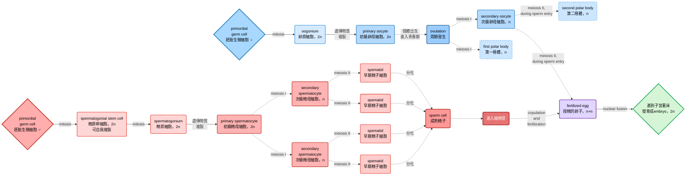
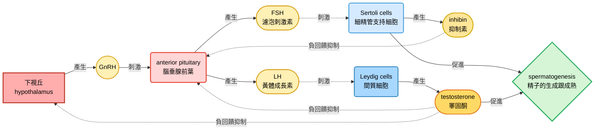
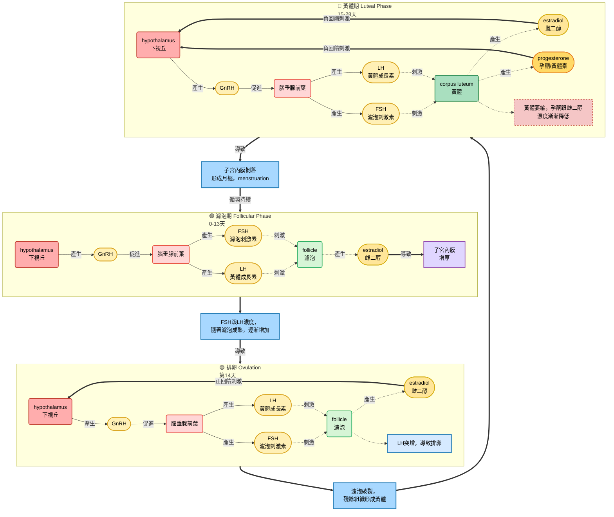
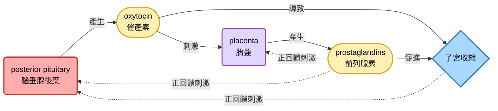

# biology note
## Chapter 45: reproductive system
### asexual and sexual reproduction
#### asesual
- budding是一種僅在無脊椎動物中出現的無性生殖法
- fission (分裂) 也是一種，只是budding的子代比親代小，fission的子代跟親代體型差不多
- fragmentation (切割)，像是渦蟲那樣，被切掉的那一部分身體可以再生
- parthenogenesis (孤雌生殖)，未受精的卵自行發育成個體，在無脊椎動物常見 (例如輪蟲)，當然，有些少數脊椎動物在特殊狀況也會產生類似現象

#### sexual reproduction
##### hermaphroditism
- 這個字來自希臘神話的兩個神: Hermes跟Aphrodite。他們倆的兒子跟窮追不捨的水仙結合，最終就變成同時有男性跟女性生殖器的個體 (真的啦我沒騙人 🫠)
- 蝸牛跟海綿等就是這種，雌雄同體的個體也可以自我授精 (self-fertilize)
- 或是這些各體會在特殊情況改變他們的性別，也算是雌雄同體 (叫做順序雌雄同體，Sequential Hermaphroditism，例如小丑魚)

##### reproduction cycle
- 大多數物種都會依據季節變化而有所謂的 "生殖週期"，由體內激素或是環境因素導致。通常，雌性在生殖週期中段通常就是所謂的 "排卵期"

> [!Tip]
> 季節溫度變化也會影響繁殖周期，所以氣候變化會影響多個物種的生殖成功率 🐱

- 水蚤 (*Daphnia*)在環境良好時行無性生殖，在環境變化惡劣時出現有性生殖 (基因重組可以增加子代存活率)
- Whiptail lizard (鞭尾蜥) 都是雌性，但是他們有跟據繁殖季節，個體會產生 "類雄性行為"。它們是完全單性，只是行為上有不同
- 通常在排卵前夕 (類似所謂的濾泡期的激素濃度樣貌)，出現雌性行為，而在孕酮上升時，表現出 "類雄性行為"

#### 到底為什麼要出現有性生殖
- 通常來說，無性生殖產生的子代，大概是有性生殖個體的兩倍多 (所以每一代過去，其生成的子代會跟有性生殖的差 $2^n$ 倍)，所以為什麼要產生 "有性生殖" 這種耗能的東西?
- 有性生殖在環境變化快速的時候較為有利 (子代存活率高，因為基因重組)，而無性生殖在穩定，favorable的環境裡面比有性生殖更有利

### fertilization
- 精卵結合的意思，可以是體外也可以是體內，看物種
- 體外授精 (例如青蛙)，雌性會把卵產在環境中，通常潮濕的環境比較適合這樣的方式
> [!Note]
> spawning: 個體們聚在一起同時把自己的配子丟出去的行為，通常受到化學信號或是環境狀況驅使 🐱

- 體內受精讓個體在乾燥環境也能生殖成功，但是通常需要合適的交配器官，以及行為互動
- 通常個體可以用信息素 (pheromoones) 改變或是影響其他個體行為
- 通常體內受精的物種產生的配子量相對較少，而且往往會出現育幼行為 (parental care)，增加其子代存活率
- 對於reptiles跟birds來說，它們的受精卵有硬殼以及內膜，防止物理傷害跟水分喪失
- 有些物種 (如咱們) 把發育的胚胎養在雌性體內

#### 配子的產生跟運輸
- 產生配子的器官叫做gonads，有些物種沒有gonads，它們的配子透過未分化的組織減數分裂形成
- 有些系統還會有運輸的管狀系統，或是腺體，來儲存、保護配子，或是讓配子能夠成熟
- 昆蟲通常性別是分開的，而且雌性通常有spermatheca，用來儲存其他個體的精子，以便在合適的時候使用
- cloaca (泄殖腔)，同時在消化、排泄、生殖中扮演角色的通道，通常在非哺乳動物的脊椎動物中常見 (例如鳥類)

##### 後者雄性優先權 (Last-male precedence)
- 在果蠅交配行為中，雄性往往能殺死或是排除雌性體內其他雄性的配子，這是一種 "精子競爭" 的機制
- 在一個實驗裡面，如果雌性跟兩種實驗下的雄性果蠅交配 (例如無法形成精子，或是交配時無法ejaculate的果蠅)，雌性的spermatheca裡面往往會缺乏儲存的配子

### reproductive system anatomy

#### male reproductive anatomy
- 外生殖器包含scrotum跟penis，內生殖器包含產生精子跟激素的gonads，以及附屬腺體

##### teste
- 也就是男性的gonads，負責產生精子，減數分裂發生的區域為seminiferous tubules (細精管)
- 經子通常無法在一般動物的體溫下存活，所以大多數哺乳動物的testes會位於scrotum裡面，讓產生精子的區域溫度低於體溫

##### ducts
- 從細精管產生後，精子會移至epididymis逐漸成熟

> [!Note]
> 通常精子從成熟到出去需要跑的管子距離有六公尺，大概花費三周

- vas deferens是儲存精子的地方，其有肌肉組織，負責在ejaculation時推動配子進入ejaculatory duct，最後從urethra排出

##### accessory glands and penis
- 附屬腺體通常有三種，產生的液體跟精子混合: seminal vesicle、prostate gland、bulbourethral gland (又稱為Cowper's gland)
- penis包含三條spongy erectile tissue，性興奮的時候會充血，導致erection
  - 上面兩條被稱為corpora cavernosa， 下面一條包圍ureathra，被稱為corpus spongiosum
- 頂端被稱為glans，由prepuce包圍 

#### female reproductive anatomy
- 外生殖器包含clitoris跟兩套labia，內生殖器包含一對gonads，管狀系統以及一個負責放置胚胎的腔室

##### ovaries
- 女性的gonads，有多個follicles (濾泡)，每個濾泡裡面都有卵母細胞 (oocyte)

##### oviduct and uterus
- 卵細胞會經過oviduct (又稱為fallopian tube)，管內有纖毛，幫忙把卵細胞運到uterus，內膜被稱為endometrium，上面有非常多血管，uterus的開口叫做cervix，通往vagina

##### vagina and vulva
- vagina作為分娩時的產道，也是在交配時容納penis的通道，其開口被稱為vulva
- vulva包含labia majora、labia minora、hymen跟clitoris
- clitoris前端也包含glans跟prepuce

> [!Tip]
> clitoris跟penis基本上屬於同源器官 🐱

#### mammary gland
- 並不屬於生殖系統的一部份，不過對於生殖也至關注要，其內皮細胞會生成乳汁，哺育幼崽

### gametogenesis
- 也就是配子的生成 (很簡單吧)

#### spematogenesis
- 通常從青春期至終生皆可發生，而且過程持續，精子通常需要7天發育成熟
- 精原幹細胞可持續自我複製，產生精原細胞
- 精原細胞的遺傳物質複製後，在減數分裂前被稱為初級精母細胞，meiosis I結束後，形成次級精母細胞
- meiosis II發生後，就是早期精細胞，分化後形成精子成熟

#### oogenesis
- 卵原細胞會先在雌性胎兒內部變成初級卵母細胞 (也就是複製遺傳物質，但是沒有減數分裂)，數量便固定下來，不再產生新的卵母細胞
- ovulation，也就是meiosis I時，會產生一個次級卵母細胞，以及第一極體
- meiosis II會在授精剛開始的時候 (例如皮質反應) 才會發生，產生第二極體以及卵 (這時尚未核融合，所以遺傳物質形式被表示成n+n)

### 性激素調控
- 性激素的調控跟下視丘 (hypothalamus)、腦垂腺前葉 (anterior pituitary)、以及gonads有關細
- GnRH (gonadotropin releasing hormone) 來自下視丘，調控FSH (FSH (follicle stimulating hormone) 跟 LH (luteinizing hormone) 在腦垂腺前葉的釋放
- FSH跟LH條控性激素 (通常為固醇類) 的產生，包含testosterone、estradiol、progesterone等等
- 性激素調控配子的產生、行為模式、以及第一跟第二性徵的發育

#### in male
- FSH作用在Sertoli cells (細精管支持細胞)，促進精子產生跟發育
- LH作用在Leydig cells (間質細胞)，促進睪酮分泌
- 睪酮作為負回饋調控GnRH、FSH、LH的生成
- inhibin由Sertoli cells分泌，抑制腦垂腺前葉的FSH分泌

#### in female
- 激素分泌跟兩個周期的 "同步" 相關，一個是卵巢周期，一個是月經週期 (或是叫做子宮周期)
- 每一次的月經週期，endometrium都會增厚，以便孕育胎兒，如果沒有胚胎著床，endometrium會剝落，產生月經 (menstruation)

##### the ovarian cycle
- 包含濾泡期、排卵、黃體期
- 在濾泡期 (follicular phase) 期間，GnRH促進FSH跟LH產生，FSH促進濾泡成熟，而濾泡會生成雌二醇 (estradiol)
- estradiol會正回饋促進GnRH的分泌，進而迅速拉高FSH跟LH的量，使濾泡迅速成熟，導致濾泡破裂 (ovulation)
- ovulation之後叫做黃體期 (luteal phase)，LH促進破裂後的濾泡組織形成黃體corpus luteum，黃體會同時產生孕酮 (progesterone) 跟estradiol
- 這導致負回饋發生於下視丘跟腦垂腺，使LH跟FSH濃度降低，這抑制了其他卵子的成熟

##### the menstrual/uterine phase
- 在ovulation之前，濾泡產生的estradiol會使endometrium增厚

> [!Tip]
> 因此，follicular phase就跟子宮的proliferative phase (周期第6到14天) 同步 🐱

- ovulation之後，雌二醇跟孕酮會維持子宮內膜的穩定跟發育
- 子宮內膜的腺體能分泌營養液，以便能夠讓著床前的胎兒能穩定生長，這被稱為secretory phase (周期第15到28天)

> [!Tip]
> luteal phase就跟secretory phase同步 🐱

- 大約有7%的女性受到endometriosis影響
- endometriosis: 本來應該乖乖待在子宮腔內部的子宮內膜組織莫名其妙地 "離家出走"，跑到子宮以外的地方落地生根，例如腹腔或是卵巢
- 這些組織也會隨著周期一起脫落或是出血，導致這些區域出血，且血液無法排除

##### menopause
- 在經歷約500次周期後，就會逕入更年期，停經發生
- 這東西在其他動物身上不常發生 (可能是因為他們根本活不到這個年紀)

#### 月經週期跟動情周期
- 月經週期只有在人類跟一些靈長動物中出現，而且並沒有一個特別的時段，是 "無法接收性行為" 的，這跟estrous cycle不一樣
- 對於有動情周期的動物來說，子宮內膜在沒有懷孕時，會自行吸收，而不會排出，而且只有在estrus (也就是發情期) 的時候才會進行交配

#### 性反應的情況
- 在性興奮時，會出現兩種狀況:
  - vasocongestion，也就是組織充血
  - myotonia，肌肉張力增加
- 主要分為四個步驟: excitement、plateau、orgasm、resolution
  - excitement: 最主要的現象就是vasocongestion，為交配做準備
  - plateau: 由性器官的刺激維持
  - orgasm: 一系列不隨意的肌肉痙攣性收縮，男性的話通常導致ejaculation，女性就是子宮跟外陰收縮
  - resolution: 系統回復正常狀態，男性的話往往會有一段時間的不反應期 (refractory period)

### 胎盤動物的胎兒發育
- conception = fertilization，發生在oviduct
- zygote進行cleavage (卵裂，僅有mitosis但是細胞不變大，而是越切越小)，形成囊胚 (blastocyst)
- 囊胚形成後移入 (著床) endometrium
- 著床完成後，母體懷孕 (pregnancy，又稱為妊娠，gestation)
- 基本上妊娠分成三個時期，每一個時期大概是三個月

#### first trimester (1~3 month)
- 著床的embryo分泌激素調控母體的生殖週期
- hCG (human chorionic gonadotropin，人類絨毛膜促性腺激素) 維持孕酮跟雌二醇的分泌，避免內膜剝落
- 前2~4周，胚胎的養分主要來自於endometrium，囊胚的外層叫做trophoblast (滋胚層) 嵌入子宮內膜，形成placenta
- umbilical cord (臍帶)，有兩條臍動脈 (缺氧血)，一條臍靜脈 (充氧血)

- 假如說zygote在卵裂時變成兩個，這叫做monozygotic twins
- 如果是兩個完全不同的受精卵，這叫做dizygotic twins
- 懷孕初期是器官形成的主要時期，到妊娠第八周的時候，基本上所有主要結構皆已生成，embryo這時被稱為fetus
- 此時有幾個事件會發生
  - 子宮頸會產生一個塞子 (mucus plug)，避免感染
  - 胎盤成形，排卵跟月經周期停止
  - 乳房變大，母體可能會有噁心等反應

#### second and third trimesters (4~9 month)
- second trimester發生的事情包含:
  - 胎兒的增長速度變快
  - 胎動形成
  - 母體內激素穩定
  - 胎盤接管了孕酮的產生
- third trimester時，基本上胎兒的大小已經占據了整個胚膜的空間 
- 分娩 (childbirth) 始於陣痛 (labor)，子宮將胎兒跟胎盤推出體外，分娩過程由oxytocin、estradiol跟prostaglandins來調節

- labor有三個時期
  - 子宮頸擴張 (dilation)
  - 胎兒產出 (expulsion)
  - 胎盤剝落

#### 母體免疫細統的抑制
- 母體能夠接受外來的配子，可能跟其免疫系統的抑制有關係
- 例如我們發現，rheumatoid arthritis (類風溼性關節炎)等自體免疫疾病，在懷孕期間症狀會減輕

#### 避孕 (contraception) 跟墮胎 (abortion)
- 通常contraception有幾種主要方法
  - 阻斷精子或是卵子的生成 (ex: vasectomy，輸精管結紮，或是混合的birth control pill，阻斷排卵)
  - 物理上使精子跟卵子分開 (ex: condom，保險套，or diaphragm，子宮隔膜的使用，tubal ligation，輸卵管結紮)
  - 物理上避免胚胎著床 (ex: IUD，子宮內避孕器)
- 能夠唯一同時避孕跟避免性傳染病的方法，就是使用condoms
- abortion可以分成自然或是人工的 (如果是自發性的，被稱為流產，miscarriage)
- RU486是孕酮的結抗劑，會導致黃體素無法發揮維持子宮內膜的作用

#### 現代科技
- 不孕的原因有很多種，有些是因為性傳染病導致的，例如淋病 (Gonorrhea) 和衣原體門 (Chlamydia)
- 試管受精是人工解決方法之一 (*in vitro* fertilization， IVF)

#### 疾病檢測
- 超音波可以檢測胎兒大小跟狀況 (ultrasound imaging)
- amniocentesis (羊膜穿刺) 跟chorionic villus sampling (絨毛膜取樣)，利用針刺，取得胎兒細胞進行基因分析
- 現在已經可以利用抽血的方式，取出胎兒DNA，檢測胎兒疾病
