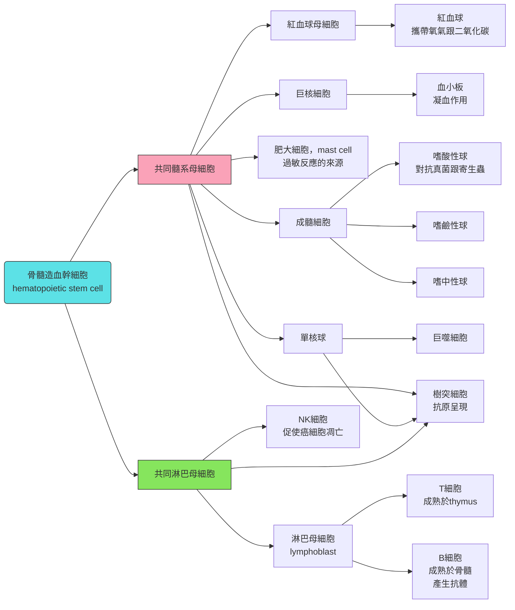
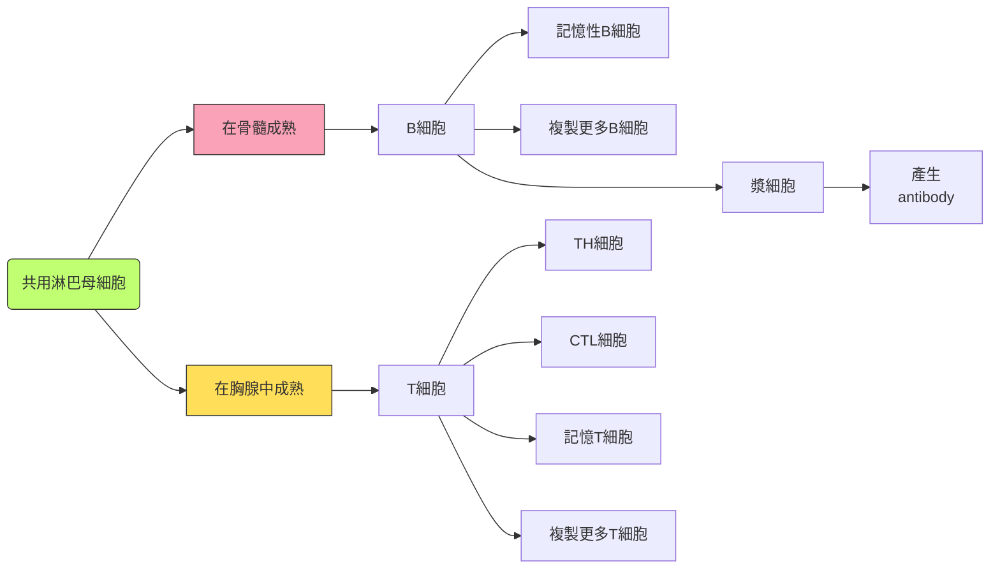

---

title: Chapter_47_Campbell's biology

---

# biology note
## chapter 47: immune system
### 前情提要
#### 昆蟲免疫系統
- 吞蟲的外骨骼屬於第一層物理免疫，消化系統由有幾丁質屏障的溶菌酶lysozyme保護
- 昆蟲的免疫細胞，**hemocytes**，會產生recognition proteins，接到其他的外來物質上面 (有點像抗體一樣)
- 其也會分泌抗菌肽，去殺死真菌或是細菌
- recognition proteins黏到外來物質上面，會啟動一種穿膜蛋白，被稱為Toll
- 昆蟲對抗病毒的方訪，是根據辨識ssRNA病毒在細胞裡面會產生的dsRNA來辨識的，因為一般昆蟲體細胞不會產生dsRNAs

> [!Tip]
> 脊椎動物比無脊椎動物多了一些免疫特色，例如natural killer cells、interferons，跟inflammatory response 🐱

### 人體物理上的第一防禦
#### 皮膚
- 身體最重要的機械屏障，體表的角蛋白 (keratin) 由角質細胞產生
- 身體的角質層上的細菌，會跟著角質層一起剝落
- 整體pH值呈現弱酸，還有鹽分 (主要是氯化鈉，增加滲透壓) 以及皮脂 (sebum)，抑制微生物生長

#### mucous membranes 黏膜
- 分布於口腔、消化道、泌尿生殖道以及呼吸道
- 可以避免微生物入侵體內，並捕獲它們
- 分泌物裡面包含了溶菌酶 (lysozyme)、乳鐵蛋白 (lactoferrin)、乳過氧化物酶 (lactoperoxidase)

| |lysozyme|lactoferrin|lactoperoxidase|
|-|--------|-----------|---------------|
|功能|切斷 peptidoglycan 的 β(1→4) 鍵，使細菌爆炸|緊緊抓住 Fe³⁺，微生物拿不到鐵，導致代謝停擺|產生次硫氰酸鹽OSCN (hypothiocyanite)，氧化細菌蛋白，並破壞代謝酵素|
|常見於|淚液、唾液、鼻腔分泌物|母乳、淚液、嗜中性球顆粒|呼吸道分泌物、母乳|

#### 呼吸系統
- 防禦的媒介包含鼻腔分泌物跟空氣的流動
- 黏液會捕獲微生物，並且透過纖毛排出
- 透過咳嗽跟噴嚏排除異物，或是進到胃部，由胃酸殺死
- 除此之外，肺泡裡面本來也有免疫細胞 (例如巨噬細胞)，可以吞噬外來物質

#### 消化道
- 胃酸很強 (pH 2 to 3)，可以把多數微生物殺死
- 消化酶本身 (例如pepsin或是trypsin) 會破壞微生物身上的蛋白質
- 膽鹽有乳化作用，所以可以破壞細菌的胞膜
- 腸道本身也有淋巴組織 (gut-associated lymphoid tissues, GALT)，可以抵抗病原體
- 腸道的微生物群 (microbiome) 可以訓練免疫系統，允許部分好菌佔據生態位，並抑制其他細菌的生長
- 有些腸胃的微生物會導致疾病，例如梭菌 (Clostridium) 或是幽門螺旋桿菌 (H. pylori)

### 細胞種類總整理

#### 從骨髓造血細胞開始
- 髓系母細胞產生紅血球、血小板、肥大細胞跟顆粒球
- 淋巴母細胞產生無粒球 (包含T細胞跟B細胞)、NK細胞、樹突細胞

#### 肥大細胞
- 直接從髓系母細胞開始，在結締組織中分化而來
- 會釋放組織胺 (histamine) 或是其他有活性的化學物質
- 在過敏反應中起到重要作用，其相關物質包含免疫球蛋白E (IgE)

#### 顆粒球
- 細胞核的形狀不規則，被稱為 "分葉核"，分葉核可以變形、拉長、折疊，讓整個細胞更容易擠過狹縫，在各個組織中遊走
- 細胞質裡面有儲存體 (granule)，裡面的物質可以殺死微生物，或是提高發炎反應
- 包含嗜中性球、嗜鹼性球、嗜酸性球

|種類|basophile|eosinphile|neutrophile|
|--------|---------|----------|-----------|
|中文|嗜鹼性球|嗜酸性球|嗜中性球|
|染色|可以用鹼性染料染成藍黑色|可以用酸性染料染成紅色|在中性pH值下染成紫色|
|功能|可以釋放肝素 (抗凝血劑)，確保發炎區域血流暢通，表面有IgE受體，可以釋放組織胺，通常不吞噬|抵抗原生動物或是寄生蟲，也可以分解組織胺，抑制過敏反應|分葉明顯 (2~5葉) 具有很強的吞噬能力，也可以產生活性氧。遷移能力很強，在發炎信號 (如補體C5a、白三烯) 下快速抵達感染部位，白血球中佔最多 (50~70%)|

#### 淋巴球
- 包含T細胞 (胸腺細胞)、B細胞、自然殺手細胞 (NK cell)、和先天淋巴細胞 (ILC)
- T細胞跟B細胞只有在特定抗原跟其表面受體結合時，才會活化
- 活化之後，這些細胞在淋巴系統內繼續複製
- 記憶細胞雖然是活化的細胞，但是他們不會立即複製，只會在宿主再次遇到相同抗原時複製

#### 免疫系統怎麼辨認細胞?
##### 如何辨識
- 在巨噬細胞和嗜中性球的辨識方法上面，主要透過 "要不要調理素 (例如補體)" 來分:

|種類|opsonin-dependent|opsonin-independent|
|---|-------------------|-----------------|
|特徵|細胞透過辨識補體來打擊|細胞透過辨識病原體本身有的一些物質來打擊|
|舉例|經典路徑跟凝集素路徑|病原體相關分子模式 (PAMP or MAMP)|

##### 辨識什麼
- 在辨識的物體上面，可以分成PAMP跟DAMP

|種類|病原體相關分子模式 PAMP|損傷相關分子模式 DAMP|
|---|----|----|
|定義|微生物身上保守、必需且特異的分子結構|我們的體細胞在應激、損傷、壞死或異常死亡時，從細胞內釋放到外部的分子|
|舉例|LPS、Peptidoglycan、teichoic acid、Flagellin、細菌的DNA或是RNA、病毒的衣殼蛋白|ATP、線粒體DNA、線粒體甲醯肽、熱休克蛋白、尿酸鹽晶體|
|主要辨識原因|殺死病原體|修復體細胞|

### 先天性免疫的防禦
#### TLRs
- 辨識這些外來物質的受體被稱為toll-like receptors

| **TLR 編號** | **主要辨識物質 (Ligand)** | **來源** |
| --- | --- | --- |
| **TLR1/TLR2** | 三酰基脂肪醯肽 (triacylated lipopeptides) | 細菌細胞壁 (革蘭陽性菌) |
| **TLR2/TLR6** | 二酰基脂肪醯肽 (diacylated lipopeptides), 脂多醣樣分子 | 細菌、真菌 |
| **TLR3** | 雙股 RNA (dsRNA) | 病毒感染 (如 RNA 病毒) |
| **TLR4** | 脂多醣 (LPS) | 革蘭陰性菌外膜 |
| **TLR5** | 鞭毛蛋白 (flagellin) | 細菌鞭毛 |
| **TLR7/TLR8** | 單股 RNA (ssRNA) | 病毒 RNA |
| **TLR9** | 非甲基化 CpG DNA | 細菌與病毒 DNA |

#### Antimicrobial peptides 抗菌肽
- 很小，通常只有20~50個胺基酸
- 通常帶正電，因為微生物的LPS跟teichoic acid帶負電，微生物就可以被吸上來
- 線性的 $\alpha$ -helix分子，裡面沒有半胱胺酸殘基
- 通常為雙親性分子 (amphipathic)，很適合插進細胞膜
- Defensins (防禦素)，如 $\alpha$ -defensins (Paneth cells) 、 $\beta$ -defensins (上皮細胞)
- Cathelicidin，如LL-37，是人類身上最有名的一條
- 破壞細胞膜的方式，可以是Barrel-stave (在細胞膜上面戳洞，導致細菌爆炸)，或是Carpet model (像是介面活性劑一樣使膜分裂成小塊)

> [!Note]
> *Streptococcus pneumoniae* 會導致肺炎跟腦膜炎，*Mycobacterium tuberculosis* 會導致結核病

#### complement system 補體系統
- 通常由30多種血清蛋白 (serum protein) 組成，主要作用方式有三種:

|機制|又被稱為|具體做法|注釋|
|---|-------|-------|---|
|標記敵人|調理作用|用蛋白質 (如C3b) 標記細菌表面，促使巨噬細胞吞噬該病原體|標記細菌表面的補體 又稱為調理素 (opsonins)|
|直接擊殺|膜攻擊複合物|在細菌膜上|打洞 (和細菌素類似但更複雜)|
|發出警報|趨化與發炎|釋放化學訊號 (如C3a, C5a) ，呼叫更多免疫細胞，並引發局部發炎||

#### cytokine
- 是小型的，可溶的蛋白質or糖蛋白，是先天性&後天性免疫系統的調節器，也可以增加造血功能

|種類|chemokine|interferon|interleukins|CSFs|TNFs|
|---|---------|----------|------------|----|----|
|中文|趨化因子|干擾素|白血球介素|群落刺激因子|腫瘤壞死因子|
|功能|誘導細胞遷移|調節細胞因子的產生、 抑制病毒複製|由一個 白血球釋放，作用於 另一個白血球|刺激骨髓中的 未成熟白血球 生長跟分化|刺激發炎反應|

#### Systemic and Chronic Inflammation
- 有時身體是區域性的發炎 (例如單純的傷口跟肥大細胞釋放組織胺等等)，但是有些是屬於系統性的或是慢性的發炎反應
- 例如急性的全身性發炎反應包含發燒 (體溫升高可以活化其吞噬作用、組織修復)、細胞因子風暴、敗血性休克 (septic shock) 等等
- 慢性發炎反應，例如自體免疫疾病 (包含Crohn’s disease)

### 後天性免疫
#### 四大特徵
- 可以區分敵我: 對分自身物質做出選擇性反應
- 多樣性: 可以依病原體產生不同種抗
- 特異性: 每一種抗體都對應特定的抗原
- 記憶性: 可以在第二次接觸的時候快速消滅病原體

#### 簡介
- 抗原呈現細胞包含DC、巨噬細胞、ILCs等等
- 根據分裂的方式，呈現大概如下:

#### 自我耐受性跟增值
- 如果T或是B細胞在成熟時，產生的抗原受體會跟身體反應，該細胞會執行程序性死亡 (細胞凋亡)
- 在淋巴結中，淋巴球就在那邊等，等到合適的抗原自己結合上來，才會活化該淋巴球
- 活化後T跟B細胞開始大量複製，一部份變成功能性細胞 (effector cells)，一部份變成記憶性細胞 (memory cells)

#### T lymphocyte
- 在胸腺成熟
- 其受體有 $\alpha$ 跟 $\beta$ 鏈，一長一短，分為可變區 (variable region, V) 跟不變區 (constant region, C)
- 只結合抗原呈現細胞的MHC (主要組織相容性複合體) 上的抗原

> [!Important]
> T cell會同時結合MHC跟MHC上的抗原，這屬於雙重辨識 !!

#### B cell
- 在骨髓成熟，其辨識抗原的受體為兩種鏈組成: 輕鏈跟重鏈，共四條鏈，Y字形，中間由S-S bridge固定，分為可變區 (variable region, V) 跟不變區 (constant region, C)
- 可待在脾臟或是淋巴結等器官
- 成熟或是活化的細胞稱為漿細胞 (plasma cell)，可產生抗體
- TH細胞配對到抗原呈現細胞後，活化 (IL-2訊號)，該活化的細胞開始跟B細胞配對
- 一旦配對成功，B細胞活化成漿細胞，開始大量產生antibodies

#### 抗體是甚麼
- 抗體就是B細胞的 "抗原受體" 溶解在體液中的樣子
- 輕鏈跟重鏈都由Ig gene所編碼，基因裡面分為可變段V、連結段J，不變段C，V、J形成可變區
- C形成不變區，多樣性是由不同段落的重排產生，而且重鏈區的組合比輕鏈還要多
- 抗體的變化來自B細胞內，Ig基因的直接重組 (反正一種B細胞就是產生一種抗體)
- 重組酶 (**recombinase**) 會隨便配對V跟J片段，產生隨機的可變區樣貌。輕鏈跟重鏈都有這種現象

- 突變也會增加抗體的多樣性
- 輕鏈跟重鏈的基因都只有一套。所以它並不是多基因遺傳的東西，純粹靠重組酶的隨機切割配對
- 基因的重組是永久的，一個B細胞注定它的抗體就只能是哪一種
- IgD 是膜結合型，而其他四種溶解在血液或是體液裡面

|類型|長相和特性|功能|
|---|---|---|
|IgM|五聚體，5個基本Y型單位，通過J鏈連接成星形|血液中IgM升高提示近期或正在感染，屬於初期感染指標|
|IgG|含量最高，佔血清抗體的75–80%|唯一能通過胎盤的抗體，提供新生兒被動免疫保護，屬於後期感染的主要抗體|
|IgA|存在於唾液、淚液、乳汁、呼吸道與腸道分泌物，有時為雙聚體方式存在|保護黏膜表面，阻止病原體黏附，可以通過母乳傳給嬰兒，建立腸道免疫|
|IgD|血清含量極低，功能不清|主要作為B細胞表面標誌，參與其成熟與活化|
|IgE|主要結合在肥大細胞，和嗜鹼性粒細胞表面|可結合寄生蟲表面抗原，激活肥大細胞釋放組織胺等，增加血管通透性，用於過敏檢測|

- 在初級跟次級感染中，就是IgM跟IgG這兩個指標為主。前者是屬於初級感染時較多，後者是第二次感染後較多
- 整體來說，由於記憶性淋巴球，第二次感染產生的抗體量較多

### 體液免疫跟細胞介導免疫
- 體液免疫: 抗體負責中和跟減緩病原體毒性
- 細胞介導免疫: T細胞促進感染的細胞凋亡

> [!Note]
> 輔助型T細胞兩個都可以活化 🐱

- 輔助型T細胞辨識的是MHC II的抗原跟MHC II受體本身，結合後雙方互相丟細胞因子傳訊
- 這些抗原呈現細胞包含巨噬細胞、樹突細胞等
- MHC II會把抗原碎片裝在上面，這些碎片來自於細胞外，呈現給CD4+ Th細胞
- Th活化之後分泌細胞因子，促進體液免疫跟細胞介導免疫

#### humoral response 
- 主角就是B cell跟提醒B cell的Th cell
- B cell 本身也是抗原呈現細胞，也有MHC II分子，可以呈現抗原給Th，使B cell活化
- 一個抗原可能有不同的epitope (抗原結合抗體的地方)，所以一個抗原可能會活化多個B細胞
- 中和反應 (neutralization): 抗體可以降低該抗原 (以及抗原對應的病原體或是毒素) 進入宿主細胞的機率
- 調理作用 (opsonization): 增加嗜中性球跟巨噬細胞吞噬該病原體的機率 (因為被標記了可以看得到)
- 抗體也可以活化補體系統。補體跟"抗體-抗原複合體" 結合後，被活化，在細胞上打洞 (也就是說，被標記的病原體更容易被補體系統看到並被活化)

#### cell mediated responses
- MHC I會把抗原碎片裝在上面，這些碎片來自於細胞質裡面，呈現給CD8+ T細胞 (胞毒性T cell，Tc cell)
- CD8+ T分泌穿孔素跟顆粒酶 (perforin and granzymes)，促進細胞凋亡

> [!Tip]
> - Th cell用CD4辨識MHC II
> - Tc cell用CD8辨識MHC I 🐱

- 體液免疫跟細胞介導免疫都促進第一次跟第二次免疫反應，而記憶型細胞主要為第二次免疫反應為主

### 應用方式
#### Immunization
- 利用把抗原人工引進到體內，以產生適應性免疫反應和記憶細胞的形成
- 目前用於免疫的疫苗 (vaccines)，是由失活細菌毒素、被殺死或減弱病原體，甚至微生物蛋白質的基因所製成
- 接種計畫已經在許多傳染病上獲得成功。然而，并非所有病原體都能輕易透過接種來管理，而且一些疫苗在貧困地區並不容易取得

#### Active and Passive Immunity
- 病原體侵入身體並引發初次或再次免疫反應，這屬於主動免疫 (Active)
- 被動免疫 (Passive) 提供立即、短期保護，但往往沒有記憶性
  - 例如，當 IgG 自然地從母親穿越胎盤到胎兒，或當 IgA 從母親透過母乳傳給嬰兒時，就會發生
  - 或著是抗蛇毒血清治療 (從對抗蛇毒進行免疫的羊或馬身上取得的血清製成)，血清中的抗體可以中和蛇毒中的毒素 

#### monoclonal antibodies
- 單克隆抗體來自培養基中生長的，單一克隆的 B 細胞
- 由於這些抗體是相同的，且針對同一個epitope，單克隆抗體被廣泛應用於各種醫療診斷和治療
  - 例如，檢試劑使用單克隆抗體來測hCG，或是被用作治療某些癌症
  - 它們也可以用來識別一個人接觸過的所有病毒 (無論是通過感染或免疫接種得到的)

#### Immune Rejection
- 將細胞從一人轉移到另一人時，可能會受到免疫防禦的攻擊
- 為了最小化移植物或組織的排斥，外科醫生使用與受體的 MHC 分子盡可能相似的供體組織
- 器官捐贈接受者也會服用抑制免疫反應的藥物
> [!Important]
> 要讓CD8可以辨認最好，因為無法被辨認也會導致胞毒免疫 !! 🤔
- 血型也是一樣的，輸入不相容的血液可能導致輸入的細胞被溶解，並出現發冷、發燒、休克，甚至可能導致腎功能問題

### 免疫系統功能問題所以發的疾病
#### allergies
- 對於過敏原 (allergens) 這種抗原的反應過度，就被稱為過敏
- 第一次接觸過敏原時，B cell會分泌針對花粉粒表面抗原的特異性IgE抗體
- 當第二次過敏原進入身體時，它們結合到IgE抗體上，並引發肥大細胞釋放組織胺及其他發炎化學物質
- 急性過敏反應可在接觸過敏原幾秒內引發過敏性休克 (anaphylactic shock)，透過注射腎上腺素，可以迅速抵銷過敏反應

#### autoimmune diseases
- 在自身免疫性疾病患者中，免疫系統失去對自身的耐受性，轉而攻擊身體的某些分子

| **疾病** | **主要抗原靶點** | **影響部位** |
| --- | --- | --- |
| **類風濕性關節炎 (Rheumatoid Arthritis, RA)** | 抗 citrullinated protein antibodies (ACPAs)，抗 IgG Fc 片段 (Rheumatoid factor) | 關節滑膜組織，造成慢性炎症與關節破壞 |
| **系統性紅斑狼瘡 (Systemic Lupus Erythematosus, SLE)** | 抗核抗體 (ANA)，抗雙股 DNA (anti-dsDNA)，抗 Sm 蛋白 | 核酸與核蛋白，影響腎臟、皮膚、血管等多器官 |
| **多發性硬化症 (Multiple Sclerosis, MS)** | 抗髓鞘鹼性蛋白 (Myelin basic protein, MBP)，抗髓鞘寡糖蛋白 (MOG) | 中樞神經系統髓鞘，導致神經傳導障礙 |
| **第一型糖尿病 (Type 1 Diabetes Mellitus, T1DM)** | 抗胰島素，抗谷氨酸脫羧酶 (GAD65)，抗胰島 β 細胞抗原 | 胰島 β 細胞，造成胰島素分泌不足 |
| **重症肌無力 (Myasthenia Gravis, MG)** | 抗乙醯膽鹼受體 (AChR)，抗 MuSK 蛋白 | 神經肌肉接合處，導致肌肉無力 |
| **橋本氏甲狀腺炎 (Hashimoto’s Thyroiditis)** | 抗甲狀腺球蛋白 (anti-Tg)，抗甲狀腺過氧化酶 (anti-TPO) | 甲狀腺組織，造成甲狀腺功能低下 |

- 遺傳、性別和環境都會影響對自身免疫疾病的易感性。通常，許多這類疾病，女性比男性更常受影響

#### 演化適應
- 某些病原體可以改變epitope表達，防止宿主辨識，這被稱為抗原變異，**antigenic variation**
- 引起昏睡病的寄生蟲 (也就是動質體綱的錐蟲，*Trypanosoma*) 是一個例子
- 抗原變異也是流感病毒持續成為主要公共衛生問題的主要原因，所以每年都需要製造新的流感疫苗

#### latency
- 有些病毒可能以休眠狀態留在宿主體內，這種狀態稱為潛伏期 (latency)
- 例如herpesvirus就是一種，不同類型的herpesvirus會選擇特定細胞來潛伏

| **病毒** | **主要疾病** | **影響細胞/器官** |
| --- | --- | --- |
| **HSV-1 (Herpes Simplex Virus type 1)** | 口腔皰疹 (oral herpes)，角膜炎，腦炎 | 上皮細胞、神經元 (三叉神經節) |
| **HSV-2 (Herpes Simplex Virus type 2)** | 生殖器皰疹 (genital herpes)，新生兒感染 | 生殖道上皮細胞，神經元 (薦神經節) |
| **VZV (Varicella-Zoster Virus)** | 水痘 (chickenpox)，帶狀皰疹 (shingles) | 上皮細胞、感覺神經元、皮膚 |
| **EBV (Epstein-Barr Virus)** | 傳染性單核球增多症 (mononucleosis)，伯基特氏淋巴瘤，鼻咽癌 | B 淋巴球，上皮細胞 |
| **CMV (Cytomegalovirus)** | 先天性 CMV 感染，免疫抑制患者的肺炎/腦炎 | 單核細胞、巨噬細胞，上皮細胞 |
| **HHV-6 (Human Herpesvirus 6)** | 嬰兒玫瑰疹 (roseola infantum)，免疫抑制患者腦炎 | T 淋巴球 (CD4+) |
| **HHV-8 (Kaposi’s Sarcoma-associated Herpesvirus, KSHV)** | 卡波西氏肉瘤 | 血管內皮細胞，B 淋巴球 |

#### Human immunodeficiency virus, HIV
- 主要感染輔助T細胞
- HIV 能在宿主中持續存在，因為它具有高突變率，這促進了抗原變異
- HIV 感染會導致後天性免疫缺陷症候群 (AIDS)，這些患者對於機會性感染和癌症的易感性非常高 (一般人可以克服的疾病，對他們來說都很致命 🙂)

