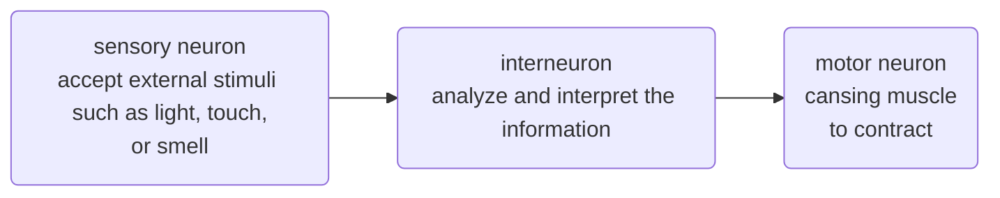
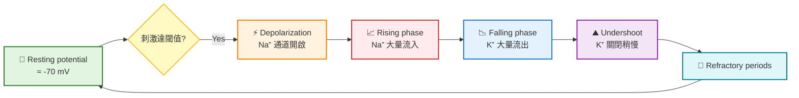

---

title: Chapter_48_Campbell's biology

---

# biology note
## chapter 48: what is electrical signal 🧠
### wha is neuron
- 神經元包含細胞本體 (cell body)、樹突 (dendrites)、軸突 (axon)、軸丘 (axon hillock)
- 突觸 (synapse) 就是軸突跟另一個細胞的間隙，軸突的末端是突觸末梢，由neurotransmitters傳遞訊息
- 訊號的傳遞包含電訊號 (長距離) 跟化學訊號 (短距離)

#### 訊息傳遞過程
- 分成**sensory input** (感官接收)、**integration** (整合)、**motor output** (動作輸出)

- 神經元的形狀多變，由簡而繁，取決於其功能，神經束 (nerves) 就是一堆軸突的聚集

- 動物的複雜神經元包含CNS (**central nervous system**，來自神經管) 以及PNS (**peripheral nervous system**，來自neural crest cell)，兩者都需要支持細胞 (也就是膠細胞，**gilal cell，gila**)

### membrane potential
- 膜電位平常處於靜止膜電位 (resting potential)，當電位開始變化到一定值時，被稱為動作電位 (action potential)
- 鈉鉀幫浦其實不是產生膜電位的主因。人家最主要做的，是讓 **" $Na^+$ 在膜外多， $K^+$ 在膜內多"** 這件事。
- 產生膜電位的最主要原因，來自於膜上的離子通道數量不一。通常，鉀離子通道多於鈉離子通道。
- 鈉離子會偏向流入細胞，鉀離子會偏向流出細胞，但是鉀離子通道比較多，因此產生靜止膜電位 (等一下會詳細討論)
> [!Tip] 
> 基本概念: 3鈉出，2鉀進，**鉀出得去，鈉進不來**。🐱

### what is electrochemical gradient
- 電化學梯度主要由兩個東西影響。分別是濃度梯度跟電場梯度。
- 屬於選擇性滲透 (**selective permeability**)

#### 濃度梯度
- 跟滲透壓有關。離子從濃度高的地方 → 濃度低的地方擴散
- 假如說 $K^+$ 沒有帶電，那麼 $K^+$ 應該會均勻分布在整個燒杯裡面
- 然而，我們發現， $K^+$ 明顯在左側比較多，濃度並沒有平衡
- 因此只有一種可能，這些離子帶電，產生了電場梯度，拉動了 $K^+$ 離子，使其無法完全均勻分布
- 同樣的邏輯也用在 $Na^+$ 上

#### 電場梯度
- 要是我在一杯氯化鉀溶液裡面植入一對電極，那麼離子會往與其電荷相反的電極跑去 (正離子跑向負極，反之)
- 也就是說，我們可以理解成，離子會偏向 "中和電場" 的方向
- 但是我們實際測量會發現，膜電位並不是0，原因就是因為，兩邊膜的離子濃度不一，濃度梯度產生的力量會促使$K^+$離子往濃度較低的方向跑過去
- 同樣的邏輯也用在$Na^+$上

#### Nernst equation 
##### 公式主體
- 在計算單一離子導致的靜止膜電位時，使用的公式如下:

$$
\begin{align}
E_\text{ion} &=\frac{RT}{zF}\, \ln (\frac{[\text{ion}]_\text{out}}{[\text{ion}]_\text{in}})\\[0.6em]
& \text{其中:}\\[0.6em]
E & =\text{該離子造成的膜電位}\\
z & =\text{離子電荷}\\
R & =8.314\, J/mol\cdot K\\
T & =\text{絕對溫度}\\
F & =\text{法拉第常數:}\, 96485\, C/mol
\end{align}
$$

- 我們可以基本將其簡化成:

$$
\boxed{E_\text{ion}=\frac{62}{z}\,\text{mV} (\log\frac{[\text{ion}]_\text{out}}{[\text{ion}]_\text{in}})}
$$

##### 接下來我們來開始可怕的計算地獄吧... 🙂

- 我們目前已知各個離子的梯度，如下:

|ion types|細胞內濃度|細胞外濃度|
|---|---|---|
|鉀離子 $K^+$|140 mM|5 mM|
|鈉離子 $Na^+$|15 mM|150mM|
|氯離子 $Cl^-$|10 mM|120 mM|

- 我們分別根據濃度在膜的內外放入氯化鉀跟氯化鈉
- 如果該膜僅選擇性滲透鉀離子，那麼膜電位為:

$$
E_K = \frac{62}{+1}(\log\frac{5}{140})=-89.72\,\text{mV}
$$

- 如果該膜僅選擇性滲透鉀離子，那麼膜電位為:

$$
E_{Na}= \frac{62}{+1}(\log\frac{150}{15})=+62\,\text{mV}
$$

- 由於膜上面同時有鉀離子跟鈉離子，所以我們可以推測，無論是在靜止膜電位、去極化、過極化，膜電位基本上都會在大約 -90mV跟+62mV 之間
- 因為膜對 $K^+$ 的通透性最高，靜止電位就接近 $K^+$ 的平衡電位 (通常在 -70 ~ -90 mV)

#### 補充: Goldman–Hodgkin–Katz (GHK) equation
##### 公式主體

$$
V_m = \frac{RT}{F} \ln \left(\frac{P_K[K^+]_\text{out} + P_{Na}[Na^+]_\text{out} + P_{Cl}[Cl^-]_\text{in}}{P_K[K^+]_\text{in} + P_{Na}[Na^+]_\text{in} + P_{Cl}[Cl^-]_\text{out}} \right)
$$

- 其中， $P$ 為膜對該離子的通透性
- 通道密度越大， $P$ 的權重越大
- GHK方程式僅適用於單價離子，對於某些通透性低的離子 (如 $Ca^{2+}$ )，可忽略不計
##### 舉栗 🌰
- 對於人體神經細胞來說，如下:

|ion types|細胞內濃度|細胞外濃度|通透性比值|
|---|---|---|---|
|鉀離子 $K^+$|140 mM|5 mM|1.0|
|鈉離子 $Na^+$|15 mM|150mM|0.04|
|氯離子 $Cl^-$|10 mM|120 mM|0.45|

$$
\begin{align}
& \text{膜內狀態:}\\[0.5em]
& P_K[K^+]_\text{out} + P{Na}[Na^+]_\text{out} + P_{Cl}[Cl^-]_\text{in} \\[0.3em]
& = (1.0)(5) + (0.04)(150) + (0.45)(10) \\[0.3em]
& = 5 + 6 + 4.5 = 15.5\\[1em]
& \text{膜外狀態:}\\[0.5em]
& P_K[K^+]_\text{in} + P_{Na}[Na^+]_\text{in} + P_{Cl}[Cl^-]_\text{out} \\[0.3em]
& = (1.0)(140) + (0.04)(15) + (0.45)(120) \\[0.3em]
& = 140 + 0.6 + 54 = 194.6\\[1em]
& \text{代回公式:}\\[0.5em]
& V_m = \frac{RT}{F} \ln (\frac{15.5}{194.6})
\approx 26.7 \times -2.5301
\approx \boxed{-67.55\text{mV}}
\end{align}
$$

- 因此可推斷出，人的神經細胞的靜止膜電位大概是$-67.55\text{mV}$

#### how to caculate the free energy $\Delta G$ ?

##### 公式主體
- 想要計算 "溶質從 $C_S$ 跑到 $C_E$ "，可用以下公式:

$$\Delta G = RT \,\ln\frac{C_E}{C_S}+zF\Delta \psi$$

- 此公式相當於 "運輸一莫耳的物質需要的能量"，並同時將濃度梯度跟電場梯度加起來
- 此處的 $\Delta \psi$ 就是剛才計算的膜電位
##### 舉栗 🌰
- 一樣，我們的各個離子濃度如下:

|ion types|細胞內濃度|細胞外濃度|
|---|---|---|
|鉀離子 $K^+$|140 mM|5 mM|
|鈉離子 $Na^+$|15 mM|150mM|

- 同時我們以剛才算的為例，定義膜電位: $-67.55\text{mV} \approx -0.068\text{V}$
- 我們分別計算鈉離子跟鉀離子的跨膜運輸的自由能

$$
\begin{align}
\Delta G_{Na^+} & = RT \,\ln\frac{[Na^+]_E}{[Na^+]_S}+zF\Delta \psi\\[0.5em]
& =8.314\times 310\,\text{K}\times (\ln\frac{0.150}{0.015}) + 1\times 96485\times (+0.068)\\[0.5em]
& =5935+6561=12.496\,\text{kJ/mol}\\[1em]
\Delta G_{K^+} & = RT \,\ln\frac{[K^+]_E}{[K^+]_S}+zF\Delta \psi\\[0.5em]
& = 8.314\times 310\,\text{K}\times (\ln\frac{0.140}{0.005}) + 1\times 96485\times (- 0.068)\\[0.5em]
& = 8588+(-6561)=2.027\,\text{kJ/mol}
\end{align}
$$

- 由於鈉鉀幫浦為 "3鈉出，2鉀進，使用1 ATP" ，因此我們可以推測每使用1 ATP，用來運輸的能量為:

$$\Delta G_\text{total}=3\times 12.496 + 2\times 2.027= +41.542\,\text{kJ}$$

- 雖然ATP水解的自由能為$-30.5\,\text{kJ/mol}$，但是在身體的狀態條件下，為高 ATP/低 ADP的比例，這樣會讓反應更偏向釋放能量。因此ATP水解的實際自由能變化可以達到 $-50\, \text{kJ/mol}$
- 由於 $50>41.542$ ，鈉鉀幫浦確實有辦法用一ATP就做到 "3鈉出，2鉀進" 的目標 🐱

> [!Note]
> $Cl^-$ 和 $Ca^{2+}$ 也有各自的平衡電位，但在動作電位的主要過程中影響較小。

### 動作電位
- 透過電壓門控通道 (voltage gated ion channels) 控制

#### hyperpolarization and depolarization
- 靜止膜電位大概是-72mV，所以過極化就是讓電位往鉀離子通道全開 (-90mV) 更靠近一點，去極化就是讓電位往鈉離子通道全開 (+62mV) 更靠近一點
- 不過只要沒有超過threshold，通常不久之後，膜電位會漸漸回到-72mV
- 然而，有些通道受到膜電位目前的狀態影響，如果超過某個threshold，就會開啟，這也是動作電位的原理

#### action potential
- 動作電位具有恆定的幅度，屬於all-or-none特性
##### 1. Resting Potential
- 細胞維持在約 -70 mV，大多數電位門控鈉和鉀通道是關閉的，靜止膜電位]主要由鉀通道決定
- $K^+$ 漏通道開放， $K^+$ 持續外流
- $Na^+/K^+$ ATPase 幫浦維持濃度梯度
- 膜電位接近 $K^+$ 的平衡電位

##### 2. Depolarization
- 刺激使電壓依賴性 $Na^+$ 通道開始開啟。
- $Na^+$ 通道快速開啟，$Na^+$ 大量流入
- 膜電位迅速上升，朝向 $Na^+$ 平衡電位 (+62 mV)
- 正回饋: 更多 $Na^+$ 通道被激活

##### 3. Rising Phase
- 動作電位快速衝到峰值。
- $Na^+$ 流入達到最大
- 膜電位接近 +30 ~ +40 mV

##### 4. Falling Phase
- $Na^+$ 通道關閉， $K^+$ 通道打開。
- 電壓依賴性 $K^+$ 通道延遲開啟， $K^+$ 外流
- 膜電位下降回負值
- $Na^+$ 通道進入失活狀態
- **refractory period**，失活狀態下，通道無法立即再開，通道通常不會立即在開啟，動作電位暫時無法出現

> [!Tip]
> - 電壓依賴性 Na⁺ 通道是一種跨膜蛋白，主要由四個重複的結構域 (DI–DIV) 組成，每個結構域有六個跨膜螺旋 (S1–S6)
> - S4 螺旋是電壓感測器，帶有正電荷，會隨膜電位改變而移動
> - 失活門 (inactivation gate)位於通道的胞內環 (通常是 DIII–DIV 之間的連接 loop)，含有一個 "IFM 三肽" (isoleucine–phenylalanine–methionine)，像一個小球或 "蓋子"
> - 在通道開啟後的毫秒內，IFM 三肽會像塞子一樣插入通道的內口，阻止 $Na^+$ 再流入 (失活)
> - 復極化 → 復原: 當膜電位回到負值，通道回到關閉狀態，失活門移開，準備下一次開啟 🐱

##### 5. Undershoot (Hyperpolarization)
- $K^+$ 通道關閉較慢，造成膜電位短暫低於靜止值。
- $K^+$ 外流持續，膜電位降到 -80 ~ -90 mV
- $Na^+$ 通道逐漸恢復到可激活狀態
- 最後回到靜止電位

#### 動作電位傳遞
- 在動作電位產生的部位 (通常是軸丘)，電流會去極化鄰近區域
- 由於失活的 $Na^+$ 通道位於去極化區域前方 (也就是目前過極化的地方)，可防止動作電位反向傳遞
- 一個神經元產生動作電位的 "頻率" 與輸入信號強度成正比
- 編碼離子通道的基因突變會導致影響神經或腦部，或是肌肉、心臟的疾病 (因為肌肉收縮也是一種跟離子通道有關的東西)

#### 軸突的演化適應
- 動作電位的傳遞速度正比於軸突的直徑
- 在脊椎動物中，軸突由髓鞘 (**myelin sheath**) 絕緣，以增加動作電位的速度
- 髓鞘是由膠質細胞形成的: 在中樞神經系統中是寡樹突膠質細胞，而在周邊神經系統中則是許旺細胞 (**Schwann cells**)

- 兩個髓鞘中間沒有被包裹的軸突區域被成為朗氏節 (**node of Ranvier**)，電位門控鈉通道僅在此處才有
- 在髓鞘化的軸突中，動作電位透過跳躍傳導 (**saltatory conduction**)，在node of Ranvier之間跳躍傳遞

### 神經元在synapse與其他細胞溝通
- 絕大多數神經突觸是化學突
- 神經傳導物質在神經元之間傳遞資訊
- 突觸前神經元 (**presynaptic neuron**) 在突觸終末的突觸囊泡中，合成並包裝神經傳導物質。而動作電位會導致期從囊泡中釋放至突觸間隙 (**synaptic cleft**)，神經傳導物質結合到突觸後神經元上的受體

- 有些通道屬於**ligand-gated ion channel**，接收到配體就會打開，導致去極化，產生突觸後電位 (**postsynaptic potential**)

> [!Note]
> 有些ligand-gated ion channel對鈉離子跟鉀離子都有通透性 🐱

#### 突觸後電位類型
##### EPSPs, Excitatory Postsynaptic Potentials
- 通常是配體門控的 $Na^+$ 通道 或非專一性陽離子通道 (可允許 $Na^+$ 進入，有時也允許少量 $K^+$ 外流)
- $Na^+$ 內流 → 使膜電位去極化，導致膜電位更接近閾值，增加動作電位產生的可能性
- 神經傳遞物質例子: 
  - **glutamate** (主要的中樞興奮性神經傳遞物質)
  - **acetylcholine** (神經肌肉接合處)

##### IPSPs, Inhibitory Postsynaptic Potentials)
- 通常是配體門控的 $Cl^⁻$ 通道 或 $K^+$ 通道，可能是:
  - $Cl^⁻$ 內流 → 使膜電位更負（超極化）
  - $K^+$ 外流 → 也使膜電位更負
- 導致膜電位遠離閾值，降低動作電位產生的可能性
- 神經傳遞物質例子: 
  - **GABA** ( $\gamma$ -aminobutyric acid，中樞神經的主要的抑制性神經傳遞物質)
  - **glycine** (在脊髓常見)

#### summation of postsynaptic potentials
- 一個突觸後神經元的細胞體和樹突可能會從數百或數千個突觸終末接收輸入
- 單一個EPSP通常太小，無法觸發後突觸神經元的動作電位
- 個別後突觸電位可以結合，在稱為summation的過程中，產生一個更大的電位，這被稱為summed effect
- EPSPs 及 IPSPs 的總和效應決定突觸後神經元的軸丘要不要傳遞動作電位

> [!Tip]
> 一個IPSP抵銷一個EPSP 🐱

#### 神經傳導物質信號的終止
- 傳遞結束後，神經傳導物質分子會從神經突觸間隙中清除
- 可能是會被酵素水解，或是被再回收到突觸前神經元
- **sarin**抑制分解神經傳遞物質 (acetylcholine) 的酶 (acetylcholine esterase)，導致死亡

#### 突觸的調控
- 有些神經傳遞物的受體不是門控通道，而是**metabotropic receptor** (例如GPCR)，因此，突觸後神經元的離子通過通道的狀態，就取決於一個或多個細胞通路步驟，該通路往往涉及第二信使 (如cAMP)
- 一個神經傳遞物，根據其受體的不同，可導致完全不同的反應 (可以是抑制型，也可以是激動型)

#### acetylcholine
- 調控肌肉運動、記憶形成跟學習
- 脊椎動物有兩種乙烯膽鹼受體，一種為配體門控通道，一種是代謝型受體

##### Nicotine
- 直接結合並活化**菸鹼型乙醯膽鹼受體 (nAChR)**，也就是acetylcholine的配體門控陽離子通道
- 效果: 模仿ACh → 開啟通道 → $Na^+$ 內流 → 去極化 → 促進興奮性突觸後電位 (EPSP)

> [!Tip]
> 屬於 "受體激動劑" (增強ACh的作用，即使沒有真正的ACh存在) 🐱

##### Sarin or VX
- **抑制乙醯膽鹼酯酶 (AChE)**，這是分解ACh的酵素
- 效果: ACh無法被分解 → 在突觸間隙累積 → 持續刺激受體
- 造成過度去極化，肌肉或神經持續收縮，最終導致癱瘓或呼吸衰竭。

> [!Tip]
> 屬於 "酵素抑制劑"，讓ACh的訊號無法關掉 🐱

##### Botulinum toxin 
- 阻斷突觸前神經末端的ACh釋放。它**切斷SNARE蛋白**，讓囊泡無法與膜融合
- 效果: ACh 無法釋放 → 突觸後受體沒有刺激 → 神經肌肉傳導中斷。
- 造成肌肉鬆弛性麻痺

>[!Tip]
> 屬於 "釋放抑制劑"，直接切斷ACh的來源 🐱

#### amino acid
- 包含**glycine、GABA、glutamate**

#### biogenic amine
- 生物胺包括**norepinephrine、epinephrine、dopamine跟serotonin (5-HT)**
- 前三者以**tyrosine**為前驅物，血清素的前驅物是**tryptophan**

#### neuropeptide
- 例如**P物質 (substance P)、內啡肽 (endorphins)**

#### Gases
- 例如**一氧化氮** (nitric oxide， $NO$ )、**少量一氧化碳** ( $CO$ )

| 類別 | 代表性神經傳遞物 | 功能與特色 |
| --- | --- | --- |
| **Amino acids** | **Glutamate** | 主要的興奮性神經傳遞物，促進 EPSPs，參與學習與記憶 (長期增強 LTP)。 |
|  | **GABA ( $\gamma$ -aminobutyric acid)** | 主要的抑制性神經傳遞物，開啟 Cl⁻ 通道，造成 IPSPs，維持神經穩定。 |
|  | **Glycine** | 在脊髓與腦幹常見，抑制性，幫助運動協調。 |
| **Biogenic amines** | **Acetylcholine (ACh)** | 在神經肌肉接合處引起肌肉收縮；在中樞參與注意力、學習。 |
|  | **Dopamine** | 調控動作、獎賞與動機；失衡與帕金森氏症、成癮相關。 |
|  | **Norepinephrine (Noradrenaline)** | 參與覺醒、注意力、交感神經反應。 |
|  | **Serotonin (5-HT)** | 調控情緒、睡眠、食慾；抗憂鬱藥常作用於此。 |
| **Neuropeptides** | **Substance P** | 傳遞疼痛訊號。 |
|  | **Endorphins** | 內生性阿片類，抑制疼痛，產生愉悅感。 |
| **Gases** | **Nitric oxide (NO)** | 非囊泡釋放，直接擴散；調控血管擴張、突觸可塑性。 |
|  | **Carbon monoxide (CO)** | 也可作為訊號分子，調控神經傳導。 |
| **其他** | **ATP** | 可作為神經傳遞物，調控痛覺與神經調節。 |
|  | **Endocannabinoids** | 逆行性傳遞，調控突觸釋放，與食慾、痛覺、情緒相關。 |