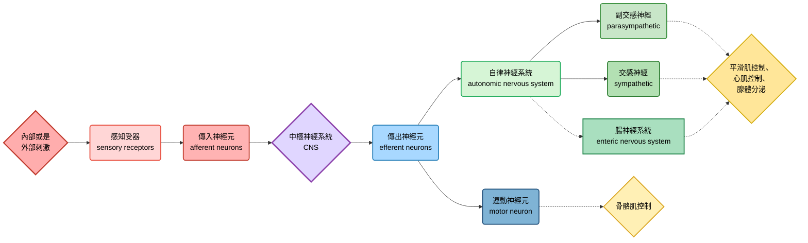

---

title: Chapter_49_Campbell's biology

---

# biology note

## chapter 49: neural regulation in animals
### 我們的神經系統長怎樣
#### 無脊椎動物
- 神經系統再寒武紀大爆發時就有出現，並且各自分化了
- 例如刺絲胞動物門 (cnidarians) 有神經網 (nerve nets)，而更複雜的生物出現神經束 (nerves)
- 海星的神經屬於輻射狀神經束，連結到中樞的 "神經環"
- 兩側對稱動物 (bilaterally symmetrical animals) 產生頭化現象 (cephalization)，主要的處理中心或是感知中心移至頭部
- flatworm就已經有這種現象，也有中樞神經 (central nervous system , CNS)，周邊神經系統 (peripheral nervous system, PNS) 會將信號傳入或是傳出中樞神經系統
- 到了環節動物跟節肢動物，出現了神經節 (ganglia) 的構造

> [!Note]
> - CNS由大腦跟脊髓組成
> - PNS由神經束神經節組成 🐱

- 神經的複雜程度取決於其生活方式，例如不動的軟體動物 (例如雙殼綱) 神經構造就比較簡單，活動量高的軟體動物 (例如頭足綱)，有比較複雜的神經構造

#### 脊椎動物
##### CNS
- CNS發育於中空的神經管，神經管裡面的空間形成脊髓狹窄的中央管 (central canal)，以及大腦的腦室 (ventricles)
- 裡面充滿腦脊髓液 (cerebrospinal fluid)，為中樞神經系統提供營養跟激素，並且帶走廢物
- 大腦跟脊髓有灰質 (gray matter) 跟白質 (white matter)，灰質主要是細胞本體、樹突、未髓鞘化的軸突組成。白質主要由已髓鞘化的軸突束組成
- 脊髓除了接收大腦訊息以及傳遞訊息，也可以獨立於腦部產生反射 (reflex)，例如膝跳反射 (knee-jerk reflex)，有時反射甚至不需要interneuron的參與，只要有sensory neuron跟motor neuron就行

> [!Important]
> - 大腦為**灰質外，白質內**；
> - 脊髓為**灰質內，白質外**。 🐱

##### PNS
- 分為傳出神經元 (**efferent neurons**) 跟傳入神經元 (**afferent neurons**)

- 運動神經元系統 (motor system)，控制隨意肌 (也就是骨骼肌)，在突觸分泌acetylcholine
- 自律神經系統 (autonomic nervous system)，控制平滑肌跟心肌
   - sympathetic division: 負責戰或逃反應 (fight-or-flight)，preganglionic neurons在突觸分泌acetylcholine，postganglionic neurons分泌norepinephrine
   - parasympathetic division: 負責休息跟消化 (rest-and-digest)，preganglionic neurons跟postganglionic neurons都是在突觸分泌acetylcholine
  

- 腸神經系統 (enteric nervous system)，直接控制消化道、胰臟、或是膽囊的部分

#### glial cells, or gila
- 神經膠細胞具有多種功能，包含支持、滋養跟調節神經元
   - 胚胎放射膠細胞 (embryonic radial glia) 形成好幾條渠道，神經元就沿著這些渠道生長跟遷移
   - 星狀細胞 (astrocyte) 形成血腦屏障 (blood-brain barrier, BBB)
   - 兩種細胞都是幹細胞，可以進行細胞分裂跟分化 

### the brain in vertebrates
- 包含三大區域: 前腦 (forebrain)、中腦 (midbrain) 跟後腦 (hindbrain)
- 這切區域在胚胎發育時，來自神經管前端 (anterior)
- 前腦包含嗅球，以及睡眠、學習等等我們常第一時間想到的大腦功能
- 中腦協調感覺輸入的一部份
- 後腦包含非自主的活動 (例如呼吸節律)，以及運動協調

- 中腦跟部分後腦形成腦幹 (brainstem)，與脊髓相連，後腦的另一部份形成cerebellum (小腦)
- 前腦分化成間腦 (diencephelon) 跟端腦 (telencephalon)，間腦變成腦內的內分泌組織，端腦形成大腦主體 (cerebrum)

- cerebrum就是控制骨骼肌、情緒、學習、記憶、認知的地方，尤其在骨骼肌控制、認知跟學習的部分，由大腦皮質擔任重要角色
- 胼胝體 (corpus callosum) 為軸突束，連接左右腦半球
- cerebellum跟平衡感、運動控制有關
- diencephelon的重點就是端視丘、視丘跟下視丘，下視丘控制體溫以及生理時鐘
- brainstem由中腦、橋腦 (pons) 跟延髓 (medulla oblongata) 組成
  - 中腦就是感覺訊息的整合區，會幫忙把整合後的信號發送到大腦特定區域
  - 橋腦跟延髓在周邊神經以及中腦之間幫忙傳遞信號
  - 延髓也控制一些自主功能 (例如呼吸、吞嚥、嘔吐反射等)

#### 睡跟醒的控制
- 覺醒 (arousal) 就是大腦能感知外界信號的狀態，而睡眠 (steep) 雖然能接收外部信號，但是無法感知
- 由brainstem跟cerebrum控制
- 兩個狀態的切換主要由網狀結構 (reticular formation) 控制，這是由中腦跟橋腦的神經元組成的，其調控睡眠周期 (也包含REM跟夢境的部分)
- 生理時鐘由於是由diencephelon控制，因此前腦也算是有參一咖

> [!Tip]
> 海豚的大腦左右會在不同的state之間切換，每一次只會有一邊的腦是 "睡著" 的 !! 👀

#### 晝夜節律
- circadian rhythms的底層機制是周期性的基因表現以及細胞活動
- 通常會跟外界的日夜同步 (通常啦，通宵的我是例外 🙂)
- 在哺乳動物中，該節律由下視丘的 "視交叉上核" (suprachiasmatic nucleus, SCN) 神經元簇協調

#### 情緒
- 由杏仁核 (amygdala)、海馬迴 (hippocampus)、視丘的一部份等等區域控制
- 屬於邊緣系統 (limbic system) 的一部份
- 當有情緒相關的記憶時，amygdala往往會幫助該記憶的提取跟儲存
- 情緒的產生跟體驗是非常複雜的交互作用 (複雜到你會想要摔書的程度 🤣)

#### 影像掃描
- 正子斷層掃描 (positron emission tomography, PET)，透過注射放射性葡萄糖來檢測大腦的代謝活動
- 功能性磁振造影 (functional magnetic resonance imaging, fMRI)，透過檢測局部氧濃度的變化檢測大腦活動
- fMRI應用範圍很廣，包含監測中風之後的復健狀況、提高腦部外科手術的有效性

### 大腦皮質的區塊介紹
- 不同腦葉 (lobe) 控制特定腦區活動，包含額葉 (frontal)、顳葉 (temporal)、枕葉 (occipital)、頂葉 (parietal) 等等

#### 訊息傳遞
##### 1. 感覺輸入 (Sensory Input)
- 感覺器官 (眼睛、耳朵、皮膚等)將外界刺激轉換成電訊號
- 訊號經由感覺神經元傳入中樞神經系統
- 例如: 視覺訊號先到視丘 (thalamus)，再送往初級視覺皮層

##### 2. 初級皮層處理 (Primary Cortical Areas)
- 每種感覺有對應的初級皮層，例如: 
  - 視覺皮層 (枕葉，occipital lobe)
  - 聽覺皮層 (顳葉，temporal lobe)
  - 體感皮層 (頂葉，parietal lobe)
- 在這裡，訊號被初步解碼成基本特徵 (如顏色、形狀、音高、觸覺強度)

##### 3. 聯合皮層整合 (Association Areas)
- 訊號進一步在聯合皮層整合，形成更高階的知覺與意義
- 例如，把 "顏色 + 邊界 + 運動" 整合成 "這是一隻移動的貓咪 🐱"，整合後的訊息可以傳遞到其它腦區，例如: 
   - parietal lobe可以做空間定位、感覺整合
   - temporal lobe幫忙語言理解 (例如Broca's area)、記憶
   - frontal lobe負責決策、計劃、執行控制

##### 4. 運動輸出 (Motor Output)
- 訊號由初級運動皮層發出，經由脊髓運動神經元到達肌肉
  - 小腦可以幫忙協調動作、平衡
  - basal ganglia可幫忙動作啟動與抑制

> [!Important]
> 在somatosensory cortex跟motor cortex，不同cortex區域負責不同的身體部位 !! 👀

#### 語言輸出跟輸入
- **Broca’s area**負責把語言 "說出來" (缺失的話，只能聽懂，無法說話)
- **Wernicke’s area**負責 "理解語言" (缺失的話，可以說話，但無法溝通)

#### 皮質的功能側化現象
- 左腦半球主要負責語言、邏輯的部分 (所以Broca’s area等區域也在這個位置)
- 右腦半球負責更多圖形跟臉部辨識、非語言化思考
- 這左右腦功能有差異的現象，被稱為 "側化" (lateralization)，不過由於有corpus callosum，所以兩個半球的分工還是能夠協調

> [!Note]
> corpus callosum的切開會導致 "裂腦現象" 的發生 ("split brain" effect) 🤔

#### 額葉的功能
- 額葉的損害可能影響決策能力以及情緒反應，但是不會妨礙記憶力跟智力，也就是說，額葉更重要的功能叫做 "執行" (就是CEO啦)
- 經典翻車案例包含:
  - Phineas Gage (1848)，鐵棒意外穿過個體的額葉 (這人活下來也是奇蹟)，智力與基本感覺運動功能保留，但性格劇烈改變——變得衝動、粗魯、缺乏計劃性。該案例首次顯示額葉與人格、社會行為密切相關

  
  - lobotomy (1930~1950)，透過冰錐手術來切除額葉，當時用於治療精神疾病，患者焦慮或攻擊性減少，但同時失去情感深度、判斷力與自主性。後來被認為是過度破壞性的治療，逐漸被淘汰

#### 鳥類為甚麼這麼聰明? 🐥
- 鳥類並沒有跟人類等哺乳動物類似的neocortex，神經元的排列方式也不太一樣，但是整合訊息的能力依然很高
- 目前認為，鳥類整合訊息的地方，位於大腦頂部跟外側，細胞核叢聚的區域 (這地方被稱為pallium)

##### 哺乳類 cortex
- 典型的六層結構 (laminar organization): 從分子層到多形層，每層有不同的神經元型態與連結模式
- 這種層狀結構讓訊息能在垂直柱狀單位 (cortical columns) 中高效處理。

##### 鳥類 pallium
- 沒有明顯的六層結構，而是呈現核團式 (nuclear organization): 神經元聚集成團塊，而非層狀排列
- 雖然缺乏層狀，但這些核團之間的連結模式能達到類似哺乳類皮質的功能分工

> [!Note]
> 鳥類 pallium 與哺乳類 cortex 在結構上不同 (層狀 vs 核團)，但在功能上卻有高度相似性，這也是 "趨同演化" 案例 😏

### 突觸連結的變化
- 基因表現跟訊號傳遞決定跟調控神經元的形成位置
- 然而，在競爭生長支持因子的過程中，胚胎發育產生的神經元，只有一半能存活到成年，其他都死光了

> [!Important]
> 承認吧，你家小孩的神經元比你還多 !!

#### 神經可塑性
- 代表神經系統出生後會重塑的能力
- 神經可塑性缺陷可能是自閉症譜系障礙的潛在病因 (autism spectrum disorder)，表現症狀包含溝通跟社交互動障礙、重複跟強迫行為等
- 這種疾病其實有遺傳傾向
- 如果兩個突觸 (這兩個突觸可能來自於完全不同區域的神經元) 常常**同時一起放電**，他們倆的信號都會增強
- 反之，如果出現放電的不同步或是延遲，反而會降低信號，甚至是突觸萎縮

#### 記憶跟學習
- 神經可塑性跟記憶有關係，短期記憶跟海馬迴形成的暫時連結有關係，而在長期記憶，大腦皮質的連結最終會取代海馬迴的暫時連結
- 也就是說，海馬迴病不是幫你儲存存舊的記憶，而是幫你形成新記憶。你的長期記憶連結已經在大腦皮質裡面形成了
- 記憶的鞏固過程，可能一部份發生在睡眠階段
- 記憶的丟失，以及海馬迴的損害，可能跟失智 (例如Alzheimer’s disease) 有關係 

#### LTP, long term potentiation
- 整個過程可以分為三個主要階段: **誘導 (Induction)**、**維持 (Maintenance)** 與 **表現 (Expression)**
##### 關鍵角色
- **突觸前神經元**: 釋放神經傳導物質**麩胺酸 (Glutamate)**。
- **突觸後神經元**: 主要有兩種麩胺酸受體: 
    - **AMPA 受體**: 平時負責快速傳導訊號。一旦結合麩胺酸，會讓鈉離子 ( $Na^+$ ) 流入，造成去極化。
    - **NMDA 受體**: 平時被鎂離子 ( $Mg^{2+}$ ) 堵住通道口。需要 "強烈的去極化" 才能把鎂離子踢開。它允許鈣離子 ( $Ca^{2+}$ ) 流入，這是啟動 LTP 的關鍵。

##### 第一階段: 誘導 (Induction) 

- 這個階段需要突觸後神經元產生 "強烈去極化"
1. **高頻釋放麩胺酸**: 突觸前神經元因高頻刺激，反覆釋放大量麩胺酸到突觸間隙。
2. **AMPA 受體引發初步去極化**: 麩胺酸與突觸後膜上的AMPA受體結合， $Na^+$ 快速流入，產生EPSP。雖然一般單次刺激的EPSP很小，但高頻刺激讓EPSP不斷疊加，膜電位顯著上升
3. **NMDA 受體的鎂離子阻斷被解除**: 當膜電位因疊加的EPSP達到足夠去極化，原本堵在NMDA受體通道口的 $Mg^{2+}$ 會因電荷排斥而被踢開
4. **鈣離子湧入**: 此時NMDA受體通道開啟，除了 $Na^+$ 流入， $Ca^{2+}$ 也大量流入突觸後細胞內。這些 $Ca^{2+}$ 是啟動 LTP 的關鍵第二信使
5.  **活化 $Ca^{2+}$ 依賴性酵素**: 流入的 $Ca^{2+}$ 會結合並活化多種酵素，最重要的是 **CaMKII (鈣/鈣調蛋白依賴性蛋白激酶 II)** 和 PKC、PKA 等

##### 第二階段: 表現 (Expression) 
- 這個階段發生在誘導後數分鐘內，突觸反應立即變強。效應包含:
1. **AMPA受體磷酸化**: 活化的CaMKII會直接磷酸化已存在突觸後膜上的AMPA受體，使其對麩胺酸的敏感度提高、通道開啟時間變長。這導致每次刺激能產生更大的EPSP
2. **更多AMPA受體插入膜中**: 細胞內的AMPA受體 (原本儲存在胞內囊泡中) 會受到 CaMKII 及其他訊號的驅動，快速移動並插入到突觸後膜上。這增加了受體的總數目，對麩胺酸的反應更強
3. **突觸後結構初步變化**: 突觸後密度 (PSD) 區域變大、結構更穩固。
- 當下次再給予單次刺激時，即使只釋放少量麩胺酸，突觸後神經元也會因為有更多、更敏感的 AMPA 受體而產生遠比 "LTP 誘導前" 更大的EPSP

##### 第三階段: 維持 (Maintenance) 
- 如果要讓LTP持續數小時、數天甚至更久，需要蛋白質合成與結構改變。
1. **逆行訊息傳遞**: 突觸後細胞產生的某些訊號會傳回突觸前細胞，促進它釋放更多麩胺酸，形成正回饋
2. **基因表達與新蛋白質合成**: $Ca^{2+}$ 流入也會活化其他路徑 (如 MAPK/ERK)，最終影響細胞核，轉錄CREB (cAMP 反應元件結合蛋白)相關基因。這些基因會製造新的蛋白質 (包括新的AMPA受體、細胞骨架蛋白等等)
3. **突觸結構重塑**: 新合成的蛋白質被送到特定突觸，導致:
    - 突觸後膜面積增大、密度變厚
    - 可能產生新的突觸棘 (dendritic spine)
    - 突觸前末梢也跟著增大、囊泡增多

##### 總結圖表

| 階段 | 關鍵事件 | 主要分子 | 時間尺度 |
| :--- | :--- | :--- | :--- |
| **誘導** | 強烈去極化 → Mg²⁺ 離開 NMDA 受體 → Ca²⁺ 流入 | NMDA 受體、Ca²⁺ | 毫秒至秒 |
| **表現** | AMPA 受體磷酸化 + 更多 AMPA 受體插入膜 | CaMKII、AMPA 受體 | 分鐘至小時 |
| **維持** | 蛋白質合成、突觸結構改變 | CREB、PKMζ、新蛋白質 | 小時至天 |

> [相關資訊可以參考這一篇文章喔~](https://pmc.ncbi.nlm.nih.gov/articles/PMC3367554/)，或是直接參考doi: 10.1101/cshperspect.a005710 😏

### nervous system disorders
#### schizophrenia
- 思覺失調症，aka精神分裂，通常症狀包含幻覺 (hallucinations) 跟妄想 (delusions)，約有1%的人口罹患
- 有很強的遺傳傾向，當然，環境因子也會影響，一致率大概是48%
- 被認為是多巴胺通路的失調導致，D2受體的拮抗劑常常用來緩解症狀 (例如risperidone)

#### depression
- 一般的抑鬱症狀包含失去興趣跟愉悅感 (anhedonia)，或是動機喪失
- 雙極性情感疾患 (bipolar disorder，也就是躁鬱症)，會有manic跟depressive phase的交替狀態
- 通常會透過活化生物氨的作用路徑來緩解症狀，例如作用在血清素 (SSRIs，例如fluoxetine)、或是作用在正腎上腺素和多巴胺 (NDRIs，例如bupripion)

#### drug addiction
- 通常跟邊緣系統的中腦邊緣迴路有關係，主要影響神經傳遞物為dopamine
- 有些藥物之所以會成癮 (例如苯乙胺類藥物)，是因為其過度活化了中腦邊緣迴路導致
- 會導致強迫型的服用藥物或是成癮物，且難以控制。長期的獎勵迴路活化也會促進LTP (只是不太好的那種 🤣)

> [!Note]
> 核心路徑是**中腦腹側被蓋區 (VTA) → 伏隔核 (nucleus accumbens) → 前額葉皮質**

##### Nicotine
- 結合在VTA的菸鹼型乙醯膽鹼受體 (nAChR)
- 直接促進VTA多巴胺神經元放電 → 增加伏隔核的多巴胺釋放

##### Alcohol
- 主要透過GABA_A受體增強 (抑制性) 與NMDA受體抑制 (興奮性)
- 在VTA中，酒精減少抑制性GABAergic神經元的活性 → 解除對多巴胺神經元的抑制 → 多巴胺釋放增加

##### Opioids
- 結合在VTA的 $\mu$ 受體，其主要位於GABAergic抑制性神經元上
- 抑制這些GABA神經元 → 減少它們對多巴胺神經元的抑制 → 多巴胺神經元放電增加

#### Alzheimer’s disease, AD
- 屬於失智 (dementia) 的一種，隨著年齡增長，罹患風險也會上升
- 被認為跟類澱粉斑塊、神經纖維纏結、以及tau蛋白過度磷酸化有關係
- 會導致腦組織大量萎縮 (也就是神經元死亡)
- 目前沒有治癒方法，但有些藥物可以緩解症狀
- 被認為有些基因跟這個疾病有關係 (如APOE4)

> [!Note]
> 在chronic traumatic encephalopathy (慢性創傷性腦病，CTE) 中，也有發現tau蛋白累積的症狀 🤔

#### Parkinson’s disease, PD
- 由於分泌dopamine的神經元 (黑質腹側的緻密部) 喪失所導致的疾病
- 症狀包含肌肉震顫、姿勢平衡障礙、運動遲緩等等
- 被認為跟基因有關係 (例如SNCA、LRRK2)
- 治療方式包含使用L-dopa (dopamine前驅物的一種):

$$L-dopa\xrightarrow{dopa\ decarboxylation} dopamine$$
