# biology note
## Chapter 43: transport system
### 物質交換
- 小分子可以透過diffusion在細胞跟環境間交換
- 但是單純擴散只有在小距離有用，因為擴散的時間跟擴散距離的平方成正比:
$$
t\propto d^2
$$
- 簡單的生物可以直接進行擴散，但是多數大型動物需要**利用循環系統**
#### 消化循環腔
- 刺絲胞動物沒有循環系統，他們有的是gastrovascular cavities，作為消化跟養分分配的手段，體腔跟消化循環腔只有兩層細胞厚
- flatworm也有消化循環腔，三胚層的身體

#### 循環系統
- 循環系統包含**循環的液體、內部連接的系統、幫蒲 (也就是心臟)**，用來交換氣體、吸收養分、帶走代謝廢物
- 可分為開放式跟閉鎖式循環，節肢動物跟一部份軟體動物 (如腹足綱) 屬於開放式，傳送的液體叫做hemolymph，所有臟器都浸泡在裡面
- 閉鎖式循環系統中，血液跟臟器沒有直接接觸，而是在封閉的血管裡面流動，例子包含環節動物、頭足綱、脊椎動物
> [!Tip]
> 開放式系統優勢: 更省能量
> 閉鎖式系統優勢: 物種可以長更大、傳送營養更有效率

#### 脊椎動物的循環系統
- 又稱為心血管系統 (cardiovascular system)
- 三種血管包含arteries，veins，以及capillaries，單方向循環
- 具體的方向為**arteries → arterioles → capillaries → venules → veins**
> [!Caution]
> Arteries跟veins的分法是透過 "血流方向是遠離心臟還是接近心臟" 來分，而不是其血液的含氧量 !
- 血液進入 atria (心房) ，然後從 ventricles (心室) 被打出去
- 脊椎動物的心臟chambers數量跟位置大不相同
#### single circularion
- 魚類 (軟骨跟硬骨) 為單循環，兩個chamber的心臟
#### double circulation
- 兩棲類、爬蟲類跟哺乳動物為雙循環，低氧血在心臟右側，高氧血在心臟左側
- 在爬蟲跟哺乳動物，低氧血會經過pulmonary circuit (肺循環)，從肺臟接收氧氣
- 在兩棲類身上，低氧血會經過pulmocutaneous circuit (肺皮循環)，從廢跟皮膚接收氧氣
- 高氧血由systemic circuit傳送
- 基本上，雙循環動物的血壓會比單循環還要高
#### 演化上的雙循環差異
- 有些雙循環系統動物能進行 "間歇性呼吸" (intermittent breathers)
- 兩棲跟爬蟲動物可以長時間不進行氣體交換
- 兩棲類主要是三腔室心臟，兩心房一心室
  - 心室裡面的充氧跟缺氧血可以相互混合，但通常有一個脊狀結構，把大部分的充氧血帶到體循環，缺氧血帶到肺皮循環
  - 青蛙在水面下時，基本上血液不經過肺臟
- 多數爬蟲動物也是三腔室心臟，心室中間由發育不全的隔膜分開缺氧跟充氧血
- 鱷魚的心室隔膜發育完好，而且**肺循環跟體循環有在其間相連**
> [!Note] 
> 通常是在右心室 (也就是連接肺動脈的地方)，多開一個通道 (又稱為Panizza tube)，讓缺氧血流到體循環當中 👀
- 鳥跟哺乳類就是四腔室心臟，兩心房兩心室。他們屬於內溫動物，通常需要更多的氧氣

### 深入探討
#### 哺乳動物循環系統
- 右心室打出血液，讓血液進到肺循環
- 血液到微血管床中 (又稱為capillary beds)，在那裏釋放二氧化碳，接收氧氣
- 然後透過肺靜脈 (pulmonary veins) 進到左心房
- 充氧血從左心室打出去，透過主動脈 (aorta)，進到體循環
- aorta的第一個分支為冠狀動脈 (coronary arteries)，為心臟提供氧氣
- 接下來就是傳到微血管床，提供身體氧氣，並且二氧化碳從組織溶入血漿
- 血液匯聚到小靜脈，然後再連接到靜脈。靜脈分為上腔跟下腔靜脈 (superior & inferior vena cava)，把上半身跟下半身的血液匯聚到右心房，然後最終進到右心室

#### 心臟節律
- 心臟由心肌組成，兩個心防的心肌壁較薄，心室的心肌較厚
- 心臟收縮期被稱為systole phase，舒張期被稱為diastole phase
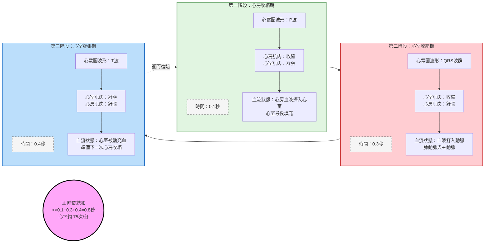
- cardiac output = 心臟每分鐘輸出的血量，和心律 (一分鐘跳多少次) 跟stroke volume (一次心搏的輸出量) 有關
- 一共有四個瓣膜 (valves): 
  - 房室瓣 (atriovemtricular valves, AV valves)，隔開心房跟心室
  - 半月瓣 (semilunar valves)，隔開心室和大血管 (aorta跟pulmonary artery)
- 心跳的聲音 (撲通)，第一心音為血液撞擊房室瓣的聲音，第二心音是血液撞擊半月瓣的聲音
- 如果瓣膜有缺陷，導致血液逆流出現，會導致心雜音 (heart murmur)
#### 維持心律
- 心肌細胞為自發節律 (autorhythmic)，不需要神經系統即可收縮
- 竇房結 (sinoatrial node, SA node) 位於右心房上側，決定心臟的收縮，這些傳導的脈衝可以用心電圖紀錄 (electrocardiogram, ECG)
- 房室結 (atrioventricular node, AV node) 位於右心房下側，接收SA node的脈衝
- 脈衝延遲，傳到Purkinje fiber (位於兩側心室肌肉)，導致心室收縮
- SA node的脈衝受到自律神經的影響，同時也受到激素跟體溫的影響

|階段|對應到|
|---|---|
|P波|來自SA node的訊號傳到心房|
|PQ間期|電信號延遲傳導，讓心室有時間流入血液|
|QRS波群|心室去極化，導致心室強力收縮，打出血液|
|ST間期|去極化到再極化的期間，心室持續收縮的階段|
|T波|心室再極化，心室回復舒張|

### 血管跟血壓
#### 血管結構
- 血管中的內皮細胞能降低血流阻力
- 微血管大概跟紅血球質鏡差不多寬，血管只有一層內皮細胞厚 + 基底膜，幫助物質交換
- 動脈跟靜脈都有內皮細胞、平滑肌跟結締組織，動脈血管壁有彈性 (因為內部血壓較高)，靜脈血液血壓低，所以血管壁比較鬆弛，還包含瓣膜，防止血液逆流
#### 血液流速和血壓
- 血液從動脈到微血管，速率越來越慢，阻力增加，總橫截面積增加
- 從微血管到靜脈，總橫截面積減小，血流速度逐漸回升到原本速率的一半
- 血管壁回彈是維持血壓的原因之一，當血液流到微血管時，阻力增加，因此血壓開始降低
- 血壓分為收縮壓 (systolic pressure) 跟舒張壓 (diastolic pressure)，前者為心臟收縮時的動脈血壓 (最高)，後者為心臟舒張時的動脈血壓 (較低)，使血壓在動脈如同波一樣傳遞
- 血管舒張跟收縮為平滑肌改變小動脈的直徑造成的結果，造成血壓上升或是下降
- 一氧化氮 (nitric oxide, $NO$) 是血管的擴張劑，而內皮素 (endothelin) 微血管的收縮劑

#### 血壓和重力的關係
- 量血壓時，測量的動脈要跟心臟等高，正常的血壓在靜息時通常為 (120/70 mmHg)，因為重力會影響血壓高低
- 長頸鹿需要有非常高的收縮壓，好把血液打到高處
- 靜脈的瓣膜讓血液抵抗重力，避免逆流。同時，骨骼肌跟靜脈平滑肌的收縮也有防止逆流的功能

#### 微血管和淋巴系統
- 多數的微血管並沒有血液流過，通常只有5~10%的微血管是被使用的
- 動脈的收縮跟舒張，以及微血管前括約肌 (precapillary sphincters)，控制血流的分布
- 不同化學物質、激素跟神經衝動調控血流的分配
- 物質的交換在血液跟組織液之間進行
- 血漿中的蛋白質增加血液滲透壓，促進組織液回到血管，而血壓傾向於將血漿壓出血管。通常出大於進，導致組織中的液體增加
- 這些液體被稱為淋巴 (lymph) ，會透過淋巴系統，從脖子的靜脈重新回到血液裡面
- 淋巴管一端為盲端，接收組織中的液體，淋巴管裡面也有瓣膜
- 水腫 = 淋巴液回不到血液裡造成
- 淋巴結過濾淋巴中的病原體，當身體受到感染時，淋巴結會腫大

### 血液的成分
- 屬於結締組織的一種，血漿占大宗 (55%)，其餘為細胞 (45%)

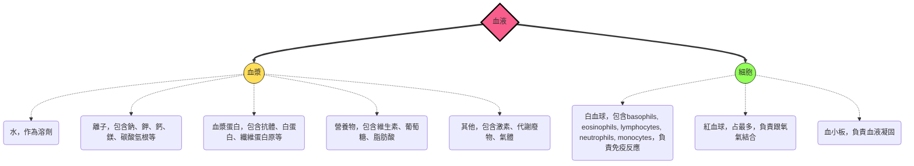
#### plasma
- 血漿的蛋白質影響pH值，維持血液滲透壓。有些血漿蛋白也作為傳輸脂肪 (脂蛋白)、免疫 (抗體)、或是血液凝固 (纖維蛋白原)
- 組成成分跟組織液很像，不過血漿的蛋白質通常更多
#### RBC, WBC and platelets
- erythrocytes (紅血球) 
  - 佔血球最多，包含血紅蛋白，裡面的血基質 (heme) 可以跟氧氣結合，一個血紅蛋白有四個heme → 最多四個氧氣
  - 多數紅血球在哺乳動物中沒有粒線體和細胞核
  - 鐮刀型紅血球貧血會產生不正常的血紅蛋白 (Glu → Val, point mutation)，它們會形成長纖維，導致紅血球呈鐮刀狀，這些血球會阻塞血管，導致劇痛或是器官腫脹
  - 血球數量大減 (多數被快速消耗)
- Leukocytes (白血球)
  - 總共有五種，防禦方式包含吞噬作用，或是對異物產生免疫反應 (包含生成抗體跟細胞因子)
  - 在循環系統內，或是在組織內都會出現
- Platelets
  - 細胞碎片，作為血液凝固用

#### Stem cells
- 血球跟血小板都來自紅骨髓的幹細胞
- 紅血球生成素 (erythropoietin, EPO) 在氧氣較少的時候負責幫忙生成紅血球，重組的EPO可以用來治療貧血

#### 血液凝固
- coagulation = 血液變成血塊的過程
- 級聯反應讓fibrinogen活化成fibrin
- 如果血塊生成在血管裡面，被稱為thrombus (血栓)，可能阻礙血流，導致心肌梗塞或是中風
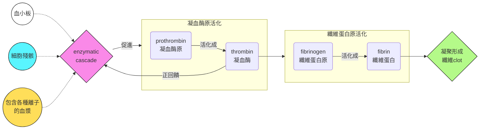
#### 心血管疾病
- Cardiovascular diseases 的範圍從心臟功能不整到供血的中斷都有
- 動脈硬化 (atherosclerosis) 是因為脂肪產生的斑塊積累在動脈導致的
- 動脈內皮的損傷會導致發炎，白血球聚集
- 脂肪沉積出現 (plaque)，血管內皮變硬，如果斑塊破裂，會產生thrombus
- 心臟病發 (myocardial infarction，心肌梗塞)，是因為冠狀動脈阻塞導致心肌組織缺氧，中風 (stroke) 是因為頭腦的動脈阻塞導致神經元缺氧
- 心絞痛 (angina pectoris) 通常就是冠狀動脈部分阻塞導致的胸痛
- 動脈阻塞可以透過手術治療，如下:

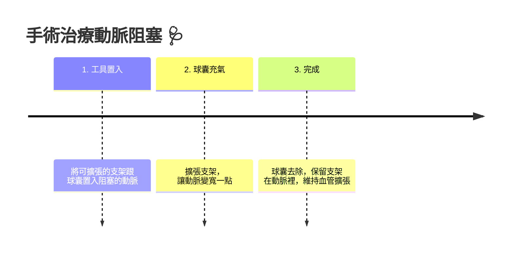
#### 危險因子
- LDL負責把膽固醇運到細胞，用於細胞模建造
- HDL用來去除多餘的膽固醇，並將其運回肝臟
- 高LDL/HDL比例，會導致心血管疾病風險增加
- 炎症也是風險因子之一
> [!Note]
> statin是一種藥物，可以降低LDL的量
> Aspirin可抗炎，也有助於降低心血管疾病

### 氣體交換
#### 分壓的影響
- 分壓 = 某氣體在混合氣體中所佔的壓力
- 分壓影響液體在水中的溶解度
- 在同樣體積下，水中的氧氣量往往比空氣中更少，因此，在水中需要更有效地獲得氧氣
- 獲得氧氣的媒介 (respiratory surfaces) 包含皮膚、鰓、肺、氣管等

#### Gills
- 鰓有非常大的表面積，水生動物會讓水流過鰓
- 利用逆交換系統 (countercurrent exchange system)，讓血流方向跟水流流過的方向不一樣，這讓魚可以吸收80%的水中氧氣

#### Tracheal systems
- 昆蟲的氣管系統由分支的管形成網路，直接讓氧氣通過系統傳給身體細胞
- 因此，昆蟲的呼吸系統跟循環系統分開，氣管會分支成tracheole (小氣管)，小氣管直接連接體細胞
#### Lungs
- 肺相當於表面積內摺的一個器官，大部分的爬蟲或是哺乳動物幾乎完全依賴肺臟進行氣體交換

#### 詳細了解下哺乳動物的呼吸方式
- 分支的管子將氣體傳送到肺部，鼻孔先進行空氣的過濾
- 咽 (pharynx) 控制器體到肺臟&食物到胃裡
- 吞嚥的時候，喉部 (larynx) 向上移動，導致會厭 (epiglottis) 覆蓋在聲門上，防止食物掉入氣管
> [!Tip]
> **epiglottis = epi + glottis = 在聲門上方的結構**

- 空氣經過**pharynx → larynx → tranchea → bronchi → bronchioles → alveoli**，在此處進行氣體交換
- 氣管壁上的纖毛跟黏液將空氣中的微粒往上排除，最後跑回咽部，被推到食道裡面
- 肺泡 (alveoli) 位於細支氣管 (bronchioles) 末端，氧氣透過上面的表皮層進到微血管，二氧化碳反之
- 肺泡沒有纖毛，容易受到感染，肺泡的表面有surfactants，如果缺乏這個東西 (例如一些嬰兒)，容易導致RDS (respiratory distress syndrome，呼吸窘迫症候群，症狀為肺泡積水)

### 如何讓氣體進入肺臟
#### amphibian
- 使用正壓呼吸，把氣體灌進氣管，然後呼氣時，肺部跟體壁壓力導致回彈
#### birds
- 鳥類有氣囊 (air sacs)，分為前氣囊 (anterior air sacs) 跟後氣囊 (posterior air sacs)，作用像是風箱一樣，讓肺部持續有空氣流入，這讓鳥類的換氣更有效率
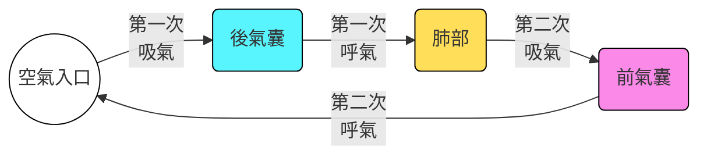
#### mammals
- 哺乳類用的是負壓呼吸，把氣體拉入肺臟。肋間肌 (rib muscles)跟橫膈 (diaphragm) 收縮時，肺部擴張
- 通常，吸氣屬於肌肉主動作用，而呼氣通常靠回彈 (被動) 即可達成
- 每一次吐氣的時候，還會有一些氣體遺留在肺臟，所以每一次吸氣，是 "新空氣 + 舊空氣" 的混合
#### 節律控制
- 呼吸通常屬於不隨意運動 (involuntary)
- 呼吸控制中樞位於medulla oblongata (延髓)，偵測腦脊髓液 (cerebrospinal fluid) 的酸鹼值
> [!Tip]
> cerebrospinal = cerebral + spinal = 腦跟脊隨

- 偵測的訊號會傳給主要控制呼吸中樞，而進一步的呼吸調節發生在橋腦 (pons)

### 氣體交換的適應性
- 有些東西可以讓血液能夠攜帶更多的氧氣跟二氧化碳，我們稱其為 "respiratory pigments"
- 吸氣之後，氧分壓增加，這個氧分壓通常比肺泡微血管高
- 這個現象促進氧氣擴散到微血管中，二氧化碳排出，最終導致氣體分壓血管內外相同
- 在體微血管床，整體分壓偏好讓氧氣淨流出血液，二氧化碳淨流入血液

#### respiratory pigments
- 通常是攜帶氧氣的蛋白質，大部分脊椎動物有的叫做血紅蛋白 (hemoglobin)，四個子單元組成，由鐵離子結合氧氣
- 節肢動物跟很多軟體動物用的是血藍素 (hemocyanin)，利用銅離子來當作結合氧氣的分子 
- 當一個血基質單元結合到氧氣，會促使其他子單元對氧氣的結合度上升，也就是協同性，可以在血紅蛋白的結合曲線中看出來
- 二氧化碳的產生會降低血液酸鹼值，因此會降低血紅蛋白對氧氣的結合度，促進氧氣的釋放。這被稱為Bohr effect

#### 二氧化碳的運輸
- 血紅蛋白基本上比較不載送二氧化碳，載送二氧化碳的主成分是血漿中的碳酸氫根離子，形成碳酸:
$$
HCO_3^{-} + H^{+}\rightarrow H_2CO_3
$$

---

## Chapter 44: excertory system 🤔
### 滲透壓調節水分跟溶質
- Osmoregulation的調節力量來自於濃度梯度，取決於osmolarity，也就是溶質的濃度
- 要是膜的兩邊osmolarity相同，這被稱為isoosmotic，水來回流動的量相同，沒有淨流量
- 要是有淨流量的話，一邊是hypoosmotic，另一邊是hyperosmotic
#### 動物如何調節這部分
- 可分為osmoconformers跟osmoregulators:
  - Osmoconformers: 身體跟外界環境等張，不需要調借自身滲透壓
  - Osmoregulators: 需要花費能量，在不同滲透壓的環境下去控制水的出入
  - 前者比後者適應性更強
- 多數動物屬於stenohaline (狹鹽性)，無法承受高的滲透壓變化，反之，有些屬於euryhaline (廣鹽性)
#### marine animals
- 多數無脊椎海洋生物屬於osmoconformers，但是它們有些會主動對特定的溶質濃度進行調整
- 硬骨魚類由於身體相對海洋低鹽，他們會**吞下大量海水來補足失去的水分，再用鰓跟腎臟大量排出鹽分**
- 滲透壓調節的時候，通常代謝廢物也會一起被排出 (例如urea)
- 鯊魚反其道而行，透過將尿素的濃度提高，增加自己體內的滲透壓
- 尿素雖然好用，但它是一種蛋白質變性劑。高濃度的尿素會破壞體內酶和蛋白質的結構，使其無法正常運作。因此，鯊魚體內必須同時累積高濃度的氧化三甲胺 (trimethylamine oxide, TMAO)
   - 它是一種強大的蛋白質穩定劑，可以對抗尿素帶來的破壞性影響，保護蛋白質的結構和功能。
#### freshwater animals
- 外界環境對它們來說是低鹽的，它們不喝水，但是需要大量排出被稀釋的尿液
- 至於排泄失去的鹽份，要用食物或是鰓吸收來補充
- 鮭魚屬於euryhaline fishes，它們會洄游，再低鹽河跟高鹽海中變換位置
- 當它們跑到海裡時，會增加皮質醇的分泌，用來增加排出鹽份的細胞數量
#### Other animals
- desiccation (極度脫水) 對大部分動物致命，但是一些無脊椎動物可以自行脫水進入休眠，這個適應又被稱為 "anhydrobiosis"
  - 例如，緩步動物 (Tardigrades, 也就是水熊蟲)
- 陸地上的動物通常都有避免脫水的表皮，或著乾脆就避免白天活動來減少水分流失 (nocturnal lifestyle)

#### 滲透壓調節的能量學
- 到底需要花多少能量調節這回事? 這取決於:
  - 你跟外界環境的滲透壓差別
  - 身體對水的通透性
  - 你的主動運輸幫蒲要花多少能量移動離子
- 運輸上皮就是用來控制溶質的移動方向的，有很大的表面積
- 例如鳥類的鼻鹽腺就是移除血液過多的氯化鈉

### 排泄到底是什麼鬼?
- 所有動物都要處理ammonia，一種含氮分子分解產生的代謝廢物。排出這些廢物的過程，就叫做 "excretion"
- 廢物通常是三種為主: ammonia、urea、uric acid，這三種的毒性、水溶性、花費的能量都不一樣
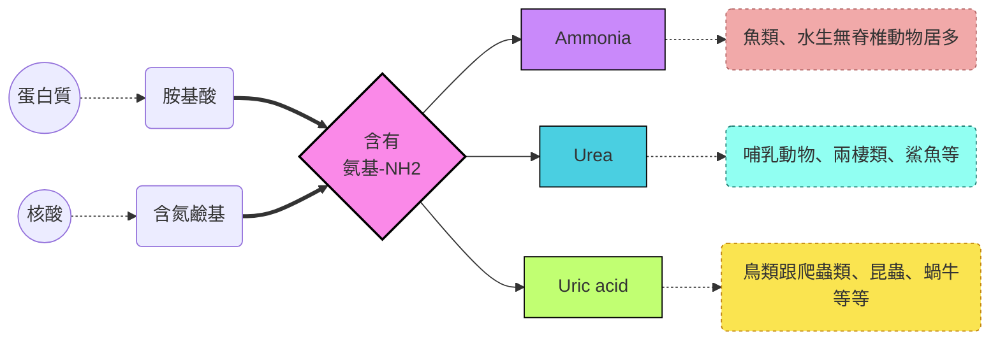
#### ammonia
- 這東西很毒，可溶入水中，通常需要一堆水來處理它，多數無脊椎動物直接透過體表排出ammonia
#### urea
- 陸生動物排泄時的主角，稍微比氨還好一點，沒那麼毒，也可以溶於水
- 脊椎動物利用肝臟來產生urea，把ammonia變成urea的過程需要能量，但是由於毒性沒有那麼高，需水量就沒有那麼嚴格
#### uric acid
- 昆蟲、蝸牛、爬蟲類、鳥類的主要排泄廢物
- 基本上相對無毒，但是不太能溶於水，從ammonia變成尿酸需要的能量就更多
#### 演化上的需求
- 這跟動物的棲息地，尤其是水的可得性有關，或是動物的卵的環境影響
- 也跟動物能量的可用性、以及食物來源有關係

### 不同型態的排泄系統
- 尿液的產生先來自於濾液 (filtrate)，主要過程包含:
  - **過濾**: 濾液的產生
  - **再吸收**: 把不同的溶質收回來
  - **分泌**: 把不需要的東西丟到濾液裡面
  - **排出**: 加工過後的濾液排出體外

#### protonephridia
- 原腎管是一個一端為盲管的系統，細部構造包含焰細胞 (flame bulb)
- 焰細胞裡面有纖毛，過濾的液體被纖毛掃出身體之外
- 渦蟲 (flatworm) 就有這個東西
#### metanephridia
- 後腎管從前一個體節吸收體液，被下一個體節的微血管網圍繞。微血管負責蟲吸收養分，最後濾液從外部開口排出
- 蚯蚓的每一個體節都有一對後腎管
#### Malpighian tubules
- 在陸生的節肢動物 (例如昆蟲)，利用馬氏管從血淋巴中吸收含氮廢物，並直接連結消化道
- 由於最後產生的是尿酸，因此可以跳過 "過濾" 的步驟，並且保留水分

#### kidney and nephron
- 腎臟是脊椎動物的主要排泄器官
- 每個腎臟包含腎髓質 (renal medulla) 跟腎皮質 (renal cortex)
- 腎元 (nephron) 的組合就是**排泄管道 + 微血管網**
- 人體有約100萬個腎元，85%為皮質腎元 (cortical nephrons)，只有延伸到腎髓質一點點，剩下的叫做近髓腎元 (juxtamedullary nephrons)，嵌入髓質較深，對濃縮尿液貢獻較多。
- 濾液會經過的流程如下: **proximal tubule → loop of Henle → distal tubule → collecting duct → renal pelvis → ureter → urinary bladder → urethra**
- afferent arteeriole 後形成 glomerulus，被Bowman's capsule包覆著。濾液幾乎把很多東西丟出來，包含所有鹽類、葡萄糖、胺基酸、藥物等
- Loop of Henle 還會分成 **descending limb** 跟 **ascending limb**
- 近端跟遠端腎小管周圍的微血管叫做Peritubular capillaries
- loop of Henle周圍圍繞的血管叫做Vasa recta

### take a closer look
- 一般情況下，由於血液不斷循環，人的腎臟每天要過濾的血液有1600升，只有1.5升的尿液被排出
#### proximal tubule
- 所有剛濾出的營養素，都會被主動運出濾液，進到組織液中，並慢慢流入毛細血管，它們都會在這個地方被重吸收
- 有些毒素也會在這裡被主動運輸到濾液裡面
- 鹽分也會被主動濾出 ($Na^+$會被主動運輸，促使帶負電荷的 $Cl^-$ 被動跑出去)
#### btw, how does it complete pH balance?
- 身體代謝會產酸，產生的多餘的 $H^+$ 會跟 $HCO_3^-$ 結合，過多會導致酸中毒，因此身體要想辦法把 $H^+$ 排出去
- proximal tubule 的上皮轉運細胞會主動產生 $NH_3$ ，將多餘的氫離子跟其結合，形成銨根離子排入濾液中
- 同時把 $HCO_3^-$ 回收到組織液中循環
>[!Note] 
> 無論是遠端或是近端小管，都會做這個事情

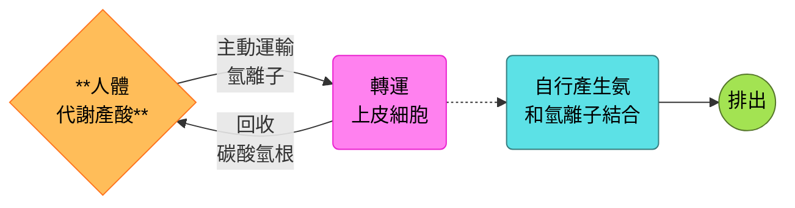
#### descending limb of the loop of Henle
- 從 cortex 暫時下降到 medulla
- 此處的轉運上皮細胞幾乎只有水通道，由於 medulla 組織液的鹽分濃度很高，水會在此處被排出，暫時形成高濃度的濾液

#### ascending limb of the loop of Henle
- 從 medulla 上升回 cortex
- 此處的轉運上皮細胞缺乏水通道，所以是鹽類的運輸為主
- ascending limb 的細段被動運輸出去鹽分，到了粗段，由於管外的鹽度下降，上皮細胞開始主動從濾液運輸鹽類到medulla，維持medulla的高鹽分

#### distal tubule
- 和 proximal tubule 一樣，主動排出離子跟鹽分 (如 $K^+$ 和 $NaCl$ ) ，也會運輸氫離子到管中，並再吸收碳酸氫根，調控pH值平衡

#### collection tube
- 持續經過 medulla 內部，並且最終移動到腎盂，因此尿液在此高度濃縮
- ADH調控此處上皮細胞的水通道密度，其作用時會增加水通道的數量，使 medulla 重吸收更多水分
- 尿素也會在這個地方因為管內濃度高而在髓質累積，因此髓質的尿素濃度也很高

#### what about vasa recta?
- 血管基本上圍繞 loop of Henle，因此 Vasa recta 會因為周圍滲透壓偏高而跟著一起高濃度
- 直到回到腎靜脈附近 (位於 cortex，ascending limb附近) 時，滲透壓因為周圍的低鹽而重回正常

#### the gradient of solute and water conservation
- **水是一個不可能主動運輸的東西**，所以，唯一能夠濃縮尿液的方法，就是讓管外的鹽分濃度夠高，使水被動從管內流出
- 在一整條管子的各個區域的上皮細胞，通常都會主動運輸鹽分到 medulla (descending limb 除外)，增加其鹽分濃度，**medulla 的滲透壓相當於決定了這個物種的水再吸收能力**
- 陸域動物的水再吸收能力就是為了在陸地上生活的一種適應
- 動物花很多能量於主動運輸鹽份，最主要影響滲透壓的物質就是氯化鈉跟尿素

#### concentrating uring in mammalian kidneys
- 剛才做的總結中，近端小管的濾液在滲透壓維持不變的情況下，重吸收水分跟鹽份，使濾液容量減小
- 到了loop of Henle的降支區，水分先流失掉很大一部份，導致濾液濃縮
- 在升支端，改成 $NaCl$ 被丟出濾液，這是維持髓質高滲透壓的關鍵 
- 在loop of Henle裡面也可以發現**逆交換 (countercurrent multiplier system)** 的情形，這讓vasa recta提供腎臟養分的同時，不影響滲透壓梯度
- 尿液跟腎髓質的滲透壓相同，但是大幅高於其他的組織液跟血液

### 哺乳動物的再吸收水能力
- juxtamedullary nephron是水分重吸收的主角
- 在乾燥環境中生存的哺乳動物，通常loop of Henle也更長
- 南美吸血蝙蝠在近食時要盡可能吃飽，所以會將大量水排掉 (好裝更多血液，而不影響飛行)
- 而回去棲息、消化時，血液的胺基酸代謝需要大量水分，這時排出的尿液滲透壓會變高

#### 鳥類跟爬蟲類
- 鳥類的loop of Henle比較短，不過他們重吸收的方式本身就不是以這個為主，它們排出的代謝廢物是尿酸，本身就不用太多水
- 其餘的爬蟲類基本上**只有皮質腎元，水的重吸收是在泄殖腔中進行**

#### 淡水魚類跟兩棲類
- 淡水魚排出的尿液比較稀釋，**鹽份的再吸收是依賴於distal tubules**
> [!Note]
> 青蛙的膀胱可以進行水分的重吸收 (很神) 🫠

#### 海洋魚類
- 通常腎元**更小，更少，而且沒有distal tubule，有些甚至連腎絲球都缺乏**
- 基本上不怎麼排泄了，滲透壓調節主要靠鰓來幫忙

### 當激素來幫忙
- 基本上神經跟激素一起控制腎臟的調節滲透壓能力
#### Antidiuretic hormone
- 又稱為ADH或是vesopressin
- 由腦垂腺後葉釋放，然後在collective duct cells上面作用
- 這會促進水通道嵌入細胞膜上面，增加水分重吸收率
- 下視丘的細胞會偵測血液滲透壓，並調控ADH的釋放

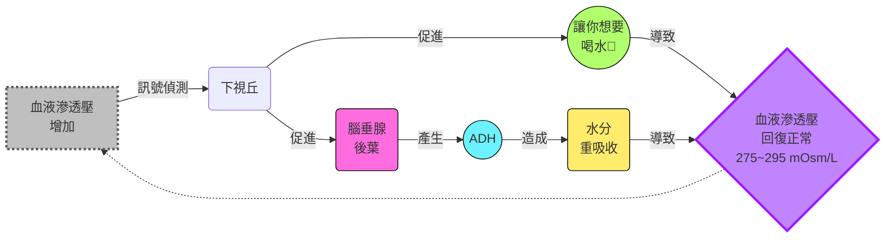
- 酒精會抑制ADH的釋放 (因此宿醉的症狀之一就是脫水)
- ADH基因，或是水通道基因的突變，會導致尿崩症 (diabetes insipidus)

#### RAAS 
- 叫做**腎素-血管張力素-醛固酮系統** (renin angiotensin aldosterone system)
- 當腎絲球附近血壓下降時，會使腎絲球旁器 (juxtaglomerular apparatus, JGA) 釋放renin，renin促進angiotensin II 的產生
> [!Note]
> angio = veso = blood vessel，原本指容器的意思 🐱
> renal = nephro = kidney

- angiotensin II 促進血管收縮，降低血液流到腎臟的量，並增加aldosterone的釋放，增加血容量跟血壓

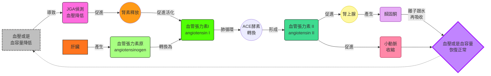
#### 激素的互相調控
- ADH跟RAAS都會提升水的再吸收，不過只有RAAS系統除了再吸收水，也再吸收 $Na^+$ 
- 心房排鈉肽 (atrial natriuretic peptide, ANP) 跟RAAS系統拮抗，在血容量跟血壓上升時會釋放，抑制renin的釋放
- 因此，ANP作用就是降血壓跟血容量

---
## Chapter 45: reproductive system
### asexual and sexual reproduction
#### asesual
- budding是一種僅在無脊椎動物中出現的無性生殖法
- fission (分裂) 也是一種，只是budding的子代比親代小，fission的子代跟親代體型差不多
- fragmentation (切割)，像是渦蟲那樣，被切掉的那一部分身體可以再生
- parthenogenesis (孤雌生殖)，未受精的卵自行發育成個體，在無脊椎動物常見 (例如輪蟲)，當然，有些少數脊椎動物在特殊狀況也會產生類似現象

#### sexual reproduction
##### hermaphroditism
- 這個字來自希臘神話的兩個神: Hermes跟Aphrodite。他們倆的兒子跟窮追不捨的水仙結合，最終就變成同時有男性跟女性生殖器的個體 (真的啦我沒騙人 🫠)
- 蝸牛跟海綿等就是這種，雌雄同體的個體也可以自我授精 (self-fertilize)
- 或是這些各體會在特殊情況改變他們的性別，也算是雌雄同體 (叫做順序雌雄同體，Sequential Hermaphroditism，例如小丑魚)

##### reproduction cycle
- 大多數物種都會依據季節變化而有所謂的 "生殖週期"，由體內激素或是環境因素導致。通常，雌性在生殖週期中段通常就是所謂的 "排卵期"

> [!Tip]
> 季節溫度變化也會影響繁殖周期，所以氣候變化會影響多個物種的生殖成功率 🐱

- 水蚤 (*Daphnia*)在環境良好時行無性生殖，在環境變化惡劣時出現有性生殖 (基因重組可以增加子代存活率)
- Whiptail lizard (鞭尾蜥) 都是雌性，但是他們有跟據繁殖季節，個體會產生 "類雄性行為"。它們是完全單性，只是行為上有不同
- 通常在排卵前夕 (類似所謂的濾泡期的激素濃度樣貌)，出現雌性行為，而在孕酮上升時，表現出 "類雄性行為"

#### 到底為什麼要出現有性生殖
- 通常來說，無性生殖產生的子代，大概是有性生殖個體的兩倍多 (所以每一代過去，其生成的子代會跟有性生殖的差 $2^n$ 倍)，所以為什麼要產生 "有性生殖" 這種耗能的東西?
- 有性生殖在環境變化快速的時候較為有利 (子代存活率高，因為基因重組)，而無性生殖在穩定，favorable的環境裡面比有性生殖更有利

### fertilization
- 精卵結合的意思，可以是體外也可以是體內，看物種
- 體外授精 (例如青蛙)，雌性會把卵產在環境中，通常潮濕的環境比較適合這樣的方式
> [!Note]
> spawning: 個體們聚在一起同時把自己的配子丟出去的行為，通常受到化學信號或是環境狀況驅使 🐱

- 體內受精讓個體在乾燥環境也能生殖成功，但是通常需要合適的交配器官，以及行為互動
- 通常個體可以用信息素 (pheromoones) 改變或是影響其他個體行為
- 通常體內受精的物種產生的配子量相對較少，而且往往會出現育幼行為 (parental care)，增加其子代存活率
- 對於reptiles跟birds來說，它們的受精卵有硬殼以及內膜，防止物理傷害跟水分喪失
- 有些物種 (如咱們) 把發育的胚胎養在雌性體內

#### 配子的產生跟運輸
- 產生配子的器官叫做gonads，有些物種沒有gonads，它們的配子透過未分化的組織減數分裂形成
- 有些系統還會有運輸的管狀系統，或是腺體，來儲存、保護配子，或是讓配子能夠成熟
- 昆蟲通常性別是分開的，而且雌性通常有spermatheca，用來儲存其他個體的精子，以便在合適的時候使用
- cloaca (泄殖腔)，同時在消化、排泄、生殖中扮演角色的通道，通常在非哺乳動物的脊椎動物中常見 (例如鳥類)

##### 後者雄性優先權 (Last-male precedence)
- 在果蠅交配行為中，雄性往往能殺死或是排除雌性體內其他雄性的配子，這是一種 "精子競爭" 的機制
- 在一個實驗裡面，如果雌性跟兩種實驗下的雄性果蠅交配 (例如無法形成精子，或是交配時無法ejaculate的果蠅)，雌性的spermatheca裡面往往會缺乏儲存的配子

### reproductive system anatomy

#### male reproductive anatomy
- 外生殖器包含scrotum跟penis，內生殖器包含產生精子跟激素的gonads，以及附屬腺體

##### teste
- 也就是男性的gonads，負責產生精子，減數分裂發生的區域為seminiferous tubules (細精管)
- 經子通常無法在一般動物的體溫下存活，所以大多數哺乳動物的testes會位於scrotum裡面，讓產生精子的區域溫度低於體溫

##### ducts
- 從細精管產生後，精子會移至epididymis逐漸成熟

> [!Note]
> 通常精子從成熟到出去需要跑的管子距離有六公尺，大概花費三周

- vas deferens是儲存精子的地方，其有肌肉組織，負責在ejaculation時推動配子進入ejaculatory duct，最後從urethra排出

##### accessory glands and penis
- 附屬腺體通常有三種，產生的液體跟精子混合: seminal vesicle、prostate gland、bulbourethral gland (又稱為Cowper's gland)
- penis包含三條spongy erectile tissue，性興奮的時候會充血，導致erection
  - 上面兩條被稱為corpora cavernosa， 下面一條包圍ureathra，被稱為corpus spongiosum
- 頂端被稱為glans，由prepuce包圍 

#### female reproductive anatomy
- 外生殖器包含clitoris跟兩套labia，內生殖器包含一對gonads，管狀系統以及一個負責放置胚胎的腔室

##### ovaries
- 女性的gonads，有多個follicles (濾泡)，每個濾泡裡面都有卵母細胞 (oocyte)

##### oviduct and uterus
- 卵細胞會經過oviduct (又稱為fallopian tube)，管內有纖毛，幫忙把卵細胞運到uterus，內膜被稱為endometrium，上面有非常多血管，uterus的開口叫做cervix，通往vagina

##### vagina and vulva
- vagina作為分娩時的產道，也是在交配時容納penis的通道，其開口被稱為vulva
- vulva包含labia majora、labia minora、hymen跟clitoris
- clitoris前端也包含glans跟prepuce

> [!Tip]
> clitoris跟penis基本上屬於同源器官 🐱

#### mammary gland
- 並不屬於生殖系統的一部份，不過對於生殖也至關注要，其內皮細胞會生成乳汁，哺育幼崽

### gametogenesis
- 也就是配子的生成 (很簡單吧)

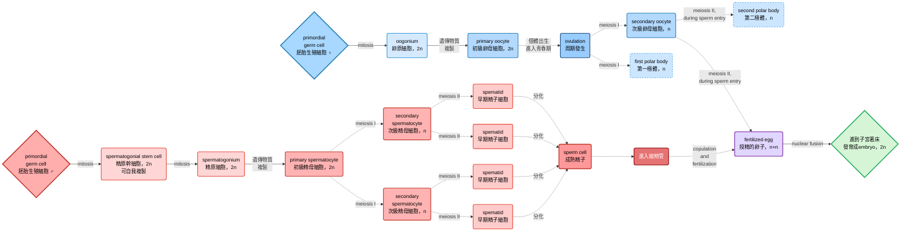

#### spematogenesis
- 通常從青春期至終生皆可發生，而且過程持續，精子通常需要7天發育成熟
- 精原幹細胞可持續自我複製，產生精原細胞
- 精原細胞的遺傳物質複製後，在減數分裂前被稱為初級精母細胞，meiosis I結束後，形成次級精母細胞
- meiosis II發生後，就是早期精細胞，分化後形成精子成熟

#### oogenesis
- 卵原細胞會先在雌性胎兒內部變成初級卵母細胞 (也就是複製遺傳物質，但是沒有減數分裂)，數量便固定下來，不再產生新的卵母細胞
- ovulation，也就是meiosis I時，會產生一個次級卵母細胞，以及第一極體
- meiosis II會在授精剛開始的時候 (例如皮質反應) 才會發生，產生第二極體以及卵 (這時尚未核融合，所以遺傳物質形式被表示成n+n)

### 性激素調控
- 性激素的調控跟下視丘 (hypothalamus)、腦垂腺前葉 (anterior pituitary)、以及gonads有關細
- GnRH (gonadotropin releasing hormone) 來自下視丘，調控FSH (FSH (follicle stimulating hormone) 跟 LH (luteinizing hormone) 在腦垂腺前葉的釋放
- FSH跟LH條控性激素 (通常為固醇類) 的產生，包含testosterone、estradiol、progesterone等等
- 性激素調控配子的產生、行為模式、以及第一跟第二性徵的發育

#### in male
- FSH作用在Sertoli cells (細精管支持細胞)，促進精子產生跟發育
- LH作用在Leydig cells (間質細胞)，促進睪酮分泌
- 睪酮作為負回饋調控GnRH、FSH、LH的生成
- inhibin由Sertoli cells分泌，抑制腦垂腺前葉的FSH分泌

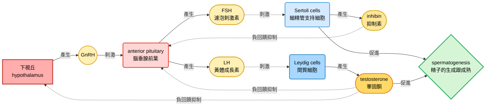

#### in female
- 激素分泌跟兩個周期的 "同步" 相關，一個是卵巢周期，一個是月經週期 (或是叫做子宮周期)
- 每一次的月經週期，endometrium都會增厚，以便孕育胎兒，如果沒有胚胎著床，endometrium會剝落，產生月經 (menstruation)

##### the ovarian cycle
- 包含濾泡期、排卵、黃體期
- 在濾泡期 (follicular phase) 期間，GnRH促進FSH跟LH產生，FSH促進濾泡成熟，而濾泡會生成雌二醇 (estradiol)
- estradiol會正回饋促進GnRH的分泌，進而迅速拉高FSH跟LH的量，使濾泡迅速成熟，導致濾泡破裂 (ovulation)
- ovulation之後叫做黃體期 (luteal phase)，LH促進破裂後的濾泡組織形成黃體corpus luteum，黃體會同時產生孕酮 (progesterone) 跟estradiol
- 這導致負回饋發生於下視丘跟腦垂腺，使LH跟FSH濃度降低，這抑制了其他卵子的成熟

##### the menstrual/uterine phase
- 在ovulation之前，濾泡產生的estradiol會使endometrium增厚

> [!Tip]
> 因此，follicular phase就跟子宮的proliferative phase (周期第6到14天) 同步 🐱

- ovulation之後，雌二醇跟孕酮會維持子宮內膜的穩定跟發育
- 子宮內膜的腺體能分泌營養液，以便能夠讓著床前的胎兒能穩定生長，這被稱為secretory phase (周期第15到28天)

> [!Tip]
> luteal phase就跟secretory phase同步 🐱

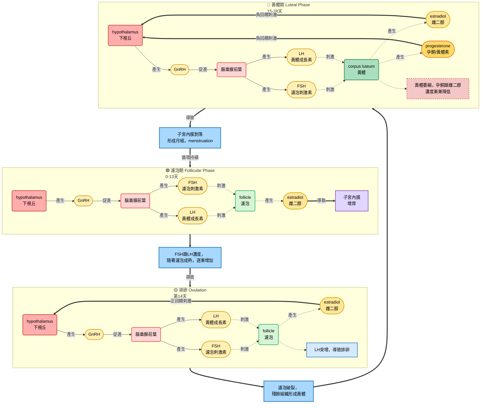

- 大約有7%的女性受到endometriosis影響
- endometriosis: 本來應該乖乖待在子宮腔內部的子宮內膜組織莫名其妙地 "離家出走"，跑到子宮以外的地方落地生根，例如腹腔或是卵巢
- 這些組織也會隨著周期一起脫落或是出血，導致這些區域出血，且血液無法排除

##### menopause
- 在經歷約500次周期後，就會逕入更年期，停經發生
- 這東西在其他動物身上不常發生 (可能是因為他們根本活不到這個年紀)

#### 月經週期跟動情周期
- 月經週期只有在人類跟一些靈長動物中出現，而且並沒有一個特別的時段，是 "無法接收性行為" 的，這跟estrous cycle不一樣
- 對於有動情周期的動物來說，子宮內膜在沒有懷孕時，會自行吸收，而不會排出，而且只有在estrus (也就是發情期) 的時候才會進行交配

#### 性反應的情況
- 在性興奮時，會出現兩種狀況:
  - vasocongestion，也就是組織充血
  - myotonia，肌肉張力增加
- 主要分為四個步驟: excitement、plateau、orgasm、resolution
  - excitement: 最主要的現象就是vasocongestion，為交配做準備
  - plateau: 由性器官的刺激維持
  - orgasm: 一系列不隨意的肌肉痙攣性收縮，男性的話通常導致ejaculation，女性就是子宮跟外陰收縮
  - resolution: 系統回復正常狀態，男性的話往往會有一段時間的不反應期 (refractory period)

### 胎盤動物的胎兒發育
- conception = fertilization，發生在oviduct
- zygote進行cleavage (卵裂，僅有mitosis但是細胞不變大，而是越切越小)，形成囊胚 (blastocyst)
- 囊胚形成後移入 (著床) endometrium
- 著床完成後，母體懷孕 (pregnancy，又稱為妊娠，gestation)
- 基本上妊娠分成三個時期，每一個時期大概是三個月

#### first trimester (1~3 month)
- 著床的embryo分泌激素調控母體的生殖週期
- hCG (human chorionic gonadotropin，人類絨毛膜促性腺激素) 維持孕酮跟雌二醇的分泌，避免內膜剝落
- 前2~4周，胚胎的養分主要來自於endometrium，囊胚的外層叫做trophoblast (滋胚層) 嵌入子宮內膜，形成placenta
- umbilical cord (臍帶)，有兩條臍動脈 (缺氧血)，一條臍靜脈 (充氧血)

- 假如說zygote在卵裂時變成兩個，這叫做monozygotic twins
- 如果是兩個完全不同的受精卵，這叫做dizygotic twins
- 懷孕初期是器官形成的主要時期，到妊娠第八周的時候，基本上所有主要結構皆已生成，embryo這時被稱為fetus
- 此時有幾個事件會發生
  - 子宮頸會產生一個塞子 (mucus plug)，避免感染
  - 胎盤成形，排卵跟月經周期停止
  - 乳房變大，母體可能會有噁心等反應

#### second and third trimesters (4~9 month)
- second trimester發生的事情包含:
  - 胎兒的增長速度變快
  - 胎動形成
  - 母體內激素穩定
  - 胎盤接管了孕酮的產生
- third trimester時，基本上胎兒的大小已經占據了整個胚膜的空間 
- 分娩 (childbirth) 始於陣痛 (labor)，子宮將胎兒跟胎盤推出體外，分娩過程由oxytocin、estradiol跟prostaglandins來調節

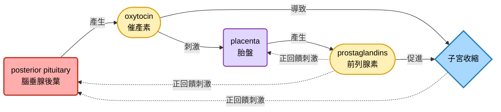

- labor有三個時期
  - 子宮頸擴張 (dilation)
  - 胎兒產出 (expulsion)
  - 胎盤剝落

#### 母體免疫細統的抑制
- 母體能夠接受外來的配子，可能跟其免疫系統的抑制有關係
- 例如我們發現，rheumatoid arthritis (類風溼性關節炎)等自體免疫疾病，在懷孕期間症狀會減輕

#### 避孕 (contraception) 跟墮胎 (abortion)
- 通常contraception有幾種主要方法
  - 阻斷精子或是卵子的生成 (ex: vasectomy，輸精管結紮，或是混合的birth control pill，阻斷排卵)
  - 物理上使精子跟卵子分開 (ex: condom，保險套，or diaphragm，子宮隔膜的使用，tubal ligation，輸卵管結紮)
  - 物理上避免胚胎著床 (ex: IUD，子宮內避孕器)
- 能夠唯一同時避孕跟避免性傳染病的方法，就是使用condoms
- abortion可以分成自然或是人工的 (如果是自發性的，被稱為流產，miscarriage)
- RU486是孕酮的結抗劑，會導致黃體素無法發揮維持子宮內膜的作用

#### 現代科技
- 不孕的原因有很多種，有些是因為性傳染病導致的，例如淋病 (Gonorrhea) 和衣原體門 (Chlamydia)
- 試管受精是人工解決方法之一 (*in vitro* fertilization， IVF)

#### 疾病檢測
- 超音波可以檢測胎兒大小跟狀況 (ultrasound imaging)
- amniocentesis (羊膜穿刺) 跟chorionic villus sampling (絨毛膜取樣)，利用針刺，取得胎兒細胞進行基因分析
- 現在已經可以利用抽血的方式，取出胎兒DNA，檢測胎兒疾病

---

## chapter 46: the development of embryo
### fertilization 
- 生物學家常用模式生物來研究發育學
#### the acrosomal reaction
- 在研究海膽時，acrosome位於精子頭部，有水解酶
- 卵子表面的jelly coat (又稱為zona pellucida，ZP) 裡面的蛋白ZP3會跟精子的ZP3 receptor結合，確認是同一物種的配子
- 啟動反應，水解酶釋放後，水解ZP
- 同時，精子的微絲形成 "acrosomal process"，結合到卵的vitelline layer表面的受體上面
> [!Important] 
> vitelline layer (卵黃層) 不等於 plasma membrane (細胞膜) !!

- 精子跟卵子的細胞膜融合，細胞核進入卵子，導致卵表面鈉通道開啟，去極化 (depolarization) → 阻止polyspermy 
> [!Note] 
> acrosomal process跟去極化阻止polyspermy主要在海膽身上比較常見，而且速度非常的快 👀

#### the cortical reaction
- 卵細胞膜下面有很多的顆粒泡，被稱為cortical granule
- 當精卵結合後，在細胞核進入的地方，$Ca^{2+}$濃度在該區域大幅上升，並且呈現波浪狀擴散到整個卵細胞

- $Ca^{2+}$促進顆粒馬上和細胞膜融合，在卵周空間裡面釋放物質
- 導致卵黃層跟細胞膜分離、硬化，外殼被稱為fertilization envelope。這是人類阻止polyspermy的方式
- 這種方式比海膽的去極化方式慢很多

> [!Tip]
> 如果在卵細胞中注射鈣離子，該細胞會自行產生cortical reaction 🐱

- 在人類身上，精子除了要穿過ZP，也要先穿過ZP外圍的濾泡細胞 (follicle cell) 才行

#### egg activation
- $Ca^{2+}$同時也導致了卵子的活化 (活化所需要的mRNA已經在細胞質裡面)，增加細胞的呼吸作用以及蛋白質合成
- 在授精作用後約20分鐘，才出現核的融合，之後才開始進行卵裂

### cleavage
- 卵裂通常分裂週期裡面直接跳過G1跟G2 phase，細胞沒有增大，只是從一個大細胞變成很多個小細胞 (這些小細胞又被稱為blastomeres)，形成空心的 blastula (囊胚)，囊胚裡面的空心區域被稱為叫做blastocoel

#### cleavage pattern in 🐸
- 青蛙的卵有兩個極: vegetal pole 跟 animal pole，而卵黃通常集中在 vegetal pole
- cleavage furrow 形成，但是主要在 animal pole。事實上，整個分裂器基本上會因為卵黃的關係，往 animal pole 偏移，形成 blastula
- 因此，其為不對稱分裂 (asymmetric)
- 前兩次卵裂會形成四個相同大小的細胞 (blastomeres)，但是第三次卵裂是不對稱的，產生的細胞大小不同

#### cleavage pattern in other animal
- 🧍‍♀️: 卵基本上卵黃含量少，所以基本對稱分裂 (完全卵裂，**holoblastic cleavage**)
- 🐣: 卵黃特別大，animal pole 很小，細胞基本上都只在 animal pole 分裂，最終形成一個小胚胎 + 超大的卵黃 (部分卵裂，**meroblastic cleavage**)
- 🪰: 剛開始細胞質不分裂，就是在細胞質中分裂出很多個細胞核，然後再跑到細胞邊緣形成一圈細胞，包圍著卵黃

### gastrulation
- blastula 開始向內凹，形成一個盲管
- 內凹區形成的洞叫做 blastopore (胚孔)，內部為archenteron (原腸)
- 盲管一直延伸到 blastula 另一端，形成連通的管子，整體被稱為 gastrula (原腸胚)，從原本一層囊胚變成三層胚層 (triploblasts)

- 三個germ layers各有不同功能，形成以下器官

|ectoderm|mesoderm|endoderm|
|---|---|---|
|表皮、神經跟感覺系統、腦垂體、腎上腺髓質、下巴跟牙齒|骨骼跟肌肉、循環跟淋巴系統、排泄跟生殖系統、真皮層、腎上腺皮質|消化管的上皮、呼吸、派謝、生殖道的上皮、胸腺、甲狀腺|

- 有些動物沒有胚層 (例如海綿)，有些只有兩層胚層 (diploblasts，如刺絲胞動物門)

#### gastrulation in 🐸
- 蛙卵的 blastopore 主要大概是在 animal pole 跟 vegetal pole 的交界處，這個位置通常就在**精子進入卵子的位置的對面**
- 因為長得扁平像是嘴唇，又稱為 dorsal lip (背唇)，細胞在此處內捲
- animal pole 的細胞開始往外拉扯擴散
- archenteron 形成擴張，blastocoel 開始萎縮
- blastopore形成一個環狀，並且開始收縮，使 ectoderm 從 animal pore 開始擴散至整個表面，連帶著 mesoderm 也一起擴散
- 最後原始消化道形成，收縮的 blastopore 形成 yolk plug

> 大家可以點擊以下的影片來看看喔 👀
> 

#### gastrulation in 🐣
- 雞有分成所謂的 epiblast 跟 hypoblast，但基本上胚胎只跟 epiblast 有關係，下胚層不參與胚胎本身的形成
- 不同於青蛙，雞胚胎細胞內捲的地方被稱為**primitive streak** (原條)，位於epiblast，剛開始上胚層往胚盤中線移動，然後進入胚胎內部，往卵黃方向內捲
- 內捲的細胞形成endoderm，推開不怎麼重要的 hypoblast
- 後面內捲的細胞屬於 mesoderm 一部份會遷移
- 留在epiblast的這些細胞屬於 ectoderm

#### gastrulation in 🧍‍♀️
- 人的胚胎在尚未附著在子宮時被稱為**blastocyst** (其實就是blastula啦)
- blastocyst的一端會形成inner cell mass (形成真正的胚胎)，同樣，胚胎基本上也是從epiderm來的
- 最外層細胞trophoblast (滋胚層) 植入子宮內膜，並形成指狀結構跟微血管作用
- 起源於胚胎外的四層膜 (這些統稱為**extraembryonic membrane**) 逐漸形成
- 原腸胚形成跟雞很像，epiblast也會形成原條然後向內捲

- 四種膜分別是chorion (絨毛膜)、allantois (尿囊)、amnion (羊膜)、yolk sac (卵黃囊)
- 其中，絨毛膜包裹著其他三種膜，成為最外層
- 羊膜包裹著胎兒本體，尿囊基本上就是臍帶的一部份
- 卵黃囊包裹著卵黃

- 要是想要在乾燥的地方進行生殖，要麼你發展成有殼 (也就是蛋) 的胎兒 (例如鳥跟爬蟲類)，要麼你就發育出子宮 (無論你是有袋類還是真獸亞綱)
- 鳥、爬蟲綱、哺乳綱統稱為羊膜動物 (**amniotes**)

### organogenesis
#### neurulation and cell migration
- 胚胎在三個胚層形成後，背部的中胚層形成脊索 (notochord)
- 從脊索分泌的信號分子導致外胚層形成一個區域叫做神經板

> [!Note]
> 這屬於induction的例子之一 (細胞因為別的細胞而改變發育方向) 🐱

- 板子向內凹陷，形成神經管 (neural tube)，神經管形成中樞神經系統 (也就是大腦跟脊髓)

> [!Note]
> 在脊椎動物中，脊索會在出生前消失，成為椎間盤的一部份 👀

- 同時，神經摺在收束區形成神經脊細胞 (neural crest cells)
- 神經脊細胞遷移，形成周邊神經，牙齒跟顱骨的一部份
- 體節 (somites，來自mesoderm) 也會遷移，形成間質細胞 (mesenchyme cells)
- 這些細胞構成脊椎骨、肋骨或是肋間肌

> [!Tip]
> 無脊椎動物的organogenesis的模式跟形態不同於脊椎動物，不過，像是神經管等器官形成的機制是類似的 🐱

#### cell shape changes
- 基本上都是由細胞骨架的重組控制的，尤其涉及到microtubules跟actin filaments
- 微管延伸，垂直拉長神經板上的細胞
- 同時，背側的微絲收縮，使細胞成梯形，產生凹陷
- 細胞骨架同時也控制細胞群的壓縮 (convergent) 跟拉長 (extension)，導致gastrulation

#### cell migration
- 細胞骨架在遷移中也辦也重要角色，一些穿膜的糖蛋白，以及細胞外基質都跟細胞遷移有關係

#### progeammed cell death
- 也被稱為 apoptosis (細胞凋亡)
- 例如神經元數量，嬰兒的神經元數量通常較多，到了髓鞘化後，多餘的神經就會凋亡

> [!Tip]
> 青蛙的尾巴在型態變化時也會凋亡消失 🐱

### 決定跟分化

|特徵|Determination (決定)|Differentiation (分化)|
|---|------|-----|
|定義|細胞命運被鎖定，但外觀尚未改變|細胞在結構、生化與功能上產生特化|
|可逆性|不可逆 (至少在自然發育狀態下)|最終狀態，高度穩定|
|分子標誌|特定基因被啟動 (例如：MyoD 轉錄因子)|組織特異性蛋白質 (例如：肌凝蛋白、血紅素)|
|外觀變化|看不出來 (就像還沒分系的學生)|顯著改變 (長出突觸、纖毛或變扁平)|
|實驗判斷|移植到新環境後，仍發育為原定組織|已具備特定生理功能|
|關鍵機制|細胞質決定因子、誘導作用|基因選擇性表達 (Differential gene expression)|

- 每個細胞內的基因組都是一樣的，關鍵差別就在於其決定表達什麼基因，不同基因表達，決定了細胞類性的差異
- 

#### fate mapping
- 畫出從一個胚胎的不同區域，最終會形成什麼身體構造跟器官
- 研究人員會標記各個blastomere (囊胚的細胞)，然後透過marker追蹤該blastomere的命運
- 研究人員採用單細胞消融法來確定每個細胞在C.elegans身上最終會產生的結構，最後成功確定了線蟲體內約959個體細胞的fate mapping，也因此獲得了[2002年的諾貝爾獎](https://www.nobelprize.org/prizes/medicine/2002/press-release/)

- germ cell，一種特化細胞，產生精子跟卵子，其決定因子包含一些RNA複合物或是蛋白質 (例如P granule，可以被標記，用來觀察germ cell的位置跟狀況)
- P granule在第一次卵裂之前，就會移到細胞質的背部尾端，導致不同的blastomere會有不同濃度的P granule，P granule濃度高的細胞就會變成germ cell
- 因此它是一個細胞質級的決定因子 (cytoplasmic determinants)

#### 軸向形成 axis formation
##### in the 🐸
- 精子可以從動物極的任何地方進入，進入卵子的位置決定了背腹軸的位置
- 在核融合之後，精子進入的那一刻，卵子表面的細胞質 (皮層) 會朝著精子進入點旋轉約 30° (又稱為 "皮質旋轉"，cortical rotation)
- 皮質旋轉使得營養極 (vegetal cortex) 的一些分子跟動物極細胞內的分子交互作用，導致特異性基因表達
- 旋轉之後，在精子進入點的對側，會露出下方原本被遮住的淺灰色區域，這就是灰新月 (gray crescent)

> [!Tip]
> 灰新月出現的地方，就是未來的背側 (Dorsal side)，也是原口(Blastopore，也就是屁股) 開始形成的地方。 🐱

##### in 🧍‍♀️, 🐣, and 🪰
- 在雞胚胎裡面，重力決定前後軸的位置建立，然後胚胎兩側的pH值差異決定了背腹軸的方向
- 在昆蟲身上，型態發生素 (morphogen) 的梯度決定前後軸跟背腹軸 (例如*Bicoid* $\rightarrow$ 發育成頭部)

#### 發育潛力
##### Spemann 的頭髮絲實驗 (1938)
- 他用頭髮把剛受精的蛙卵 "勒成兩半"，像個葫蘆一樣，細胞核被擠在其中一邊，另一邊只有細胞質 (無核)。隨著有核的那邊開始分裂 (變成 2, 4, 8, 16 個細胞...)，無核的那邊依然只是一團寂靜的細胞質。
- 關鍵動作: 延遲核化 (The Late Nucleation)，等到有核那邊分裂到 16 細胞期左右，Spemann稍微鬆開頭髮套索，讓其中一個細胞核 "擠" 過去那一團空的細胞質裡。然後，他把這兩半完全勒斷，讓它們徹底分家。
- 兩邊都長成了完整的蝌蚪，這證明了即使分裂到16細胞期，這些細胞核依然保有發育出完整個體的全能性 (Totipotency)

 > [!Important]
 > 如果那個 "被勒住" 的無核半部，完全沒有分到任何一點灰新月(Gray Crescent) 的細胞質，就算給它一個全能的細胞核，它最後也只會發育成一團沒有靈魂、沒有軸向、只有腹部組織的 "肉塊"，在生物學上我們叫它Belly piece (德文中被稱為Bauchstück)

- 哺乳動物的細胞全能性大概是在8個細胞 (也就是分裂三次) 後還存在
- 發育潛能隨著分裂的逐漸受限，是所有動物發育的普遍特徵，一般來說，組織特異性在原腸胚形成晚期便已經確定

#### induction
- 細胞會透過誘導作用相互影響彼此的命運，對誘導信號的反應通常就是活化一組特定基因，使細胞分化成特定類型

#### Spemann and Mangold 的合作實驗
> [關於Spemann和Mangold跟當代的歷史背景，可以點開這裡看看 🐱](https://pmc.ncbi.nlm.nih.gov/articles/PMC9468045/)

- 他們倆在早期的蠑螈原腸胚上面移植組織，發現如果在上面移植新的胚孔 (也就是dorsal lips)，會引發新的，第二次的原腸胚形成
- 背唇誘導周圍組織發生變化，形成脊索或是神經管等等

> [這裡有更詳盡的，有關於兩人實驗的介紹喔 (ง •_•)ง](https://www.cibss.uni-freiburg.de/fileadmin/user_upload/ft1.pdf)

#### 脊椎動物的四肢生成
- 雞的翅膀跟腳，是從一個稱為limb bud (肢芽) 的組織發育而來的
- 肢芽的胚胎細胞也會決定最終形成的這個四肢的不同軸向，包含進遠端軸，前後軸，背腹軸
- apical ectodermal ridge (AER，頂外胚層脊)，是肢芽頂端隆起的一個區域，
- 它會分例一種蛋白質信號: fibroblast growth factor (FGF，纖維母細胞生長因子)，促進肢芽往外生長
- 還有一個區域叫做zone of polarizing activity (ZPA，極化活化區)，位於外胚層下方的一個中胚層組織，條控的是四肢的前後軸發育
- 靠近ZPA的地方會生成後部結構，遠離ZPA的地方生成前部結構
- ZPA分泌Sonic hedgehog (對，這個蛋白質的名字就是來自於那個任天堂的音速刺蝟 🤣)
- 如果把分泌Sonic hedgehog的細胞移植到肢芽的前部結構，那會使其呈現 "鏡像對稱" 的構造，導致額外的趾頭的生成

>[!Tip]
> ##### 小摘要 
> - 前肢跟後肢的決定取決於*Hox*基因表達
> - BMP-4決定脊索跟神經管的調控
> - FGF調控近端-遠端
> - hedgehog決定limb的前後軸

> [想朝聖引用L. S. Honig and D. Summerbell的請自行點擊這個連結 🙂](https://pubmed.ncbi.nlm.nih.gov/4031751/)

#### 纖毛跟細胞命運的關係
- 細胞的單纖毛如同細胞的天線一樣，接收多種信號蛋白，如果出現缺陷，會導致信號傳導中斷
- Kartagener's syndrome是 "原發性纖毛運動障礙" (Primary Ciliary Dyskinesia, PCD) 的一個特化子集
- 在 PCD 患者體內，這些鞭毛或是纖毛的Dynein arms 發生基因突變（通常是缺失或失能），導致纖毛就像沒裝電池的螺旋槳，完全動不起來
- 症狀包含精子無法活動 (不孕)、鼻竇炎跟支氣管容易感染、內臟反轉等

##### 內臟反轉跟纖毛不動有甚麼關係??
- 在胚胎發育早期，有一個叫Node (節點) 的地方，那裡的纖毛會朝固定方向旋轉，產生一個向左的流體力量 (Nodal flow)
- 這股力量會決定妳的器官哪邊是左、哪邊是右。正常人的纖毛會往左撥，器官的定位就正常
- Kartagener's 患者的纖毛不動，導致流體方向變成隨機的。結果就是，有 50% 的機率，器官會長反 !! 👀👀

---

## chapter 47: immune system
### 前情提要
#### 昆蟲免疫系統
- 吞蟲的外骨骼屬於第一層物理免疫，消化系統由有幾丁質屏障的溶菌酶lysozyme保護
- 昆蟲的免疫細胞，**hemocytes**，會產生recognition proteins，接到其他的外來物質上面 (有點像抗體一樣)
- 其也會分泌抗菌肽，去殺死真菌或是細菌
- recognition proteins黏到外來物質上面，會啟動一種穿膜蛋白，被稱為Toll
- 昆蟲對抗病毒的方訪，是根據辨識ssRNA病毒在細胞裡面會產生的dsRNA來辨識的，因為一般昆蟲體細胞不會產生dsRNAs

> [!Tip]
> 脊椎動物比無脊椎動物多了一些免疫特色，例如natural killer cells、interferons，跟inflammatory response 🐱

### 人體物理上的第一防禦
#### 皮膚
- 身體最重要的機械屏障，體表的角蛋白 (keratin) 由角質細胞產生
- 身體的角質層上的細菌，會跟著角質層一起剝落
- 整體pH值呈現弱酸，還有鹽分 (主要是氯化鈉，增加滲透壓) 以及皮脂 (sebum)，抑制微生物生長

#### mucous membranes 黏膜
- 分布於口腔、消化道、泌尿生殖道以及呼吸道
- 可以避免微生物入侵體內，並捕獲它們
- 分泌物裡面包含了溶菌酶 (lysozyme)、乳鐵蛋白 (lactoferrin)、乳過氧化物酶 (lactoperoxidase)

| |lysozyme|lactoferrin|lactoperoxidase|
|-|--------|-----------|---------------|
|功能|切斷 peptidoglycan 的 β(1→4) 鍵，使細菌爆炸|緊緊抓住 Fe³⁺，微生物拿不到鐵，導致代謝停擺|產生次硫氰酸鹽OSCN (hypothiocyanite)，氧化細菌蛋白，並破壞代謝酵素|
|常見於|淚液、唾液、鼻腔分泌物|母乳、淚液、嗜中性球顆粒|呼吸道分泌物、母乳|

#### 呼吸系統
- 防禦的媒介包含鼻腔分泌物跟空氣的流動
- 黏液會捕獲微生物，並且透過纖毛排出
- 透過咳嗽跟噴嚏排除異物，或是進到胃部，由胃酸殺死
- 除此之外，肺泡裡面本來也有免疫細胞 (例如巨噬細胞)，可以吞噬外來物質

#### 消化道
- 胃酸很強 (pH 2 to 3)，可以把多數微生物殺死
- 消化酶本身 (例如pepsin或是trypsin) 會破壞微生物身上的蛋白質
- 膽鹽有乳化作用，所以可以破壞細菌的胞膜
- 腸道本身也有淋巴組織 (gut-associated lymphoid tissues, GALT)，可以抵抗病原體
- 腸道的微生物群 (microbiome) 可以訓練免疫系統，允許部分好菌佔據生態位，並抑制其他細菌的生長
- 有些腸胃的微生物會導致疾病，例如梭菌 (Clostridium) 或是幽門螺旋桿菌 (H. pylori)

### 細胞種類總整理

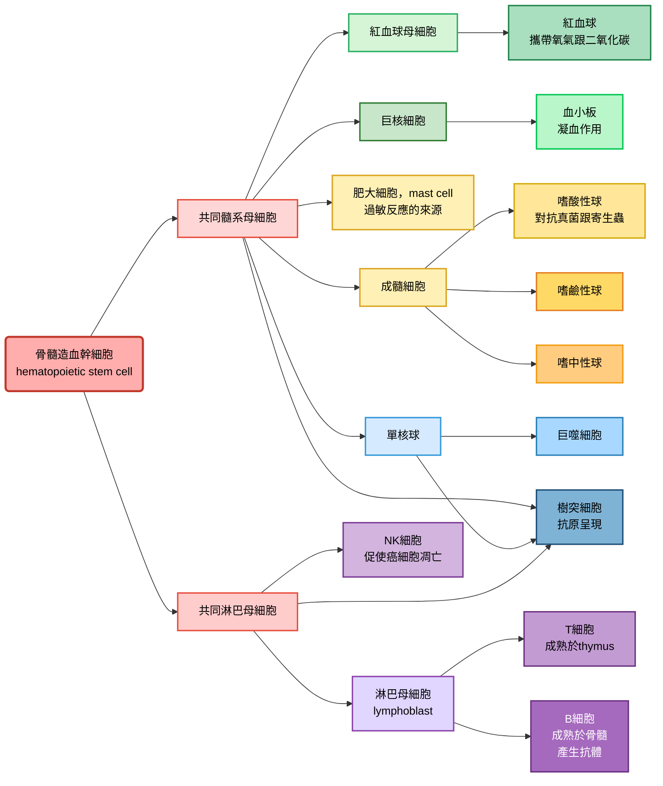
#### 從骨髓造血細胞開始
- 髓系母細胞產生紅血球、血小板、肥大細胞跟顆粒球
- 淋巴母細胞產生無粒球 (包含T細胞跟B細胞)、NK細胞、樹突細胞

#### 肥大細胞
- 直接從髓系母細胞開始，在結締組織中分化而來
- 會釋放組織胺 (histamine) 或是其他有活性的化學物質
- 在過敏反應中起到重要作用，其相關物質包含免疫球蛋白E (IgE)

#### 顆粒球
- 細胞核的形狀不規則，被稱為 "分葉核"，分葉核可以變形、拉長、折疊，讓整個細胞更容易擠過狹縫，在各個組織中遊走
- 細胞質裡面有儲存體 (granule)，裡面的物質可以殺死微生物，或是提高發炎反應
- 包含嗜中性球、嗜鹼性球、嗜酸性球

|種類|basophile|eosinphile|neutrophile|
|--------|---------|----------|-----------|
|中文|嗜鹼性球|嗜酸性球|嗜中性球|
|染色|可以用鹼性染料染成藍黑色|可以用酸性染料染成紅色|在中性pH值下染成紫色|
|功能|可以釋放肝素 (抗凝血劑)，確保發炎區域血流暢通，表面有IgE受體，可以釋放組織胺，通常不吞噬|抵抗原生動物或是寄生蟲，也可以分解組織胺，抑制過敏反應|分葉明顯 (2~5葉) 具有很強的吞噬能力，也可以產生活性氧。遷移能力很強，在發炎信號 (如補體C5a、白三烯) 下快速抵達感染部位，白血球中佔最多 (50~70%)|

#### 淋巴球
- 包含T細胞 (胸腺細胞)、B細胞、自然殺手細胞 (NK cell)、和先天淋巴細胞 (ILC)
- T細胞跟B細胞只有在特定抗原跟其表面受體結合時，才會活化
- 活化之後，這些細胞在淋巴系統內繼續複製
- 記憶細胞雖然是活化的細胞，但是他們不會立即複製，只會在宿主再次遇到相同抗原時複製

#### 免疫系統怎麼辨認細胞?
##### 如何辨識
- 在巨噬細胞和嗜中性球的辨識方法上面，主要透過 "要不要調理素 (例如補體)" 來分:

|種類|opsonin-dependent|opsonin-independent|
|---|-------------------|-----------------|
|特徵|細胞透過辨識補體來打擊|細胞透過辨識病原體本身有的一些物質來打擊|
|舉例|經典路徑跟凝集素路徑|病原體相關分子模式 (PAMP or MAMP)|

##### 辨識什麼
- 在辨識的物體上面，可以分成PAMP跟DAMP

|種類|病原體相關分子模式 PAMP|損傷相關分子模式 DAMP|
|---|----|----|
|定義|微生物身上保守、必需且特異的分子結構|我們的體細胞在應激、損傷、壞死或異常死亡時，從細胞內釋放到外部的分子|
|舉例|LPS、Peptidoglycan、teichoic acid、Flagellin、細菌的DNA或是RNA、病毒的衣殼蛋白|ATP、線粒體DNA、線粒體甲醯肽、熱休克蛋白、尿酸鹽晶體|
|主要辨識原因|殺死病原體|修復體細胞|

### 先天性免疫的防禦
#### TLRs
- 辨識這些外來物質的受體被稱為toll-like receptors

| **TLR 編號** | **主要辨識物質 (Ligand)** | **來源** |
| --- | --- | --- |
| **TLR1/TLR2** | 三酰基脂肪醯肽 (triacylated lipopeptides) | 細菌細胞壁 (革蘭陽性菌) |
| **TLR2/TLR6** | 二酰基脂肪醯肽 (diacylated lipopeptides), 脂多醣樣分子 | 細菌、真菌 |
| **TLR3** | 雙股 RNA (dsRNA) | 病毒感染 (如 RNA 病毒) |
| **TLR4** | 脂多醣 (LPS) | 革蘭陰性菌外膜 |
| **TLR5** | 鞭毛蛋白 (flagellin) | 細菌鞭毛 |
| **TLR7/TLR8** | 單股 RNA (ssRNA) | 病毒 RNA |
| **TLR9** | 非甲基化 CpG DNA | 細菌與病毒 DNA |

#### Antimicrobial peptides 抗菌肽
- 很小，通常只有20~50個胺基酸
- 通常帶正電，因為微生物的LPS跟teichoic acid帶負電，微生物就可以被吸上來
- 線性的 $\alpha$ -helix分子，裡面沒有半胱胺酸殘基
- 通常為雙親性分子 (amphipathic)，很適合插進細胞膜
- Defensins (防禦素)，如 $\alpha$ -defensins (Paneth cells) 、 $\beta$ -defensins (上皮細胞)
- Cathelicidin，如LL-37，是人類身上最有名的一條
- 破壞細胞膜的方式，可以是Barrel-stave (在細胞膜上面戳洞，導致細菌爆炸)，或是Carpet model (像是介面活性劑一樣使膜分裂成小塊)

> [!Note]
> *Streptococcus pneumoniae* 會導致肺炎跟腦膜炎，*Mycobacterium tuberculosis* 會導致結核病

#### complement system 補體系統
- 通常由30多種血清蛋白 (serum protein) 組成，主要作用方式有三種:

|機制|又被稱為|具體做法|注釋|
|---|-------|-------|---|
|標記敵人|調理作用|用蛋白質 (如C3b) 標記細菌表面，促使巨噬細胞吞噬該病原體|標記細菌表面的補體 又稱為調理素 (opsonins)|
|直接擊殺|膜攻擊複合物|在細菌膜上|打洞 (和細菌素類似但更複雜)|
|發出警報|趨化與發炎|釋放化學訊號 (如C3a, C5a) ，呼叫更多免疫細胞，並引發局部發炎||

#### cytokine
- 是小型的，可溶的蛋白質or糖蛋白，是先天性&後天性免疫系統的調節器，也可以增加造血功能

|種類|chemokine|interferon|interleukins|CSFs|TNFs|
|---|---------|----------|------------|----|----|
|中文|趨化因子|干擾素|白血球介素|群落刺激因子|腫瘤壞死因子|
|功能|誘導細胞遷移|調節細胞因子的產生、 抑制病毒複製|由一個 白血球釋放，作用於 另一個白血球|刺激骨髓中的 未成熟白血球 生長跟分化|刺激發炎反應|

#### Systemic and Chronic Inflammation
- 有時身體是區域性的發炎 (例如單純的傷口跟肥大細胞釋放組織胺等等)，但是有些是屬於系統性的或是慢性的發炎反應
- 例如急性的全身性發炎反應包含發燒 (體溫升高可以活化其吞噬作用、組織修復)、細胞因子風暴、敗血性休克 (septic shock) 等等
- 慢性發炎反應，例如自體免疫疾病 (包含Crohn’s disease)

### 後天性免疫
#### 四大特徵
- 可以區分敵我: 對分自身物質做出選擇性反應
- 多樣性: 可以依病原體產生不同種抗
- 特異性: 每一種抗體都對應特定的抗原
- 記憶性: 可以在第二次接觸的時候快速消滅病原體

#### 簡介
- 抗原呈現細胞包含DC、巨噬細胞、ILCs等等
- 根據分裂的方式，呈現大概如下:
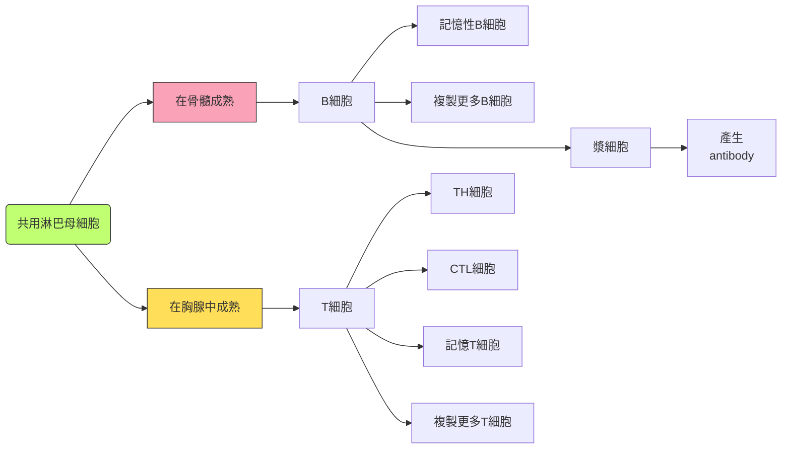

#### 自我耐受性跟增值
- 如果T或是B細胞在成熟時，產生的抗原受體會跟身體反應，該細胞會執行程序性死亡 (細胞凋亡)
- 在淋巴結中，淋巴球就在那邊等，等到合適的抗原自己結合上來，才會活化該淋巴球
- 活化後T跟B細胞開始大量複製，一部份變成功能性細胞 (effector cells)，一部份變成記憶性細胞 (memory cells)

#### T lymphocyte
- 在胸腺成熟
- 其受體有 $\alpha$ 跟 $\beta$ 鏈，一長一短，分為可變區 (variable region, V) 跟不變區 (constant region, C)
- 只結合抗原呈現細胞的MHC (主要組織相容性複合體) 上的抗原

> [!Important]
> T cell會同時結合MHC跟MHC上的抗原，這屬於雙重辨識 !!

#### B cell
- 在骨髓成熟，其辨識抗原的受體為兩種鏈組成: 輕鏈跟重鏈，共四條鏈，Y字形，中間由S-S bridge固定，分為可變區 (variable region, V) 跟不變區 (constant region, C)
- 可待在脾臟或是淋巴結等器官
- 成熟或是活化的細胞稱為漿細胞 (plasma cell)，可產生抗體
- TH細胞配對到抗原呈現細胞後，活化 (IL-2訊號)，該活化的細胞開始跟B細胞配對
- 一旦配對成功，B細胞活化成漿細胞，開始大量產生antibodies

#### 抗體是甚麼
- 抗體就是B細胞的 "抗原受體" 溶解在體液中的樣子
- 輕鏈跟重鏈都由Ig gene所編碼，基因裡面分為可變段V、連結段J，不變段C，V、J形成可變區
- C形成不變區，多樣性是由不同段落的重排產生，而且重鏈區的組合比輕鏈還要多
- 抗體的變化來自B細胞內，Ig基因的直接重組 (反正一種B細胞就是產生一種抗體)
- 重組酶 (**recombinase**) 會隨便配對V跟J片段，產生隨機的可變區樣貌。輕鏈跟重鏈都有這種現象

- 突變也會增加抗體的多樣性
- 輕鏈跟重鏈的基因都只有一套。所以它並不是多基因遺傳的東西，純粹靠重組酶的隨機切割配對
- 基因的重組是永久的，一個B細胞注定它的抗體就只能是哪一種
- IgD 是膜結合型，而其他四種溶解在血液或是體液裡面

|類型|長相和特性|功能|
|---|---|---|
|IgM|五聚體，5個基本Y型單位，通過J鏈連接成星形|血液中IgM升高提示近期或正在感染，屬於初期感染指標|
|IgG|含量最高，佔血清抗體的75–80%|唯一能通過胎盤的抗體，提供新生兒被動免疫保護，屬於後期感染的主要抗體|
|IgA|存在於唾液、淚液、乳汁、呼吸道與腸道分泌物，有時為雙聚體方式存在|保護黏膜表面，阻止病原體黏附，可以通過母乳傳給嬰兒，建立腸道免疫|
|IgD|血清含量極低，功能不清|主要作為B細胞表面標誌，參與其成熟與活化|
|IgE|主要結合在肥大細胞，和嗜鹼性粒細胞表面|可結合寄生蟲表面抗原，激活肥大細胞釋放組織胺等，增加血管通透性，用於過敏檢測|

- 在初級跟次級感染中，就是IgM跟IgG這兩個指標為主。前者是屬於初級感染時較多，後者是第二次感染後較多
- 整體來說，由於記憶性淋巴球，第二次感染產生的抗體量較多

### 體液免疫跟細胞介導免疫
- 體液免疫: 抗體負責中和跟減緩病原體毒性
- 細胞介導免疫: T細胞促進感染的細胞凋亡

> [!Note]
> 輔助型T細胞兩個都可以活化 🐱

- 輔助型T細胞辨識的是MHC II的抗原跟MHC II受體本身，結合後雙方互相丟細胞因子傳訊
- 這些抗原呈現細胞包含巨噬細胞、樹突細胞等
- MHC II會把抗原碎片裝在上面，這些碎片來自於細胞外，呈現給CD4+ Th細胞
- Th活化之後分泌細胞因子，促進體液免疫跟細胞介導免疫

#### humoral response 
- 主角就是B cell跟提醒B cell的Th cell
- B cell 本身也是抗原呈現細胞，也有MHC II分子，可以呈現抗原給Th，使B cell活化
- 一個抗原可能有不同的epitope (抗原結合抗體的地方)，所以一個抗原可能會活化多個B細胞
- 中和反應 (neutralization): 抗體可以降低該抗原 (以及抗原對應的病原體或是毒素) 進入宿主細胞的機率
- 調理作用 (opsonization): 增加嗜中性球跟巨噬細胞吞噬該病原體的機率 (因為被標記了可以看得到)
- 抗體也可以活化補體系統。補體跟"抗體-抗原複合體" 結合後，被活化，在細胞上打洞 (也就是說，被標記的病原體更容易被補體系統看到並被活化)

#### cell mediated responses
- MHC I會把抗原碎片裝在上面，這些碎片來自於細胞質裡面，呈現給CD8+ T細胞 (胞毒性T cell，Tc cell)
- CD8+ T分泌穿孔素跟顆粒酶 (perforin and granzymes)，促進細胞凋亡

> [!Tip]
> - Th cell用CD4辨識MHC II
> - Tc cell用CD8辨識MHC I 🐱

- 體液免疫跟細胞介導免疫都促進第一次跟第二次免疫反應，而記憶型細胞主要為第二次免疫反應為主

### 應用方式
#### Immunization
- 利用把抗原人工引進到體內，以產生適應性免疫反應和記憶細胞的形成
- 目前用於免疫的疫苗 (vaccines)，是由失活細菌毒素、被殺死或減弱病原體，甚至微生物蛋白質的基因所製成
- 接種計畫已經在許多傳染病上獲得成功。然而，并非所有病原體都能輕易透過接種來管理，而且一些疫苗在貧困地區並不容易取得

#### Active and Passive Immunity
- 病原體侵入身體並引發初次或再次免疫反應，這屬於主動免疫 (Active)
- 被動免疫 (Passive) 提供立即、短期保護，但往往沒有記憶性
  - 例如，當 IgG 自然地從母親穿越胎盤到胎兒，或當 IgA 從母親透過母乳傳給嬰兒時，就會發生
  - 或著是抗蛇毒血清治療 (從對抗蛇毒進行免疫的羊或馬身上取得的血清製成)，血清中的抗體可以中和蛇毒中的毒素 

#### monoclonal antibodies
- 單克隆抗體來自培養基中生長的，單一克隆的 B 細胞
- 由於這些抗體是相同的，且針對同一個epitope，單克隆抗體被廣泛應用於各種醫療診斷和治療
  - 例如，檢試劑使用單克隆抗體來測hCG，或是被用作治療某些癌症
  - 它們也可以用來識別一個人接觸過的所有病毒 (無論是通過感染或免疫接種得到的)

#### Immune Rejection
- 將細胞從一人轉移到另一人時，可能會受到免疫防禦的攻擊
- 為了最小化移植物或組織的排斥，外科醫生使用與受體的 MHC 分子盡可能相似的供體組織
- 器官捐贈接受者也會服用抑制免疫反應的藥物
> [!Important]
> 要讓CD8可以辨認最好，因為無法被辨認也會導致胞毒免疫 !! 🤔
- 血型也是一樣的，輸入不相容的血液可能導致輸入的細胞被溶解，並出現發冷、發燒、休克，甚至可能導致腎功能問題

### 免疫系統功能問題所以發的疾病
#### allergies
- 對於過敏原 (allergens) 這種抗原的反應過度，就被稱為過敏
- 第一次接觸過敏原時，B cell會分泌針對花粉粒表面抗原的特異性IgE抗體
- 當第二次過敏原進入身體時，它們結合到IgE抗體上，並引發肥大細胞釋放組織胺及其他發炎化學物質
- 急性過敏反應可在接觸過敏原幾秒內引發過敏性休克 (anaphylactic shock)，透過注射腎上腺素，可以迅速抵銷過敏反應

#### autoimmune diseases
- 在自身免疫性疾病患者中，免疫系統失去對自身的耐受性，轉而攻擊身體的某些分子

| **疾病** | **主要抗原靶點** | **影響部位** |
| --- | --- | --- |
| **類風濕性關節炎 (Rheumatoid Arthritis, RA)** | 抗 citrullinated protein antibodies (ACPAs)，抗 IgG Fc 片段 (Rheumatoid factor) | 關節滑膜組織，造成慢性炎症與關節破壞 |
| **系統性紅斑狼瘡 (Systemic Lupus Erythematosus, SLE)** | 抗核抗體 (ANA)，抗雙股 DNA (anti-dsDNA)，抗 Sm 蛋白 | 核酸與核蛋白，影響腎臟、皮膚、血管等多器官 |
| **多發性硬化症 (Multiple Sclerosis, MS)** | 抗髓鞘鹼性蛋白 (Myelin basic protein, MBP)，抗髓鞘寡糖蛋白 (MOG) | 中樞神經系統髓鞘，導致神經傳導障礙 |
| **第一型糖尿病 (Type 1 Diabetes Mellitus, T1DM)** | 抗胰島素，抗谷氨酸脫羧酶 (GAD65)，抗胰島 β 細胞抗原 | 胰島 β 細胞，造成胰島素分泌不足 |
| **重症肌無力 (Myasthenia Gravis, MG)** | 抗乙醯膽鹼受體 (AChR)，抗 MuSK 蛋白 | 神經肌肉接合處，導致肌肉無力 |
| **橋本氏甲狀腺炎 (Hashimoto’s Thyroiditis)** | 抗甲狀腺球蛋白 (anti-Tg)，抗甲狀腺過氧化酶 (anti-TPO) | 甲狀腺組織，造成甲狀腺功能低下 |

- 遺傳、性別和環境都會影響對自身免疫疾病的易感性。通常，許多這類疾病，女性比男性更常受影響

#### 演化適應
- 某些病原體可以改變epitope表達，防止宿主辨識，這被稱為抗原變異，**antigenic variation**
- 引起昏睡病的寄生蟲 (也就是動質體綱的錐蟲，*Trypanosoma*) 是一個例子
- 抗原變異也是流感病毒持續成為主要公共衛生問題的主要原因，所以每年都需要製造新的流感疫苗

#### latency
- 有些病毒可能以休眠狀態留在宿主體內，這種狀態稱為潛伏期 (latency)
- 例如herpesvirus就是一種，不同類型的herpesvirus會選擇特定細胞來潛伏

| **病毒** | **主要疾病** | **影響細胞/器官** |
| --- | --- | --- |
| **HSV-1 (Herpes Simplex Virus type 1)** | 口腔皰疹 (oral herpes)，角膜炎，腦炎 | 上皮細胞、神經元 (三叉神經節) |
| **HSV-2 (Herpes Simplex Virus type 2)** | 生殖器皰疹 (genital herpes)，新生兒感染 | 生殖道上皮細胞，神經元 (薦神經節) |
| **VZV (Varicella-Zoster Virus)** | 水痘 (chickenpox)，帶狀皰疹 (shingles) | 上皮細胞、感覺神經元、皮膚 |
| **EBV (Epstein-Barr Virus)** | 傳染性單核球增多症 (mononucleosis)，伯基特氏淋巴瘤，鼻咽癌 | B 淋巴球，上皮細胞 |
| **CMV (Cytomegalovirus)** | 先天性 CMV 感染，免疫抑制患者的肺炎/腦炎 | 單核細胞、巨噬細胞，上皮細胞 |
| **HHV-6 (Human Herpesvirus 6)** | 嬰兒玫瑰疹 (roseola infantum)，免疫抑制患者腦炎 | T 淋巴球 (CD4+) |
| **HHV-8 (Kaposi’s Sarcoma-associated Herpesvirus, KSHV)** | 卡波西氏肉瘤 | 血管內皮細胞，B 淋巴球 |

#### Human immunodeficiency virus, HIV
- 主要感染輔助T細胞
- HIV 能在宿主中持續存在，因為它具有高突變率，這促進了抗原變異
- HIV 感染會導致後天性免疫缺陷症候群 (AIDS)，這些患者對於機會性感染和癌症的易感性非常高 (一般人可以克服的疾病，對他們來說都很致命 🙂)

---

## chapter 48: what is electrical signal 🧠
### what is neuron
- 神經元包含細胞本體 (cell body)、樹突 (dendrites)、軸突 (axon)、軸丘 (axon hillock)
- 突觸 (synapse) 就是軸突跟另一個細胞的間隙，軸突的末端是突觸末梢，由neurotransmitters傳遞訊息
- 訊號的傳遞包含電訊號 (長距離) 跟化學訊號 (短距離)

#### 訊息傳遞過程
- 分成**sensory input** (感官接收)、**integration** (整合)、**motor output** (動作輸出)

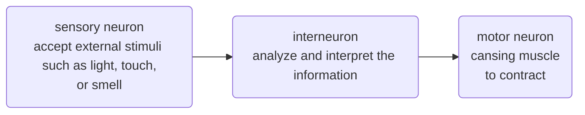
- 神經元的形狀多變，由簡而繁，取決於其功能，神經束 (nerves) 就是一堆軸突的聚集

- 動物的複雜神經元包含CNS (**central nervous system**，來自神經管) 以及PNS (**peripheral nervous system**，來自neural crest cell)，兩者都需要支持細胞 (也就是膠細胞，**gilal cell，gila**)

### membrane potential
- 膜電位平常處於靜止膜電位 (resting potential)，當電位開始變化到一定值時，被稱為動作電位 (action potential)
- 鈉鉀幫浦其實不是產生膜電位的主因。人家最主要做的，是讓 **" $Na^+$ 在膜外多， $K^+$ 在膜內多"** 這件事。
- 產生膜電位的最主要原因，來自於膜上的離子通道數量不一。通常，鉀離子通道多於鈉離子通道。
- 鈉離子會偏向流入細胞，鉀離子會偏向流出細胞，但是鉀離子通道比較多，因此產生靜止膜電位 (等一下會詳細討論)
> [!Tip] 
> 基本概念: 3鈉出，2鉀進，**鉀出得去，鈉進不來**。🐱

### what is electrochemical gradient
- 電化學梯度主要由兩個東西影響。分別是濃度梯度跟電場梯度。
- 屬於選擇性滲透 (**selective permeability**)

#### 濃度梯度
- 跟滲透壓有關。離子從濃度高的地方 → 濃度低的地方擴散
- 假如說 $K^+$ 沒有帶電，那麼 $K^+$ 應該會均勻分布在整個燒杯裡面
- 然而，我們發現， $K^+$ 明顯在左側比較多，濃度並沒有平衡
- 因此只有一種可能，這些離子帶電，產生了電場梯度，拉動了 $K^+$ 離子，使其無法完全均勻分布
- 同樣的邏輯也用在 $Na^+$ 上

#### 電場梯度
- 要是我在一杯氯化鉀溶液裡面植入一對電極，那麼離子會往與其電荷相反的電極跑去 (正離子跑向負極，反之)
- 也就是說，我們可以理解成，離子會偏向 "中和電場" 的方向
- 但是我們實際測量會發現，膜電位並不是0，原因就是因為，兩邊膜的離子濃度不一，濃度梯度產生的力量會促使$K^+$離子往濃度較低的方向跑過去
- 同樣的邏輯也用在$Na^+$上

#### Nernst equation 
##### 公式主體
- 在計算單一離子導致的靜止膜電位時，使用的公式如下:

$$
\begin{align}
E_\text{ion} &=\frac{RT}{zF}\, \ln (\frac{[\text{ion}]_\text{out}}{[\text{ion}]_\text{in}})\\[0.6em]
& \text{其中:}\\[0.6em]
E & =\text{該離子造成的膜電位}\\
z & =\text{離子電荷}\\
R & =8.314\, J/mol\cdot K\\
T & =\text{絕對溫度}\\
F & =\text{法拉第常數:}\, 96485\, C/mol
\end{align}
$$

- 我們可以基本將其簡化成:

$$
\boxed{E_\text{ion}=\frac{62}{z}\,\text{mV} (\log\frac{[\text{ion}]_\text{out}}{[\text{ion}]_\text{in}})}
$$

##### 接下來我們來開始可怕的計算地獄吧... 🙂

- 我們目前已知各個離子的梯度，如下:

|ion types|細胞內濃度|細胞外濃度|
|---|---|---|
|鉀離子 $K^+$|140 mM|5 mM|
|鈉離子 $Na^+$|15 mM|150mM|
|氯離子 $Cl^-$|10 mM|120 mM|

- 我們分別根據濃度在膜的內外放入氯化鉀跟氯化鈉
- 如果該膜僅選擇性滲透鉀離子，那麼膜電位為:

$$
E_K = \frac{62}{+1}(\log\frac{5}{140})=-89.72\,\text{mV}
$$

- 如果該膜僅選擇性滲透鉀離子，那麼膜電位為:

$$
E_{Na}= \frac{62}{+1}(\log\frac{150}{15})=+62\,\text{mV}
$$

- 由於膜上面同時有鉀離子跟鈉離子，所以我們可以推測，無論是在靜止膜電位、去極化、過極化，膜電位基本上都會在大約 -90mV跟+62mV 之間
- 因為膜對 $K^+$ 的通透性最高，靜止電位就接近 $K^+$ 的平衡電位 (通常在 -70 ~ -90 mV)

#### 補充: Goldman–Hodgkin–Katz (GHK) equation
##### 公式主體

$$
V_m = \frac{RT}{F} \ln \left(\frac{P_K[K^+]_\text{out} + P_{Na}[Na^+]_\text{out} + P_{Cl}[Cl^-]_\text{in}}{P_K[K^+]_\text{in} + P_{Na}[Na^+]_\text{in} + P_{Cl}[Cl^-]_\text{out}} \right)
$$

- 其中， $P$ 為膜對該離子的通透性
- 通道密度越大， $P$ 的權重越大
- GHK方程式僅適用於單價離子，對於某些通透性低的離子 (如 $Ca^{2+}$ )，可忽略不計
##### 舉栗 🌰
- 對於人體神經細胞來說，如下:

|ion types|細胞內濃度|細胞外濃度|通透性比值|
|---|---|---|---|
|鉀離子 $K^+$|140 mM|5 mM|1.0|
|鈉離子 $Na^+$|15 mM|150mM|0.04|
|氯離子 $Cl^-$|10 mM|120 mM|0.45|

$$
\begin{align}
& \text{膜內狀態:}\\[0.5em]
& P_K[K^+]_\text{out} + P{Na}[Na^+]_\text{out} + P_{Cl}[Cl^-]_\text{in} \\[0.3em]
& = (1.0)(5) + (0.04)(150) + (0.45)(10) \\[0.3em]
& = 5 + 6 + 4.5 = 15.5\\[1em]
& \text{膜外狀態:}\\[0.5em]
& P_K[K^+]_\text{in} + P_{Na}[Na^+]_\text{in} + P_{Cl}[Cl^-]_\text{out} \\[0.3em]
& = (1.0)(140) + (0.04)(15) + (0.45)(120) \\[0.3em]
& = 140 + 0.6 + 54 = 194.6\\[1em]
& \text{代回公式:}\\[0.5em]
& V_m = \frac{RT}{F} \ln (\frac{15.5}{194.6})
\approx 26.7 \times -2.5301
\approx \boxed{-67.55\text{mV}}
\end{align}
$$

- 因此可推斷出，人的神經細胞的靜止膜電位大概是$-67.55\text{mV}$

#### how to caculate the free energy $\Delta G$ ?

##### 公式主體
- 想要計算 "溶質從 $C_S$ 跑到 $C_E$ "，可用以下公式:

$$\Delta G = RT \,\ln\frac{C_E}{C_S}+zF\Delta \psi$$

- 此公式相當於 "運輸一莫耳的物質需要的能量"，並同時將濃度梯度跟電場梯度加起來
- 此處的 $\Delta \psi$ 就是剛才計算的膜電位
##### 舉栗 🌰
- 一樣，我們的各個離子濃度如下:

|ion types|細胞內濃度|細胞外濃度|
|---|---|---|
|鉀離子 $K^+$|140 mM|5 mM|
|鈉離子 $Na^+$|15 mM|150mM|

- 同時我們以剛才算的為例，定義膜電位: $-67.55\text{mV} \approx -0.068\text{V}$
- 我們分別計算鈉離子跟鉀離子的跨膜運輸的自由能

$$
\begin{align}
\Delta G_{Na^+} & = RT \,\ln\frac{[Na^+]_E}{[Na^+]_S}+zF\Delta \psi\\[0.5em]
& =8.314\times 310\,\text{K}\times (\ln\frac{0.150}{0.015}) + 1\times 96485\times (+0.068)\\[0.5em]
& =5935+6561=12.496\,\text{kJ/mol}\\[1em]
\Delta G_{K^+} & = RT \,\ln\frac{[K^+]_E}{[K^+]_S}+zF\Delta \psi\\[0.5em]
& = 8.314\times 310\,\text{K}\times (\ln\frac{0.140}{0.005}) + 1\times 96485\times (- 0.068)\\[0.5em]
& = 8588+(-6561)=2.027\,\text{kJ/mol}
\end{align}
$$

- 由於鈉鉀幫浦為 "3鈉出，2鉀進，使用1 ATP" ，因此我們可以推測每使用1 ATP，用來運輸的能量為:

$$\Delta G_\text{total}=3\times 12.496 + 2\times 2.027= +41.542\,\text{kJ}$$

- 雖然ATP水解的自由能為$-30.5\,\text{kJ/mol}$，但是在身體的狀態條件下，為高 ATP/低 ADP的比例，這樣會讓反應更偏向釋放能量。因此ATP水解的實際自由能變化可以達到 $-50\, \text{kJ/mol}$
- 由於 $50>41.542$ ，鈉鉀幫浦確實有辦法用一ATP就做到 "3鈉出，2鉀進" 的目標 🐱

> [!Note]
> $Cl^-$ 和 $Ca^{2+}$ 也有各自的平衡電位，但在動作電位的主要過程中影響較小。

### 動作電位
- 透過電壓門控通道 (voltage gated ion channels) 控制

#### hyperpolarization and depolarization
- 靜止膜電位大概是-72mV，所以過極化就是讓電位往鉀離子通道全開 (-90mV) 更靠近一點，去極化就是讓電位往鈉離子通道全開 (+62mV) 更靠近一點
- 不過只要沒有超過threshold，通常不久之後，膜電位會漸漸回到-72mV
- 然而，有些通道受到膜電位目前的狀態影響，如果超過某個threshold，就會開啟，這也是動作電位的原理

#### action potential
- 動作電位具有恆定的幅度，屬於all-or-none特性
##### 1. Resting Potential
- 細胞維持在約 -70 mV，大多數電位門控鈉和鉀通道是關閉的，靜止膜電位]主要由鉀通道決定
- $K^+$ 漏通道開放， $K^+$ 持續外流
- $Na^+/K^+$ ATPase 幫浦維持濃度梯度
- 膜電位接近 $K^+$ 的平衡電位

##### 2. Depolarization
- 刺激使電壓依賴性 $Na^+$ 通道開始開啟。
- $Na^+$ 通道快速開啟，$Na^+$ 大量流入
- 膜電位迅速上升，朝向 $Na^+$ 平衡電位 (+62 mV)
- 正回饋: 更多 $Na^+$ 通道被激活

##### 3. Rising Phase
- 動作電位快速衝到峰值。
- $Na^+$ 流入達到最大
- 膜電位接近 +30 ~ +40 mV

##### 4. Falling Phase
- $Na^+$ 通道關閉， $K^+$ 通道打開。
- 電壓依賴性 $K^+$ 通道延遲開啟， $K^+$ 外流
- 膜電位下降回負值
- $Na^+$ 通道進入失活狀態
- **refractory period**，失活狀態下，通道無法立即再開，通道通常不會立即在開啟，動作電位暫時無法出現

> [!Tip]
> - 電壓依賴性 Na⁺ 通道是一種跨膜蛋白，主要由四個重複的結構域 (DI–DIV) 組成，每個結構域有六個跨膜螺旋 (S1–S6)
> - S4 螺旋是電壓感測器，帶有正電荷，會隨膜電位改變而移動
> - 失活門 (inactivation gate)位於通道的胞內環 (通常是 DIII–DIV 之間的連接 loop)，含有一個 "IFM 三肽" (isoleucine–phenylalanine–methionine)，像一個小球或 "蓋子"
> - 在通道開啟後的毫秒內，IFM 三肽會像塞子一樣插入通道的內口，阻止 $Na^+$ 再流入 (失活)
> - 復極化 → 復原: 當膜電位回到負值，通道回到關閉狀態，失活門移開，準備下一次開啟 🐱

##### 5. Undershoot (Hyperpolarization)
- $K^+$ 通道關閉較慢，造成膜電位短暫低於靜止值。
- $K^+$ 外流持續，膜電位降到 -80 ~ -90 mV
- $Na^+$ 通道逐漸恢復到可激活狀態
- 最後回到靜止電位

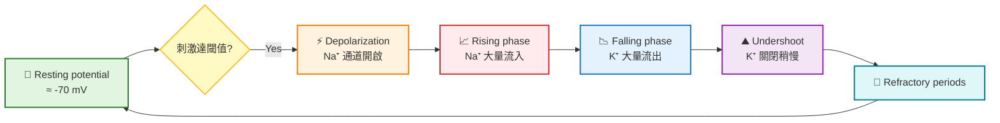

#### 動作電位傳遞
- 在動作電位產生的部位 (通常是軸丘)，電流會去極化鄰近區域
- 由於失活的 $Na^+$ 通道位於去極化區域前方 (也就是目前過極化的地方)，可防止動作電位反向傳遞
- 一個神經元產生動作電位的 "頻率" 與輸入信號強度成正比
- 編碼離子通道的基因突變會導致影響神經或腦部，或是肌肉、心臟的疾病 (因為肌肉收縮也是一種跟離子通道有關的東西)

#### 軸突的演化適應
- 動作電位的傳遞速度正比於軸突的直徑
- 在脊椎動物中，軸突由髓鞘 (**myelin sheath**) 絕緣，以增加動作電位的速度
- 髓鞘是由膠質細胞形成的: 在中樞神經系統中是寡樹突膠質細胞，而在周邊神經系統中則是許旺細胞 (**Schwann cells**)

- 兩個髓鞘中間沒有被包裹的軸突區域被成為朗氏節 (**node of Ranvier**)，電位門控鈉通道僅在此處才有
- 在髓鞘化的軸突中，動作電位透過跳躍傳導 (**saltatory conduction**)，在node of Ranvier之間跳躍傳遞

### 神經元在synapse與其他細胞溝通
- 絕大多數神經突觸是化學突
- 神經傳導物質在神經元之間傳遞資訊
- 突觸前神經元 (**presynaptic neuron**) 在突觸終末的突觸囊泡中，合成並包裝神經傳導物質。而動作電位會導致期從囊泡中釋放至突觸間隙 (**synaptic cleft**)，神經傳導物質結合到突觸後神經元上的受體

- 有些通道屬於**ligand-gated ion channel**，接收到配體就會打開，導致去極化，產生突觸後電位 (**postsynaptic potential**)

> [!Note]
> 有些ligand-gated ion channel對鈉離子跟鉀離子都有通透性 🐱

#### 突觸後電位類型
##### EPSPs, Excitatory Postsynaptic Potentials
- 通常是配體門控的 $Na^+$ 通道 或非專一性陽離子通道 (可允許 $Na^+$ 進入，有時也允許少量 $K^+$ 外流)
- $Na^+$ 內流 → 使膜電位去極化，導致膜電位更接近閾值，增加動作電位產生的可能性
- 神經傳遞物質例子: 
  - **glutamate** (主要的中樞興奮性神經傳遞物質)
  - **acetylcholine** (神經肌肉接合處)

##### IPSPs, Inhibitory Postsynaptic Potentials)
- 通常是配體門控的 $Cl^⁻$ 通道 或 $K^+$ 通道，可能是:
  - $Cl^⁻$ 內流 → 使膜電位更負（超極化）
  - $K^+$ 外流 → 也使膜電位更負
- 導致膜電位遠離閾值，降低動作電位產生的可能性
- 神經傳遞物質例子: 
  - **GABA** ( $\gamma$ -aminobutyric acid，中樞神經的主要的抑制性神經傳遞物質)
  - **glycine** (在脊髓常見)

#### summation of postsynaptic potentials
- 一個突觸後神經元的細胞體和樹突可能會從數百或數千個突觸終末接收輸入
- 單一個EPSP通常太小，無法觸發後突觸神經元的動作電位
- 個別後突觸電位可以結合，在稱為summation的過程中，產生一個更大的電位，這被稱為summed effect
- EPSPs 及 IPSPs 的總和效應決定突觸後神經元的軸丘要不要傳遞動作電位

> [!Tip]
> 一個IPSP抵銷一個EPSP 🐱

#### 神經傳導物質信號的終止
- 傳遞結束後，神經傳導物質分子會從神經突觸間隙中清除
- 可能是會被酵素水解，或是被再回收到突觸前神經元
- **sarin**抑制分解神經傳遞物質 (acetylcholine) 的酶 (acetylcholine esterase)，導致死亡

#### 突觸的調控
- 有些神經傳遞物的受體不是門控通道，而是**metabotropic receptor** (例如GPCR)，因此，突觸後神經元的離子通過通道的狀態，就取決於一個或多個細胞通路步驟，該通路往往涉及第二信使 (如cAMP)
- 一個神經傳遞物，根據其受體的不同，可導致完全不同的反應 (可以是抑制型，也可以是激動型)

#### acetylcholine
- 調控肌肉運動、記憶形成跟學習
- 脊椎動物有兩種乙烯膽鹼受體，一種為配體門控通道，一種是代謝型受體

##### Nicotine
- 直接結合並活化**菸鹼型乙醯膽鹼受體 (nAChR)**，也就是acetylcholine的配體門控陽離子通道
- 效果: 模仿ACh → 開啟通道 → $Na^+$ 內流 → 去極化 → 促進興奮性突觸後電位 (EPSP)

> [!Tip]
> 屬於 "受體激動劑" (增強ACh的作用，即使沒有真正的ACh存在) 🐱

##### Sarin or VX
- **抑制乙醯膽鹼酯酶 (AChE)**，這是分解ACh的酵素
- 效果: ACh無法被分解 → 在突觸間隙累積 → 持續刺激受體
- 造成過度去極化，肌肉或神經持續收縮，最終導致癱瘓或呼吸衰竭。

> [!Tip]
> 屬於 "酵素抑制劑"，讓ACh的訊號無法關掉 🐱

##### Botulinum toxin 
- 阻斷突觸前神經末端的ACh釋放。它**切斷SNARE蛋白**，讓囊泡無法與膜融合
- 效果: ACh 無法釋放 → 突觸後受體沒有刺激 → 神經肌肉傳導中斷。
- 造成肌肉鬆弛性麻痺

>[!Tip]
> 屬於 "釋放抑制劑"，直接切斷ACh的來源 🐱

#### amino acid
- 包含**glycine、GABA、glutamate**

#### biogenic amine
- 生物胺包括**norepinephrine、epinephrine、dopamine跟serotonin (5-HT)**
- 前三者以**tyrosine**為前驅物，血清素的前驅物是**tryptophan**

#### neuropeptide
- 例如**P物質 (substance P)、內啡肽 (endorphins)**

#### Gases
- 例如**一氧化氮** (nitric oxide， $NO$ )、**少量一氧化碳** ( $CO$ )

| 類別 | 代表性神經傳遞物 | 功能與特色 |
| --- | --- | --- |
| **Amino acids** | **Glutamate** | 主要的興奮性神經傳遞物，促進 EPSPs，參與學習與記憶 (長期增強 LTP)。 |
|  | **GABA ( $\gamma$ -aminobutyric acid)** | 主要的抑制性神經傳遞物，開啟 Cl⁻ 通道，造成 IPSPs，維持神經穩定。 |
|  | **Glycine** | 在脊髓與腦幹常見，抑制性，幫助運動協調。 |
| **Biogenic amines** | **Acetylcholine (ACh)** | 在神經肌肉接合處引起肌肉收縮；在中樞參與注意力、學習。 |
|  | **Dopamine** | 調控動作、獎賞與動機；失衡與帕金森氏症、成癮相關。 |
|  | **Norepinephrine (Noradrenaline)** | 參與覺醒、注意力、交感神經反應。 |
|  | **Serotonin (5-HT)** | 調控情緒、睡眠、食慾；抗憂鬱藥常作用於此。 |
| **Neuropeptides** | **Substance P** | 傳遞疼痛訊號。 |
|  | **Endorphins** | 內生性阿片類，抑制疼痛，產生愉悅感。 |
| **Gases** | **Nitric oxide (NO)** | 非囊泡釋放，直接擴散；調控血管擴張、突觸可塑性。 |
|  | **Carbon monoxide (CO)** | 也可作為訊號分子，調控神經傳導。 |
| **其他** | **ATP** | 可作為神經傳遞物，調控痛覺與神經調節。 |
|  | **Endocannabinoids** | 逆行性傳遞，調控突觸釋放，與食慾、痛覺、情緒相關。 |

---

## chapter 49: neural regulation in animals
### 我們的神經系統長怎樣
#### 無脊椎動物
- 神經系統再寒武紀大爆發時就有出現，並且各自分化了
- 例如刺絲胞動物門 (cnidarians) 有神經網 (nerve nets)，而更複雜的生物出現神經束 (nerves)
- 海星的神經屬於輻射狀神經束，連結到中樞的 "神經環"
- 兩側對稱動物 (bilaterally symmetrical animals) 產生頭化現象 (cephalization)，主要的處理中心或是感知中心移至頭部
- flatworm就已經有這種現象，也有中樞神經 (central nervous system , CNS)，周邊神經系統 (peripheral nervous system, PNS) 會將信號傳入或是傳出中樞神經系統
- 到了環節動物跟節肢動物，出現了神經節 (ganglia) 的構造

> [!Note]
> - CNS由大腦跟脊髓組成
> - PNS由神經束神經節組成 🐱

- 神經的複雜程度取決於其生活方式，例如不動的軟體動物 (例如雙殼綱) 神經構造就比較簡單，活動量高的軟體動物 (例如頭足綱)，有比較複雜的神經構造

#### 脊椎動物
##### CNS
- CNS發育於中空的神經管，神經管裡面的空間形成脊髓狹窄的中央管 (central canal)，以及大腦的腦室 (ventricles)
- 裡面充滿腦脊髓液 (cerebrospinal fluid)，為中樞神經系統提供營養跟激素，並且帶走廢物
- 大腦跟脊髓有灰質 (gray matter) 跟白質 (white matter)，灰質主要是細胞本體、樹突、未髓鞘化的軸突組成。白質主要由已髓鞘化的軸突束組成
- 脊髓除了接收大腦訊息以及傳遞訊息，也可以獨立於腦部產生反射 (reflex)，例如膝跳反射 (knee-jerk reflex)，有時反射甚至不需要interneuron的參與，只要有sensory neuron跟motor neuron就行

> [!Important]
> - 大腦為**灰質外，白質內**；
> - 脊髓為**灰質內，白質外**。 🐱

##### PNS
- 分為傳出神經元 (**efferent neurons**) 跟傳入神經元 (**afferent neurons**)

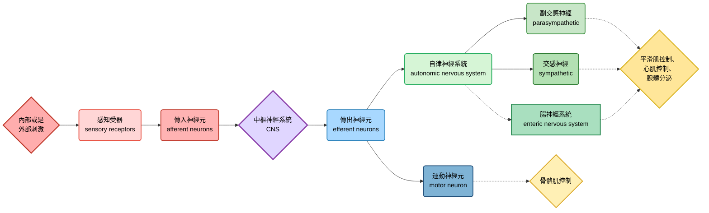

- 運動神經元系統 (motor system)，控制隨意肌 (也就是骨骼肌)，在突觸分泌acetylcholine
- 自律神經系統 (autonomic nervous system)，控制平滑肌跟心肌
   - sympathetic division: 負責戰或逃反應 (fight-or-flight)，preganglionic neurons在突觸分泌acetylcholine，postganglionic neurons分泌norepinephrine
   - parasympathetic division: 負責休息跟消化 (rest-and-digest)，preganglionic neurons跟postganglionic neurons都是在突觸分泌acetylcholine

- 腸神經系統 (enteric nervous system)，直接控制消化道、胰臟、或是膽囊的部分

#### glial cells, or gila
- 神經膠細胞具有多種功能，包含支持、滋養跟調節神經元
   - 胚胎放射膠細胞 (embryonic radial glia) 形成好幾條渠道，神經元就沿著這些渠道生長跟遷移
   - 星狀細胞 (astrocyte) 形成血腦屏障 (blood-brain barrier, BBB)
   - 兩種細胞都是幹細胞，可以進行細胞分裂跟分化 

### the brain in vertebrates
- 包含三大區域: 前腦 (forebrain)、中腦 (midbrain) 跟後腦 (hindbrain)
- 這切區域在胚胎發育時，來自神經管前端 (anterior)
- 前腦包含嗅球，以及睡眠、學習等等我們常第一時間想到的大腦功能
- 中腦協調感覺輸入的一部份
- 後腦包含非自主的活動 (例如呼吸節律)，以及運動協調

- 中腦跟部分後腦形成腦幹 (brainstem)，與脊髓相連，後腦的另一部份形成cerebellum (小腦)
- 前腦分化成間腦 (diencephelon) 跟端腦 (telencephalon)，間腦變成腦內的內分泌組織，端腦形成大腦主體 (cerebrum)

- cerebrum就是控制骨骼肌、情緒、學習、記憶、認知的地方，尤其在骨骼肌控制、認知跟學習的部分，由大腦皮質擔任重要角色
- 胼胝體 (corpus callosum) 為軸突束，連接左右腦半球
- cerebellum跟平衡感、運動控制有關
- diencephelon的重點就是端視丘、視丘跟下視丘，下視丘控制體溫以及生理時鐘
- brainstem由中腦、橋腦 (pons) 跟延髓 (medulla oblongata) 組成
  - 中腦就是感覺訊息的整合區，會幫忙把整合後的信號發送到大腦特定區域
  - 橋腦跟延髓在周邊神經以及中腦之間幫忙傳遞信號
  - 延髓也控制一些自主功能 (例如呼吸、吞嚥、嘔吐反射等)

#### 睡跟醒的控制
- 覺醒 (arousal) 就是大腦能感知外界信號的狀態，而睡眠 (steep) 雖然能接收外部信號，但是無法感知
- 由brainstem跟cerebrum控制
- 兩個狀態的切換主要由網狀結構 (reticular formation) 控制，這是由中腦跟橋腦的神經元組成的，其調控睡眠周期 (也包含REM跟夢境的部分)
- 生理時鐘由於是由diencephelon控制，因此前腦也算是有參一咖

> [!Tip]
> 海豚的大腦左右會在不同的state之間切換，每一次只會有一邊的腦是 "睡著" 的 !! 👀

#### 晝夜節律
- circadian rhythms的底層機制是周期性的基因表現以及細胞活動
- 通常會跟外界的日夜同步 (通常啦，通宵的我是例外 🙂)
- 在哺乳動物中，該節律由下視丘的 "視交叉上核" (suprachiasmatic nucleus, SCN) 神經元簇協調

#### 情緒
- 由杏仁核 (amygdala)、海馬迴 (hippocampus)、視丘的一部份等等區域控制
- 屬於邊緣系統 (limbic system) 的一部份
- 當有情緒相關的記憶時，amygdala往往會幫助該記憶的提取跟儲存
- 情緒的產生跟體驗是非常複雜的交互作用 (複雜到你會想要摔書的程度 🤣)

#### 影像掃描
- 正子斷層掃描 (positron emission tomography, PET)，透過注射放射性葡萄糖來檢測大腦的代謝活動
- 功能性磁振造影 (functional magnetic resonance imaging, fMRI)，透過檢測局部氧濃度的變化檢測大腦活動
- fMRI應用範圍很廣，包含監測中風之後的復健狀況、提高腦部外科手術的有效性

### 大腦皮質的區塊介紹
- 不同腦葉 (lobe) 控制特定腦區活動，包含額葉 (frontal)、顳葉 (temporal)、枕葉 (occipital)、頂葉 (parietal) 等等

#### 訊息傳遞
##### 1. 感覺輸入 (Sensory Input)
- 感覺器官 (眼睛、耳朵、皮膚等)將外界刺激轉換成電訊號
- 訊號經由感覺神經元傳入中樞神經系統
- 例如: 視覺訊號先到視丘 (thalamus)，再送往初級視覺皮層

##### 2. 初級皮層處理 (Primary Cortical Areas)
- 每種感覺有對應的初級皮層，例如: 
  - 視覺皮層 (枕葉，occipital lobe)
  - 聽覺皮層 (顳葉，temporal lobe)
  - 體感皮層 (頂葉，parietal lobe)
- 在這裡，訊號被初步解碼成基本特徵 (如顏色、形狀、音高、觸覺強度)

##### 3. 聯合皮層整合 (Association Areas)
- 訊號進一步在聯合皮層整合，形成更高階的知覺與意義
- 例如，把 "顏色 + 邊界 + 運動" 整合成 "這是一隻移動的貓咪 🐱"，整合後的訊息可以傳遞到其它腦區，例如: 
   - parietal lobe可以做空間定位、感覺整合
   - temporal lobe幫忙語言理解 (例如Broca's area)、記憶
   - frontal lobe負責決策、計劃、執行控制

##### 4. 運動輸出 (Motor Output)
- 訊號由初級運動皮層發出，經由脊髓運動神經元到達肌肉
  - 小腦可以幫忙協調動作、平衡
  - basal ganglia可幫忙動作啟動與抑制

> [!Important]
> 在somatosensory cortex跟motor cortex，不同cortex區域負責不同的身體部位 !! 👀

#### 語言輸出跟輸入
- **Broca’s area**負責把語言 "說出來" (缺失的話，只能聽懂，無法說話)
- **Wernicke’s area**負責 "理解語言" (缺失的話，可以說話，但無法溝通)

#### 皮質的功能側化現象
- 左腦半球主要負責語言、邏輯的部分 (所以Broca’s area等區域也在這個位置)
- 右腦半球負責更多圖形跟臉部辨識、非語言化思考
- 這左右腦功能有差異的現象，被稱為 "側化" (lateralization)，不過由於有corpus callosum，所以兩個半球的分工還是能夠協調

> [!Note]
> corpus callosum的切開會導致 "裂腦現象" 的發生 ("split brain" effect) 🤔

#### 額葉的功能
- 額葉的損害可能影響決策能力以及情緒反應，但是不會妨礙記憶力跟智力，也就是說，額葉更重要的功能叫做 "執行" (就是CEO啦)
- 經典翻車案例包含:
  - Phineas Gage (1848)，鐵棒意外穿過個體的額葉 (這人活下來也是奇蹟)，智力與基本感覺運動功能保留，但性格劇烈改變——變得衝動、粗魯、缺乏計劃性。該案例首次顯示額葉與人格、社會行為密切相關

  - lobotomy (1930~1950)，透過冰錐手術來切除額葉，當時用於治療精神疾病，患者焦慮或攻擊性減少，但同時失去情感深度、判斷力與自主性。後來被認為是過度破壞性的治療，逐漸被淘汰

#### 鳥類為甚麼這麼聰明? 🐥
- 鳥類並沒有跟人類等哺乳動物類似的neocortex，神經元的排列方式也不太一樣，但是整合訊息的能力依然很高
- 目前認為，鳥類整合訊息的地方，位於大腦頂部跟外側，細胞核叢聚的區域 (這地方被稱為pallium)

##### 哺乳類 cortex
- 典型的六層結構 (laminar organization): 從分子層到多形層，每層有不同的神經元型態與連結模式
- 這種層狀結構讓訊息能在垂直柱狀單位 (cortical columns) 中高效處理。

##### 鳥類 pallium
- 沒有明顯的六層結構，而是呈現核團式 (nuclear organization): 神經元聚集成團塊，而非層狀排列
- 雖然缺乏層狀，但這些核團之間的連結模式能達到類似哺乳類皮質的功能分工

> [!Note]
> 鳥類 pallium 與哺乳類 cortex 在結構上不同 (層狀 vs 核團)，但在功能上卻有高度相似性，這也是 "趨同演化" 案例 😏

### 突觸連結的變化
- 基因表現跟訊號傳遞決定跟調控神經元的形成位置
- 然而，在競爭生長支持因子的過程中，胚胎發育產生的神經元，只有一半能存活到成年，其他都死光了

> [!Important]
> 承認吧，你家小孩的神經元比你還多 !!

#### 神經可塑性
- 代表神經系統出生後會重塑的能力
- 神經可塑性缺陷可能是自閉症譜系障礙的潛在病因 (autism spectrum disorder)，表現症狀包含溝通跟社交互動障礙、重複跟強迫行為等
- 這種疾病其實有遺傳傾向
- 如果兩個突觸 (這兩個突觸可能來自於完全不同區域的神經元) 常常**同時一起放電**，他們倆的信號都會增強
- 反之，如果出現放電的不同步或是延遲，反而會降低信號，甚至是突觸萎縮

#### 記憶跟學習
- 神經可塑性跟記憶有關係，短期記憶跟海馬迴形成的暫時連結有關係，而在長期記憶，大腦皮質的連結最終會取代海馬迴的暫時連結
- 也就是說，海馬迴病不是幫你儲存存舊的記憶，而是幫你形成新記憶。你的長期記憶連結已經在大腦皮質裡面形成了
- 記憶的鞏固過程，可能一部份發生在睡眠階段
- 記憶的丟失，以及海馬迴的損害，可能跟失智 (例如Alzheimer’s disease) 有關係 

#### LTP, long term potentiation
- 整個過程可以分為三個主要階段: **誘導 (Induction)**、**維持 (Maintenance)** 與 **表現 (Expression)**
##### 關鍵角色
- **突觸前神經元**: 釋放神經傳導物質**麩胺酸 (Glutamate)**。
- **突觸後神經元**: 主要有兩種麩胺酸受體: 
    - **AMPA 受體**: 平時負責快速傳導訊號。一旦結合麩胺酸，會讓鈉離子 ( $Na^+$ ) 流入，造成去極化。
    - **NMDA 受體**: 平時被鎂離子 ( $Mg^{2+}$ ) 堵住通道口。需要 "強烈的去極化" 才能把鎂離子踢開。它允許鈣離子 ( $Ca^{2+}$ ) 流入，這是啟動 LTP 的關鍵。

##### 第一階段: 誘導 (Induction) 

- 這個階段需要突觸後神經元產生 "強烈去極化"
1. **高頻釋放麩胺酸**: 突觸前神經元因高頻刺激，反覆釋放大量麩胺酸到突觸間隙。
2. **AMPA 受體引發初步去極化**: 麩胺酸與突觸後膜上的AMPA受體結合， $Na^+$ 快速流入，產生EPSP。雖然一般單次刺激的EPSP很小，但高頻刺激讓EPSP不斷疊加，膜電位顯著上升
3. **NMDA 受體的鎂離子阻斷被解除**: 當膜電位因疊加的EPSP達到足夠去極化，原本堵在NMDA受體通道口的 $Mg^{2+}$ 會因電荷排斥而被踢開
4. **鈣離子湧入**: 此時NMDA受體通道開啟，除了 $Na^+$ 流入， $Ca^{2+}$ 也大量流入突觸後細胞內。這些 $Ca^{2+}$ 是啟動 LTP 的關鍵第二信使
5.  **活化 $Ca^{2+}$ 依賴性酵素**: 流入的 $Ca^{2+}$ 會結合並活化多種酵素，最重要的是 **CaMKII (鈣/鈣調蛋白依賴性蛋白激酶 II)** 和 PKC、PKA 等

##### 第二階段: 表現 (Expression) 
- 這個階段發生在誘導後數分鐘內，突觸反應立即變強。效應包含:
1. **AMPA受體磷酸化**: 活化的CaMKII會直接磷酸化已存在突觸後膜上的AMPA受體，使其對麩胺酸的敏感度提高、通道開啟時間變長。這導致每次刺激能產生更大的EPSP
2. **更多AMPA受體插入膜中**: 細胞內的AMPA受體 (原本儲存在胞內囊泡中) 會受到 CaMKII 及其他訊號的驅動，快速移動並插入到突觸後膜上。這增加了受體的總數目，對麩胺酸的反應更強
3. **突觸後結構初步變化**: 突觸後密度 (PSD) 區域變大、結構更穩固。
- 當下次再給予單次刺激時，即使只釋放少量麩胺酸，突觸後神經元也會因為有更多、更敏感的 AMPA 受體而產生遠比 "LTP 誘導前" 更大的EPSP

##### 第三階段: 維持 (Maintenance) 
- 如果要讓LTP持續數小時、數天甚至更久，需要蛋白質合成與結構改變。
1. **逆行訊息傳遞**: 突觸後細胞產生的某些訊號會傳回突觸前細胞，促進它釋放更多麩胺酸，形成正回饋
2. **基因表達與新蛋白質合成**: $Ca^{2+}$ 流入也會活化其他路徑 (如 MAPK/ERK)，最終影響細胞核，轉錄CREB (cAMP 反應元件結合蛋白)相關基因。這些基因會製造新的蛋白質 (包括新的AMPA受體、細胞骨架蛋白等等)
3. **突觸結構重塑**: 新合成的蛋白質被送到特定突觸，導致:
    - 突觸後膜面積增大、密度變厚
    - 可能產生新的突觸棘 (dendritic spine)
    - 突觸前末梢也跟著增大、囊泡增多

##### 總結圖表

| 階段 | 關鍵事件 | 主要分子 | 時間尺度 |
| :--- | :--- | :--- | :--- |
| **誘導** | 強烈去極化 → Mg²⁺ 離開 NMDA 受體 → Ca²⁺ 流入 | NMDA 受體、Ca²⁺ | 毫秒至秒 |
| **表現** | AMPA 受體磷酸化 + 更多 AMPA 受體插入膜 | CaMKII、AMPA 受體 | 分鐘至小時 |
| **維持** | 蛋白質合成、突觸結構改變 | CREB、PKMζ、新蛋白質 | 小時至天 |

> [相關資訊可以參考這一篇文章喔~](https://pmc.ncbi.nlm.nih.gov/articles/PMC3367554/)，或是直接參考doi: 10.1101/cshperspect.a005710 😏

### nervous system disorders
#### schizophrenia
- 思覺失調症，aka精神分裂，通常症狀包含幻覺 (hallucinations) 跟妄想 (delusions)，約有1%的人口罹患
- 有很強的遺傳傾向，當然，環境因子也會影響，一致率大概是48%
- 被認為是多巴胺通路的失調導致，D2受體的拮抗劑常常用來緩解症狀 (例如risperidone)

#### depression
- 一般的抑鬱症狀包含失去興趣跟愉悅感 (anhedonia)，或是動機喪失
- 雙極性情感疾患 (bipolar disorder，也就是躁鬱症)，會有manic跟depressive phase的交替狀態
- 通常會透過活化生物氨的作用路徑來緩解症狀，例如作用在血清素 (SSRIs，例如fluoxetine)、或是作用在正腎上腺素和多巴胺 (NDRIs，例如bupripion)

#### drug addiction
- 通常跟邊緣系統的中腦邊緣迴路有關係，主要影響神經傳遞物為dopamine
- 有些藥物之所以會成癮 (例如苯乙胺類藥物)，是因為其過度活化了中腦邊緣迴路導致
- 會導致強迫型的服用藥物或是成癮物，且難以控制。長期的獎勵迴路活化也會促進LTP (只是不太好的那種 🤣)

> [!Note]
> 核心路徑是**中腦腹側被蓋區 (VTA) → 伏隔核 (nucleus accumbens) → 前額葉皮質**

##### Nicotine
- 結合在VTA的菸鹼型乙醯膽鹼受體 (nAChR)
- 直接促進VTA多巴胺神經元放電 → 增加伏隔核的多巴胺釋放

##### Alcohol
- 主要透過GABA_A受體增強 (抑制性) 與NMDA受體抑制 (興奮性)
- 在VTA中，酒精減少抑制性GABAergic神經元的活性 → 解除對多巴胺神經元的抑制 → 多巴胺釋放增加

##### Opioids
- 結合在VTA的 $\mu$ 受體，其主要位於GABAergic抑制性神經元上
- 抑制這些GABA神經元 → 減少它們對多巴胺神經元的抑制 → 多巴胺神經元放電增加

#### Alzheimer’s disease, AD
- 屬於失智 (dementia) 的一種，隨著年齡增長，罹患風險也會上升
- 被認為跟類澱粉斑塊、神經纖維纏結、以及tau蛋白過度磷酸化有關係
- 會導致腦組織大量萎縮 (也就是神經元死亡)
- 目前沒有治癒方法，但有些藥物可以緩解症狀
- 被認為有些基因跟這個疾病有關係 (如APOE4)

> [!Note]
> 在chronic traumatic encephalopathy (慢性創傷性腦病，CTE) 中，也有發現tau蛋白累積的症狀 🤔

#### Parkinson’s disease, PD
- 由於分泌dopamine的神經元 (黑質腹側的緻密部) 喪失所導致的疾病
- 症狀包含肌肉震顫、姿勢平衡障礙、運動遲緩等等
- 被認為跟基因有關係 (例如SNCA、LRRK2)
- 治療方式包含使用L-dopa (dopamine前驅物的一種):

$$L-dopa\xrightarrow{dopa\ decarboxylation} dopamine$$

