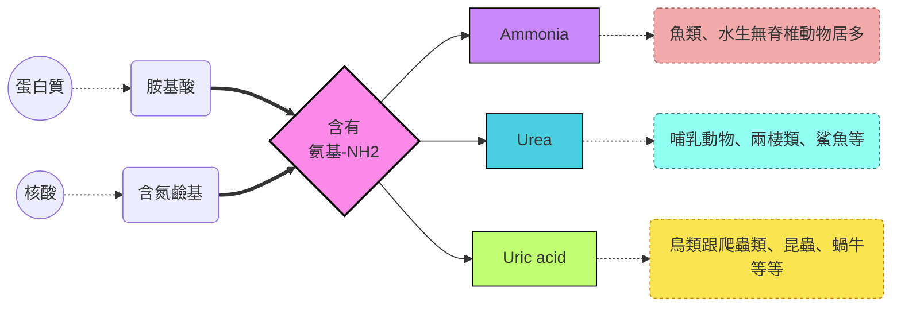
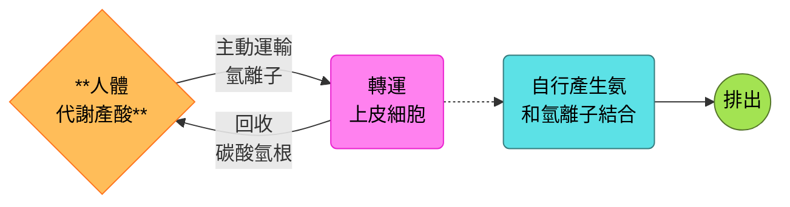
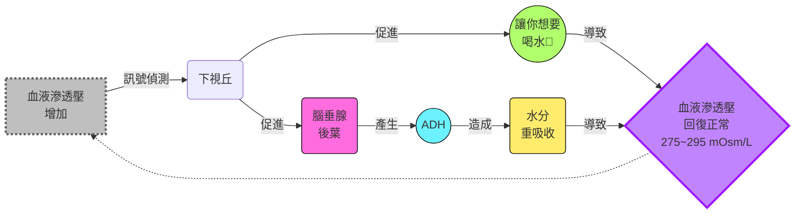
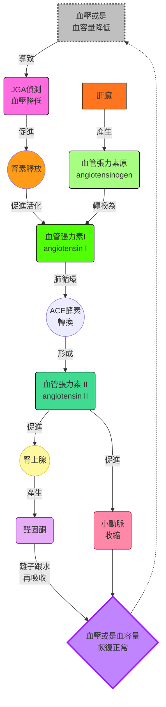

# biology note
## Chapter 44: excertory system 
### 滲透壓調節水分跟溶質
- Osmoregulation的調節力量來自於濃度梯度，取決於osmolarity，也就是溶質的濃度
- 要是膜的兩邊osmolarity相同，這被稱為isoosmotic，水來回流動的量相同，沒有淨流量
- 要是有淨流量的話，一邊是hypoosmotic，另一邊是hyperosmotic
#### 動物如何調節這部分
- 可分為osmoconformers跟osmoregulators:
  - Osmoconformers: 身體跟外界環境等張，不需要調借自身滲透壓
  - Osmoregulators: 需要花費能量，在不同滲透壓的環境下去控制水的出入
  - 前者比後者適應性更強
- 多數動物屬於stenohaline (狹鹽性)，無法承受高的滲透壓變化，反之，有些屬於euryhaline (廣鹽性)
#### marine animals
- 多數無脊椎海洋生物屬於osmoconformers，但是它們有些會主動對特定的溶質濃度進行調整
- 硬骨魚類由於身體相對海洋低鹽，他們會**吞下大量海水來補足失去的水分，再用鰓跟腎臟大量排出鹽分**
- 滲透壓調節的時候，通常代謝廢物也會一起被排出 (例如urea)
- 鯊魚反其道而行，透過將尿素的濃度提高，增加自己體內的滲透壓
- 尿素雖然好用，但它是一種蛋白質變性劑。高濃度的尿素會破壞體內酶和蛋白質的結構，使其無法正常運作。因此，鯊魚體內必須同時累積高濃度的氧化三甲胺 (trimethylamine oxide, TMAO)
   - 它是一種強大的蛋白質穩定劑，可以對抗尿素帶來的破壞性影響，保護蛋白質的結構和功能。
#### freshwater animals
- 外界環境對它們來說是低鹽的，它們不喝水，但是需要大量排出被稀釋的尿液
- 至於排泄失去的鹽份，要用食物或是鰓吸收來補充
- 鮭魚屬於euryhaline fishes，它們會洄游，再低鹽河跟高鹽海中變換位置
- 當它們跑到海裡時，會增加皮質醇的分泌，用來增加排出鹽份的細胞數量
#### Other animals
- desiccation (極度脫水) 對大部分動物致命，但是一些無脊椎動物可以自行脫水進入休眠，這個適應又被稱為 "anhydrobiosis"
  - 例如，緩步動物 (Tardigrades, 也就是水熊蟲)
- 陸地上的動物通常都有避免脫水的表皮，或著乾脆就避免白天活動來減少水分流失 (nocturnal lifestyle)

#### 滲透壓調節的能量學
- 到底需要花多少能量調節這回事? 這取決於:
  - 你跟外界環境的滲透壓差別
  - 身體對水的通透性
  - 你的主動運輸幫蒲要花多少能量移動離子
- 運輸上皮就是用來控制溶質的移動方向的，有很大的表面積
- 例如鳥類的鼻鹽腺就是移除血液過多的氯化鈉

### 排泄到底是什麼鬼?
- 所有動物都要處理ammonia，一種含氮分子分解產生的代謝廢物。排出這些廢物的過程，就叫做 "excretion"
- 廢物通常是三種為主: ammonia、urea、uric acid，這三種的毒性、水溶性、花費的能量都不一樣

#### ammonia
- 這東西很毒，可溶入水中，通常需要一堆水來處理它，多數無脊椎動物直接透過體表排出ammonia
#### urea
- 陸生動物排泄時的主角，稍微比氨還好一點，沒那麼毒，也可以溶於水
- 脊椎動物利用肝臟來產生urea，把ammonia變成urea的過程需要能量，但是由於毒性沒有那麼高，需水量就沒有那麼嚴格
#### uric acid
- 昆蟲、蝸牛、爬蟲類、鳥類的主要排泄廢物
- 基本上相對無毒，但是不太能溶於水，從ammonia變成尿酸需要的能量就更多
#### 演化上的需求
- 這跟動物的棲息地，尤其是水的可得性有關，或是動物的卵的環境影響
- 也跟動物能量的可用性、以及食物來源有關係

### 不同型態的排泄系統
- 尿液的產生先來自於濾液 (filtrate)，主要過程包含:
  - **過濾**: 濾液的產生
  - **再吸收**: 把不同的溶質收回來
  - **分泌**: 把不需要的東西丟到濾液裡面
  - **排出**: 加工過後的濾液排出體外

#### protonephridia
- 原腎管是一個一端為盲管的系統，細部構造包含焰細胞 (flame bulb)
- 焰細胞裡面有纖毛，過濾的液體被纖毛掃出身體之外
- 渦蟲 (flatworm) 就有這個東西
#### metanephridia
- 後腎管從前一個體節吸收體液，被下一個體節的微血管網圍繞。微血管負責蟲吸收養分，最後濾液從外部開口排出
- 蚯蚓的每一個體節都有一對後腎管
#### Malpighian tubules
- 在陸生的節肢動物 (例如昆蟲)，利用馬氏管從血淋巴中吸收含氮廢物，並直接連結消化道
- 由於最後產生的是尿酸，因此可以跳過 "過濾" 的步驟，並且保留水分

#### kidney and nephron
- 腎臟是脊椎動物的主要排泄器官
- 每個腎臟包含腎髓質 (renal medulla) 跟腎皮質 (renal cortex)
- 腎元 (nephron) 的組合就是**排泄管道 + 微血管網**
- 人體有約100萬個腎元，85%為皮質腎元 (cortical nephrons)，只有延伸到腎髓質一點點，剩下的叫做近髓腎元 (juxtamedullary nephrons)，嵌入髓質較深，對濃縮尿液貢獻較多。
- 濾液會經過的流程如下: **proximal tubule → loop of Henle → distal tubule → collecting duct → renal pelvis → ureter → urinary bladder → urethra**
- afferent arteeriole 後形成 glomerulus，被Bowman's capsule包覆著。濾液幾乎把很多東西丟出來，包含所有鹽類、葡萄糖、胺基酸、藥物等
- Loop of Henle 還會分成 **descending limb** 跟 **ascending limb**
- 近端跟遠端腎小管周圍的微血管叫做Peritubular capillaries
- loop of Henle周圍圍繞的血管叫做Vasa recta

### take a closer look
- 一般情況下，由於血液不斷循環，人的腎臟每天要過濾的血液有1600升，只有1.5升的尿液被排出
#### proximal tubule
- 所有剛濾出的營養素，都會被主動運出濾液，進到組織液中，並慢慢流入毛細血管，它們都會在這個地方被重吸收
- 有些毒素也會在這裡被主動運輸到濾液裡面
- 鹽分也會被主動濾出 ($Na^+$會被主動運輸，促使帶負電荷的 $Cl^-$ 被動跑出去)
#### btw, how does it complete pH balance?
- 身體代謝會產酸，產生的多餘的 $H^+$ 會跟 $HCO_3^-$ 結合，過多會導致酸中毒，因此身體要想辦法把 $H^+$ 排出去
- proximal tubule 的上皮轉運細胞會主動產生 $NH_3$ ，將多餘的氫離子跟其結合，形成銨根離子排入濾液中
- 同時把 $HCO_3^-$ 回收到組織液中循環
>[!Note] 
> 無論是遠端或是近端小管，都會做這個事情

#### descending limb of the loop of Henle
- 從 cortex 暫時下降到 medulla
- 此處的轉運上皮細胞幾乎只有水通道，由於 medulla 組織液的鹽分濃度很高，水會在此處被排出，暫時形成高濃度的濾液

#### ascending limb of the loop of Henle
- 從 medulla 上升回 cortex
- 此處的轉運上皮細胞缺乏水通道，所以是鹽類的運輸為主
- ascending limb 的細段被動運輸出去鹽分，到了粗段，由於管外的鹽度下降，上皮細胞開始主動從濾液運輸鹽類到medulla，維持medulla的高鹽分

#### distal tubule
- 和 proximal tubule 一樣，主動排出離子跟鹽分 (如 $K^+$ 和 $NaCl$ ) ，也會運輸氫離子到管中，並再吸收碳酸氫根，調控pH值平衡

#### collection tube
- 持續經過 medulla 內部，並且最終移動到腎盂，因此尿液在此高度濃縮
- ADH調控此處上皮細胞的水通道密度，其作用時會增加水通道的數量，使 medulla 重吸收更多水分
- 尿素也會在這個地方因為管內濃度高而在髓質累積，因此髓質的尿素濃度也很高

#### what about vasa recta?
- 血管基本上圍繞 loop of Henle，因此 Vasa recta 會因為周圍滲透壓偏高而跟著一起高濃度
- 直到回到腎靜脈附近 (位於 cortex，ascending limb附近) 時，滲透壓因為周圍的低鹽而重回正常

#### the gradient of solute and water conservation
- **水是一個不可能主動運輸的東西**，所以，唯一能夠濃縮尿液的方法，就是讓管外的鹽分濃度夠高，使水被動從管內流出
- 在一整條管子的各個區域的上皮細胞，通常都會主動運輸鹽分到 medulla (descending limb 除外)，增加其鹽分濃度，**medulla 的滲透壓相當於決定了這個物種的水再吸收能力**
- 陸域動物的水再吸收能力就是為了在陸地上生活的一種適應
- 動物花很多能量於主動運輸鹽份，最主要影響滲透壓的物質就是氯化鈉跟尿素

#### concentrating uring in mammalian kidneys
- 剛才做的總結中，近端小管的濾液在滲透壓維持不變的情況下，重吸收水分跟鹽份，使濾液容量減小
- 到了loop of Henle的降支區，水分先流失掉很大一部份，導致濾液濃縮
- 在升支端，改成 $NaCl$ 被丟出濾液，這是維持髓質高滲透壓的關鍵 
- 在loop of Henle裡面也可以發現**逆交換 (countercurrent multiplier system)** 的情形，這讓vasa recta提供腎臟養分的同時，不影響滲透壓梯度
- 尿液跟腎髓質的滲透壓相同，但是大幅高於其他的組織液跟血液

### 哺乳動物的再吸收水能力
- juxtamedullary nephron是水分重吸收的主角
- 在乾燥環境中生存的哺乳動物，通常loop of Henle也更長
- 南美吸血蝙蝠在近食時要盡可能吃飽，所以會將大量水排掉 (好裝更多血液，而不影響飛行)
- 而回去棲息、消化時，血液的胺基酸代謝需要大量水分，這時排出的尿液滲透壓會變高

#### 鳥類跟爬蟲類
- 鳥類的loop of Henle比較短，不過他們重吸收的方式本身就不是以這個為主，它們排出的代謝廢物是尿酸，本身就不用太多水
- 其餘的爬蟲類基本上**只有皮質腎元，水的重吸收是在泄殖腔中進行**

#### 淡水魚類跟兩棲類
- 淡水魚排出的尿液比較稀釋，**鹽份的再吸收是依賴於distal tubules**
> [!Note]
> 青蛙的膀胱可以進行水分的重吸收 (很神) 🫠

#### 海洋魚類
- 通常腎元**更小，更少，而且沒有distal tubule，有些甚至連腎絲球都缺乏**
- 基本上不怎麼排泄了，滲透壓調節主要靠鰓來幫忙

### 當激素來幫忙
- 基本上神經跟激素一起控制腎臟的調節滲透壓能力
#### Antidiuretic hormone
- 又稱為ADH或是vesopressin
- 由腦垂腺後葉釋放，然後在collective duct cells上面作用
- 這會促進水通道嵌入細胞膜上面，增加水分重吸收率
- 下視丘的細胞會偵測血液滲透壓，並調控ADH的釋放

- 酒精會抑制ADH的釋放 (因此宿醉的症狀之一就是脫水)
- ADH基因，或是水通道基因的突變，會導致尿崩症 (diabetes insipidus)

#### RAAS 
- 叫做**腎素-血管張力素-醛固酮系統** (renin angiotensin aldosterone system)
- 當腎絲球附近血壓下降時，會使腎絲球旁器 (juxtaglomerular apparatus, JGA) 釋放renin，renin促進angiotensin II 的產生
> [!Note]
> angio = veso = blood vessel，原本指容器的意思 🐱
> renal = nephro = kidney

- angiotensin II 促進血管收縮，降低血液流到腎臟的量，並增加aldosterone的釋放，增加血容量跟血壓

#### 激素的互相調控
- ADH跟RAAS都會提升水的再吸收，不過只有RAAS系統除了再吸收水，也再吸收 $Na^+$ 
- 心房排鈉肽 (atrial natriuretic peptide, ANP) 跟RAAS系統拮抗，在血容量跟血壓上升時會釋放，抑制renin的釋放
- 因此，ANP作用就是降血壓跟血容量

